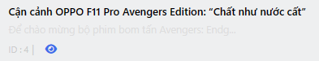

# Table Builder

### Khởi tạo table
Để khởi tạo một table bạn tạo một class kế thừa từ `SKDObjectTable`
```php
class DemoTable extends SKDObjectTable
{
    function get_columns()
    {
        return $this->_column_headers;
    }
    
    function actionButton($item, $module, $table): array
    {
        return [];
    }
    
    function headerFilter(Form $form, Request $request)
    {
        return $form;
    }

    function headerSearch(Form $form, Request $request): Form
    {
        return $form;
    }
}
```

- `get_columns` chứa header table và nội dung của column
- `actionButton` trả về danh sách button ở ô action
- `headerSearch` trả về form tìm kiếm hiển thị
- `headerFilter` trả về form tìm kiếm ẩn

### Header & Column
Khởi tạo một column
```php
function get_columns()
{
    $this->_column_headers = [
        'cb'        => 'cb',
        'title'     => [
            'label'  => trans('admin.table.title'),
            'column' => fn ($item, $args) => ColumnText::make('title', $item, $args)->title()->description(fn ($item): string => $item->excerpt),
        ],
        'order' => [
            'label'  => trans('admin.table.order'),
            'column' => fn ($item, $args) => ColumnEdit::make('order', $item, $args),
        ];
    ];

    return $this->_column_headers;
}

```
### Column Text
Column Text hiển thị văn bản đơn giản từ cơ sở dữ liệu của bạn

```php
ColumnText::make('title', $item, $args)
```
#### `#` Column Text Title
Column Text kiểu title hiển thị id và slug url
```php
ColumnText::make('title', $item, $args)->title()->description(fn ($item): string => $item->excerpt)
```


#### `#` Column Text number
Phương thức `number()` cho phép bạn định dạng một mục nhập dưới dạng số:
```php
ColumnText::make('price', $item, $args)->number()
```

#### `#` Column Text datetime
Phương thức `datetime()` cho phép bạn định dạng một mục nhập dưới dạng thời gian:

```php
ColumnText::make('created', $item, $args)->datetime('d/m/Y')
```

#### `#` Column Text description
Phương thức `description()` thêm mô tả cho nội dung column:

```php
ColumnText::make('created', $item, $args)->datetime('d/m/Y')->description(fn ($item): string => $item->excerpt)
```
### Column Badge
Table hỗ trợ hiển thị các trạng thái, trong đó bạn có thể muốn hiển thị huy hiệu có màu phù hợp với trạng thái:
Hiện tại cms hỗ trợ các loại màu:
- gray
- error (hoặc red)
- pink
- yellow
- info
- warning (hoặc orange)
- cyan
- success (hoặc green)
- lime
- info (hoặc blue)
- purple
- geekblue

```php
ColumnBadge::make('status', $item, $args)
    ->color(fn (string $state): string => match ($state) {
        'pending'   => 'warning',
        'published' => 'success',
        'block'     => 'error',
    })
    ->label(fn (string $state): string => match ($state) {
        'pending'   => 'Đợi duyệt',
        'published' => 'Đã duyệt',
        'block'     => 'Hủy',
    })
```
