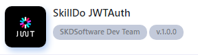

# Getting Started
> Plugin Api JWT cung cấp một hệ thống xác thực cho SPAs (single page applications), mobile applications, và based APIs.
> 
> Plugin Api JWT sử dụng cơ chế JSON Web Token để xác thực authentication (https://datatracker.ietf.org/doc/html/rfc7519)

### Installation
Tải và cài đặt plugin JWT  

### Configuration

Để cấu hình jwt bạn có thể edit file `config/jwt.php`,

**Một số tùy chọn:**

- `login` ngoài `username` thì user được phép login bằng thông tin nào (`email` hoặc `phone`)

- `private_key` chứa thông tin private key

- `public_key` chứa thông tin public key

- `ttl` Chỉ định khoảng thời gian (tính bằng phút) mà token sẽ có hiệu lực. mặc định là 8 giờ

- `refresh_ttl` Chỉ định khoảng thời gian (tính bằng phút) mà refresh token sẽ có hiệu lực. mặc định là 2 tuần

- `cronjob_token_delete` chứa thông thời key action của cronjob xóa token hết hạn quá 24 giờ