# Middleware

## 1. Middleware là gì?

Middleware hoạt động như một cơ chế lọc (filter) các HTTP request đi vào hệ thống. Trước khi request đến được Application Logic hoặc Controller, nó sẽ đi qua nhiều tầng Middleware. Bạn có thể sử dụng Middleware để:
- Xác thực người dùng (kiểm tra đăng nhập)
- Phân quyền (Roles / Permissions)
- Bảo vệ khỏi tấn công (CSFR Token, XSS Sanitization)
- Lưu Log, thống kê người dùng truy cập...

Ví dụ, SkillDo CMS đi kèm một middleware để xác nhận user đã đăng nhập. Nếu user chưa xác thực, middleware sẽ chuyển hướng người dùng trở lại màn hình đăng nhập. Ngược lại, nếu xác thực hợp lệ, request được chuyển tiếp vào ứng dụng.

## 2. Cách Tạo & Cơ Chế Hoạt Động của Middleware

Một Middleware luôn yêu cầu tồn tại phương thức `handle($request, \Closure $next)`.
Sau khi kiểm tra điều kiện, để truyền Request đi tiếp trong pipeline, ta gọi `return $next($request)`. Hoặc trả về redirect thì ta trả về Response mong muốn và kết thúc chu kì.

```php
<?php
namespace MyPlugin\Middlewares;

use SkillDo\Http\Request;
use Closure;

class ExampleMiddleware
{
    /**
     * Handle an incoming request.
     *
     * @param  \SkillDo\Http\Request  $request
     * @param  \Closure  $next
     * @return mixed
     */
    public function handle(Request $request, Closure $next)
    {
        // Kiểm tra logic...
        if ($request->input('age') <= 200) {
            return redirect('home'); // Không hợp lệ: Từ chối / Redirect
        }

        return $next($request); // Hợp lệ: Tiếp tục tới tầng tiếp theo
    }
}
```

## 3. Cách Sử Dụng Middleware

### 3.1. Gắn vào Route

Để gán Middleware vào một Route nhất định, ta sử dụng method `->middleware()`.
Có thể đưa vào Tên Class FQN, hoặc các Chuỗi (Alias / Group) định danh.

```php
use MyPlugin\Middlewares\ExampleMiddleware;

// 1. Dùng tên class trực tiếp
Route::get('/profile', function () {
    //
})->middleware(ExampleMiddleware::class);

// 2. Dùng Alias (bí danh)
Route::get('/dashboard', function () {})->middleware('auth:admin');

// 3. Gắn cho cả một mảng chung (Route Group)
Route::middleware(['auth:admin'])->group(function () {
    Route::get('/settings', function () {});
});
```

### 3.2. Đăng Ký Cấu Hình Hệ Thống (Global & Defaults)

Trên SkillDo CMS v8, các cấu hình chung của hệ thống nằm trong file `bootstrap/app.php`. Nơi này hỗ trợ bạn tùy biến Middleware Pipeline tổng bằng `\SkillDo\Configuration\Middleware`.

```php
// File: bootstrap/app.php
->withMiddleware(function (\SkillDo\Configuration\Middleware $middleware) {
    // Thêm middleware chạy trên toàn bộ hệ thống
    $middleware->append(GlobalMyCustomMiddleware::class);

    // Thêm middleware vào riêng Group "web" hoặc "api"
    $middleware->appendToGroup('web', LogVisitMiddleware::class);

    // Gán các bí danh (aliases) tùy chỉnh
    $middleware->alias([
        'my.auth' => \App\Middlewares\MyAuth::class,
    ]);
})
```

Toàn bộ API của `\SkillDo\Configuration\Middleware`:

| Method                                          | Tác dụng                                                                            |
|-------------------------------------------------|--------------------------------------------------------------------------------------|
| `prepend($middleware)` / `append($middleware)`  | Thêm middleware vào đầu / cuối danh sách Global (nhận string hoặc mảng).            |
| `remove($middleware)`                           | Gỡ middleware khỏi danh sách Global.                                                |
| `replace($search, $replace)`                    | Thay thế một middleware Global bằng class khác.                                     |
| `use(array $middleware)`                        | Thay thế TOÀN BỘ danh sách Global mặc định.                                         |
| `group($name, array $middleware)`               | Định nghĩa (hoặc ghi đè) một nhóm middleware mới.                                   |
| `prependToGroup` / `appendToGroup`              | Thêm middleware vào đầu / cuối một nhóm (`web`, `api`, hoặc nhóm tự định nghĩa).    |
| `removeFromGroup` / `replaceInGroup`            | Gỡ / thay thế middleware trong một nhóm.                                            |
| `alias(array $aliases)`                         | Gán mảng bí danh middleware cho route.                                              |
| `priority(array $priority)`                     | Quy định thứ tự ưu tiên thực thi middleware.                                        |

---

## 4. Đăng Ký Middleware Trong Plugin

Khi xây dựng Plugin, chúng ta không can thiệp vào `bootstrap/app.php` mà khai báo các Middleware qua file **`plugin.json`**. CMS Loader sẽ tự động đăng ký vào Router khi Plugin kích hoạt.

Key `middlewares` trong `plugin.json` hỗ trợ 3 nhóm cấu hình (xử lý bởi `SkillDo\Cms\Loader::registerMiddleware()`): `global` (thêm vào pipeline toàn cục), `groups` (đẩy vào nhóm `web`/`api`) và `aliases` (gán bí danh cho route).

```json
// File: plugins/my-plugin/plugin.json
{
    "name": "My Plugin",
    "class":"MyPlugin",
    "middlewares": {
        "global": [
            "MyPlugin\\Middlewares\\GlobalChecker"
        ],
        "groups": {
            "web": [
                "MyPlugin\\Middlewares\\TrackVisitor"
            ],
            "api": [
                "MyPlugin\\Middlewares\\ApiRateLimiter"
            ]
        },
        "aliases": {
            "my_plugin_auth": "MyPlugin\\Middlewares\\PluginAuthMiddleware"
        }
    }
}
```
**Giải thích:**
- Middleware trong `"global": [...]` được nối vào cuối danh sách Middleware toàn cục của Kernel (chạy trên mọi request).
- Các Middleware bên trong `"groups": {"web": [...]}` sẽ được chạy trên tất cả các Route Frontend của hệ thống thuộc nhóm web (Loader gọi `pushMiddlewareToGroup`).
- Middleware được cấu hình trong `"aliases": {"bí_danh": "..."}` sẽ được đăng ký như 1 Alias để sau này dùng: `Route::get(...)->middleware('my_plugin_auth')`.
- Class Middleware của Plugin đặt trong `plugins/my-plugin/app/Middlewares/` (PSR-4 namespace `<PluginAlias>\Middlewares\` được tự đăng ký).

---

## 5. Đăng Ký Middleware Trong Theme

Nhằm đảm bảo hiệu suất và cấu trúc chuẩn cho Theme, Middleware của Theme sẽ được thiết lập tự do thông qua cấu hình `ThemeConfig` bằng đối tượng khởi tạo file `views/theme-store/theme.json` hoặc trong Service Provider/Helper tùy chọn của Theme.
Để thông báo cho cấu hình `Loader` đăng ký Middleware, ta có thể `set` giá trị trong Theme Config.

Cách làm chuẩn là trong các function cấu hình theme (vd: file `functions.php`), gọi hàm của `themeConfig`:

```php
// Ví dụ khai báo Middleware trong theme (vd trong bootstrap/config.php)
app('themeConfig')->set('middleware', [
    'global' => [
        // \Theme\Middlewares\GlobalChecker::class,
    ],
    'groups' => [
        'web' => [
            \Theme\Middlewares\ThemeSetupMiddleware::class,
        ],
    ],
    'aliases' => [
        'theme_auth' => \Theme\Middlewares\ThemeAuthMiddleware::class,
    ]
]);
```
- Cấu trúc data giống hệt Plugin: 3 key `global` / `groups` / `aliases`. Loader sẽ `array_merge_recursive` key `middlewares` trong `theme.json` với giá trị `app('themeConfig')->get('middleware')` rồi đăng ký chung qua `registerMiddleware()`.
- Namespace chuẩn của File code phải nằm trong: `views/theme-store/app/Middlewares/ThemeSetupMiddleware.php` (PSR-4 `Theme\Middlewares\` — theme-child được ưu tiên) với cấu trúc tương tự ở phần 2.
- Hệ thống hỗ trợ hoàn toàn việc đẩy Alias lên Router cho người làm Theme thoải mái gọi vào `routes/web.php` trong theme.

---

## 6. Danh Sách Middleware Mặc Định Có Sẵn

SkillDo Framework và CMS được tích hợp sẵn một số Middleware nằm trong nhân ứng dụng để xử lý các vấn đề cơ bản về Web Security, Request, Auth, Logging. Bạn có thể sử dụng (hoặc override) nếu cần.

Thứ tự pipeline thực tế (theo `SkillDo\Configuration\Middleware::getGlobalMiddleware()` và `getMiddlewareGroups()`):

```mermaid
flowchart LR
    A["Request"] --> B["ValidatePostSize"]
    B --> C["HandleCors"]
    C --> D["SecurityHeaders"]
    D --> E["RequestSanitizer"]
    E --> T["TrailingSlash (web)"]
    T --> F["StartSession (group)"]
    F --> G["CheckInstallation (web)"]
    G --> V["CheckDatabaseVersion (web)"]
    V --> H["VerifyCsrfToken (web)"]
    H --> I["SetLanguage (web)"]
    I --> J["Route Middleware → Controller"]
```



### 6.1. Middleware Toàn Cục (Global)
Các tính năng này chạy mặc định trên mọi HTTP request không quan trọng Route (API hay Web).

| Tên Class          | Namespace                                   | Mô tả tác vụ                                                                               |
| ------------------ | ------------------------------------------- | ------------------------------------------------------------------------------------------ |
| `ValidatePostSize` | `SkillDo\Http\Middlewares\ValidatePostSize` | Kiểm tra kích thước file tải lên (Post payload) có vượt quá cấu hình server php.ini không. |
| `HandleCors`       | `SkillDo\Http\Middlewares\HandleCors`       | Quản lý headers CORS cho phép chia sẻ tài nguyên cross-origin (thiết lập qua config).      |
| `SecurityHeaders`  | `SkillDo\Http\Middlewares\SecurityHeaders`  | Inject các HTTP headers an toàn (vd: Content-Security-Policy, X-Frame-Options...).         |
| `RequestSanitizer` | `SkillDo\Http\Middlewares\RequestSanitizer` | Làm sạch toàn bộ input bằng **HTMLPurifier** (chống XSS). Cấu hình qua config `request-sanitizer` (`enabled`, `allowed_tags`, `allowed_attributes`, `excluded_fields`); tùy biến sâu hơn bằng filter `request_sanitizer_html_purifier_config`. |

> **Ghi chú:** trong source còn có class `SkillDo\Http\Middlewares\QueryStringVerified` (chặn query string chứa pattern SQLi/RCE phổ biến) nhưng **không được đăng ký mặc định** vào pipeline — muốn dùng phải tự `append()`.

### 6.2. Nhóm Middleware `web`
Những route được định nghĩa trong `routes/web.php`, `routes/admin.php` và Web của Plugin đều được tự động đi qua nhóm này.

| Tên Class           | Namespace                                       | Mô tả tác vụ                                                                                                                                                                                              |
| ------------------- | ----------------------------------------------- | ---------------------------------------------------------------------------------------------------------------------------------------------------------------------------------------------------------- |
| `TrailingSlash`     | `SkillDo\Http\Middlewares\TrailingSlash`        | Chuẩn hóa URL: xóa dấu `/` thừa ở cuối và redirect **301** về URL chuẩn (`/slug///` → `/slug`). Chỉ áp dụng cho `GET`/`HEAD` để không làm mất body của `POST`/`PUT`. Trang chủ (`/`) giữ nguyên.           |
| `StartSession`      | `SkillDo\Session\Middleware\StartSession`       | Khởi động, kích hoạt và quản lý HTTP Session.                                                                                                                                                              |
| `CheckInstallation` | `SkillDo\Cms\Http\Middleware\CheckInstallation` | Kiểm tra hệ thống đã cài đặt chưa (`InstallationState::isInstalled()`); nếu chưa thì redirect về `/install` (bỏ qua chính route `install` để tránh vòng lặp).                                              |
| `CheckDatabaseVersion` | `SkillDo\Cms\Http\Middleware\CheckDatabaseVersion` | Chặn khi **schema CSDL tụt lại so với mã nguồn** (bung source mới đè lên bản cũ mà chưa chạy cập nhật): đưa toàn bộ truy cập về `/upgrade` cho tới khi chạy hết migration còn thiếu. Bỏ qua `/install`, `/upgrade`, `/{admin}/login`, `/{admin}/crm-login`, `/{admin}/ajax`. Nếu không đọc được mốc phiên bản (mất kết nối DB…) thì cho request đi tiếp. Xem [Phiên bản & Migration CSDL](../../05-Database/05-Version-Migration.md). |
| `VerifyCsrfToken`   | `SkillDo\Http\Middlewares\VerifyCsrfToken`      | Kiểm tra token chống CSRF (bỏ qua method GET/HEAD/OPTIONS, path trong except list, action đã `addNeverVerifyAction()`, header `X-CSRF-EXEMPT` hợp lệ). Token sai trả về `419`, bị khóa tạm trả về `429`. |
| `SetLanguage`       | `SkillDo\Cms\Http\Middleware\SetLanguage`       | Bóc tách thiết lập ngôn ngữ từ segment đầu của URL/session và kích hoạt i18n localization phù hợp. Plugin có thể loại trừ path bằng `SetLanguage::exclude('sitemap*.xml')`.                                |

### 6.3. Nhóm Middleware `api`
Những route được cấu hình vào nhóm API (vd: `routes/api.php`) sẽ đi qua đây.

| Tên Class      | Namespace                                 | Mô tả tác vụ                                                                                |
| -------------- | ----------------------------------------- | ------------------------------------------------------------------------------------------- |
| `StartSession` | `SkillDo\Session\Middleware\StartSession` | Khởi động Session nếu cấu hình API cần dùng đến Session. (Mặc định được bật cùng API list). |

### 6.4. Các Middleware Thường Dùng (Dành cho Route)
Các Middleware tùy chọn, bạn cần chủ động gọi tên alias thông qua `->middleware('tên')`

| Alias (Tên Gọi)      | Class                                                 | Mô tả tác vụ                                                                                                                                                                  |
| -------------------- | ----------------------------------------------------- | ------------------------------------------------------------------------------------------------------------------------------------------------------------------------------ |
| `auth`               | `SkillDo\Cms\Http\Middleware\Authenticate`            | Kiểm tra User phía Front-End đã đăng nhập chưa (guard mặc định `web`); chưa đăng nhập sẽ redirect về `route('auth.login')`. Tự động login lại nếu có cookie `user_login` (remember me). |
| `auth:admin`         | `SkillDo\Cms\Http\Middleware\Authenticate`            | Kiểm tra Account Admin: ngoài đăng nhập còn yêu cầu capability `loggin_admin`; nếu không đạt sẽ redirect về `/{admin-prefix}/login?redirect_to=...`.                          |
| `guest`              | `SkillDo\Cms\Http\Middleware\RedirectIfAuthenticated` | Nếu User đã login thì không cho truy cập vào Route này (vd: trang đăng nhập, chặng đường về trang home nếu đã đăng nhập trang login).                                          |
| `jwt`                | `SkillDo\Api\Middlewares\JwtAuthenticate`             | (Đăng ký bởi `ApiServiceProvider`) Xác thực API qua JWT Bearer token.                                                                                                          |
| `api-key`            | `SkillDo\Api\Middlewares\ApiKeyAuthenticate`          | (Đăng ký bởi `ApiServiceProvider`) Xác thực API qua API key.                                                                                                                   |
| `api.auth`           | `SkillDo\Api\Middlewares\ApiAuthenticate`             | (Đăng ký bởi `ApiServiceProvider`) Xác thực API tổng hợp (JWT hoặc API key).                                                                                                   |
| *(không có alias)*   | `SkillDo\Cms\Http\Middleware\FullPageCache`           | Cache toàn bộ HTML Response 5 phút cho GET request của khách chưa login (loại trừ `/admin/*`, `/api/*`, `/cart*`, `/checkout*`, `/account*`). Tự thêm vào group/route nếu muốn dùng. |
