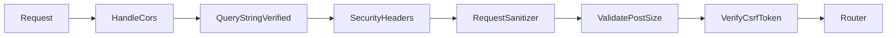

# Middleware

## 1. Middleware là gì?

Middleware hoạt động như một cơ chế lọc (filter) các HTTP request đi vào hệ thống. Trước khi request đến được Application Logic hoặc Controller, nó sẽ đi qua nhiều tầng Middleware. Bạn có thể sử dụng Middleware để:
- Xác thực người dùng (kiểm tra đăng nhập)
- Phân quyền (Roles / Permissions)
- Bảo vệ khỏi tấn công (CSFR Token, XSS Sanitization)
- Lưu Log, thống kê người dùng truy cập...

Ví dụ, SkillDo CMS đi kèm một middleware để xác nhận user đã đăng nhập. Nếu user chưa xác thực, middleware sẽ chuyển hướng người dùng trở lại màn hình đăng nhập. Ngược lại, nếu xác thực hợp lệ, request được chuyển tiếp vào ứng dụng.

## 2. Cách Tạo & Cơ Chế Hoạt Động của Middleware

Một Middleware luôn yêu cầu tồn tại phương thức `handle($request, \Closure $next)`.
Sau khi kiểm tra điều kiện, để truyền Request đi tiếp trong pipeline, ta gọi `return $next($request)`. Hoặc trả về redirect thì ta trả về Response mong muốn và kết thúc chu kì.

```php
<?php
namespace SkillDo\Http\Middlewares;

use SkillDo\Http\Request;
use Closure;

class ExampleMiddleware
{
    /**
     * Handle an incoming request.
     *
     * @param  \SkillDo\Http\Request  $request
     * @param  \Closure  $next
     * @return mixed
     */
    public function handle(Request $request, Closure $next)
    {
        // Kiểm tra logic...
        if ($request->input('age') <= 200) {
            return redirect('home'); // Không hợp lệ: Từ chối / Redirect
        }

        return $next($request); // Hợp lệ: Tiếp tục tới tầng tiếp theo
    }
}
```

## 3. Cách Sử Dụng Middleware

### 3.1. Gắn vào Route

Để gán Middleware vào một Route nhất định, ta sử dụng method `->middleware()`.
Có thể đưa vào Tên Class FQN, hoặc các Chuỗi (Alias / Group) định danh.

```php
use SkillDo\Http\Middlewares\ExampleMiddleware;

// 1. Dùng tên class trực tiếp
Route::get('/profile', function () {
    //
})->middleware(ExampleMiddleware::class);

// 2. Dùng Alias (bí danh)
Route::get('/dashboard', function () {})->middleware('auth:admin');

// 3. Gắn cho cả một mảng chung (Route Group)
Route::middleware(['auth:admin', 'admin.permission'])->group(function () {
    Route::get('/settings', function () {});
});
```

### 3.2. Đăng Ký Cấu Hình Hệ Thống (Global & Defaults)

Trên SkillDo CMS v8, các cấu hình chung của hệ thống nằm trong file `bootstrap/app.php`. Nơi này hỗ trợ bạn tùy biến Middleware Pipeline tổng bằng `\SkillDo\Configuration\Middleware`.

```php
// File: bootstrap/app.php
->withMiddleware(function (\SkillDo\Configuration\Middleware $middleware) {
    // Thêm middleware chạy trên toàn bộ hệ thống
    $middleware->append(GlobalMyCustomMiddleware::class);

    // Thêm middleware vào riêng Group "web" hoặc "api"
    $middleware->appendToGroup('web', LogVisitMiddleware::class);

    // Gán các bí danh (aliases) tùy chỉnh
    $middleware->alias([
        'admin.auth' => \SkillDo\Cms\Http\Middleware\AdminAuth::class,
    ]);
})
```

---

## 4. Đăng Ký Middleware Trong Plugin

Khi xây dựng Plugin, chúng ta không can thiệp vào `bootstrap/app.php` mà khai báo các Middleware qua file **`plugin.json`**. CMS Loader sẽ tự động đăng ký vào Router khi Plugin kích hoạt.

Tùy chọn thiết lập bao gồm nhóm vào các `groups` (thường là nhóm chung cho `web` hoặc `api`) và gán alias (`route`).

```json
// File: plugins/my-plugin/plugin.json
{
    "name": "My Plugin",
    "class":"MyPlugin",
    "middlewares": {
        "groups": {
            "web": [
                "MyPlugin\\Middlewares\\TrackVisitor"
            ],
            "api": [
                "MyPlugin\\Middlewares\\ApiRateLimiter"
            ]
        },
        "route": {
            "my_plugin_auth": "MyPlugin\\Middlewares\\PluginAuthMiddleware"
        }
    }
}
```
**Giải thích:**
- Các Middleware bên trong `"groups": {"web": [...]}` sẽ được chạy trên tất cả các Route Frontend của hệ thống thuộc nhóm web.
- Middleware được cấu hình trong `"route": {"bí_danh": "..."}` sẽ được đăng ký như 1 Alias để sau này dùng: `Route::get(...)->middleware('my_plugin_auth')`.

---

## 5. Đăng Ký Middleware Trong Theme

Nhằm đảm bảo hiệu suất và cấu trúc chuẩn cho Theme, Middleware của Theme sẽ được thiết lập tự do thông qua cấu hình `ThemeConfig` bằng đối tượng khởi tạo file `views/theme-store/theme.json` hoặc trong Service Provider/Helper tùy chọn của Theme.
Để thông báo cho cấu hình `Loader` đăng ký Middleware, ta có thể `set` giá trị trong Theme Config.

Cách làm chuẩn là trong các function cấu hình theme (vd: file `functions.php`), gọi hàm của `themeConfig`:

```php
// Ví dụ khai báo Middleware trong theme (vd trong function boot)
app('themeConfig')->set('middleware', [
    'groups' => [
        'web' => [
            \Theme\Middlewares\ThemeSetupMiddleware::class,
        ],
    ],
    'route' => [
        'theme_auth' => \Theme\Middlewares\ThemeAuthMiddleware::class,
    ]
]);
```
- Namespace chuẩn của File code phải nằm trong: `views/theme-store/app/Middlewares/ThemeSetupMiddleware.php` với cấu trúc tương tự ở phần 2.
- Hệ thống hỗ trợ hoàn toàn việc đẩy Alias lên Router cho người làm Theme thoải mái gọi vào `routes/web.php` trong theme.

---

## 6. Danh Sách Middleware Mặc Định Có Sẵn

SkillDo Framework và CMS được tích hợp sẵn một số Middleware nằm trong nhân ứng dụng để xử lý các vấn đề cơ bản về Web Security, Request, Auth, Logging. Bạn có thể sử dụng (hoặc override) nếu cần.



### 6.1. Middleware Toàn Cục (Global)
Các tính năng này chạy mặc định trên mọi HTTP request không quan trọng Route (API hay Web).

| Tên Class          | Namespace                                   | Mô tả tác vụ                                                                               |
| ------------------ | ------------------------------------------- | ------------------------------------------------------------------------------------------ |
| `ValidatePostSize` | `SkillDo\Http\Middlewares\ValidatePostSize` | Kiểm tra kích thước file tải lên (Post payload) có vượt quá cấu hình server php.ini không. |
| `HandleCors`       | `SkillDo\Http\Middlewares\HandleCors`       | Quản lý headers CORS cho phép chia sẻ tài nguyên cross-origin (thiết lập qua config).      |
| `SecurityHeaders`  | `SkillDo\Http\Middlewares\SecurityHeaders`  | Inject các HTTP headers an toàn (vd: Content-Security-Policy, X-Frame-Options...).         |
| `RequestSanitizer` | `SkillDo\Http\Middlewares\RequestSanitizer` | Làm sạch input dữ liệu từ Payload, chống XSS, cắt khoảng trắng (trim string).              |

### 6.2. Nhóm Middleware `web`
Những route được định nghĩa trong `routes/web.php`, `routes/admin.php` và Web của Plugin đều được tự động đi qua nhóm này.

| Tên Class         | Namespace                                  | Mô tả tác vụ                                                                           |
| ----------------- | ------------------------------------------ | -------------------------------------------------------------------------------------- |
| `StartSession`    | `SkillDo\Session\Middleware\StartSession`  | Khởi động, kích hoạt và quản lý HTTP Session.                                          |
| `VerifyCsrfToken` | `SkillDo\Http\Middlewares\VerifyCsrfToken` | Kiểm tra token để phòng chống tấn công CSRF trên các form (Ngoại trừ method GET/HEAD). |
| `SetLanguage`     | `SkillDo\Cms\Http\Middleware\SetLanguage`  | Bóc tách thiết lập ngôn ngữ từ Request và kích hoạt i18n localization phù hợp.         |

### 6.3. Nhóm Middleware `api`
Những route được cấu hình vào nhóm API (vd: `routes/api.php`) sẽ đi qua đây.

| Tên Class      | Namespace                                 | Mô tả tác vụ                                                                                |
| -------------- | ----------------------------------------- | ------------------------------------------------------------------------------------------- |
| `StartSession` | `SkillDo\Session\Middleware\StartSession` | Khởi động Session nếu cấu hình API cần dùng đến Session. (Mặc định được bật cùng API list). |

### 6.4. Các Middleware Thường Dùng (Dành cho Route)
Các Middleware tùy chọn, bạn cần chủ động gọi tên alias thông qua `->middleware('tên')`

| Alias (Tên Gọi)      | Class                                                 | Mô tả tác vụ                                                                                                                          |
| -------------------- | ----------------------------------------------------- | ------------------------------------------------------------------------------------------------------------------------------------- |
| `auth`               | `SkillDo\Cms\Http\Middleware\Authenticate`            | Kiểm tra User phía Front-End đã xử lý đăng nhập chưa.                                                                                 |
| `auth:admin`         | `SkillDo\Cms\Http\Middleware\Authenticate`            | Kiểm tra session Account Admin (Phân quyền Backend/CMS).                                                                              |
| `guest`              | `SkillDo\Cms\Http\Middleware\RedirectIfAuthenticated` | Nếu User đã login thì không cho truy cập vào Route này (vd: trang đăng nhập, chặng đường về trang home nếu đã đăng nhập trang login). |
| *(Tùy Theme config)* | `SkillDo\Cms\Http\Middleware\FullPageCache`           | Cache toàn bộ View Response sau khi Render nếu hệ thống cache được bật.                                                               |
