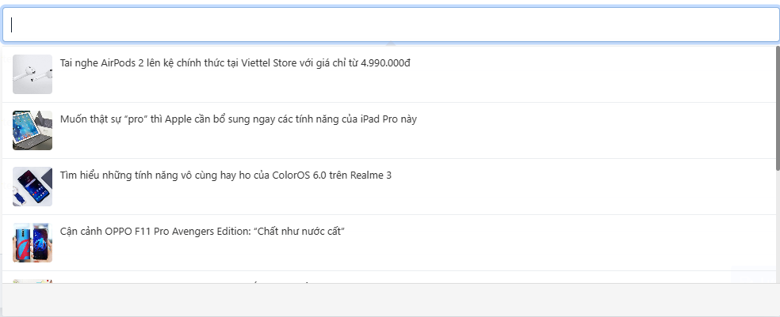

# Field Popover
Popover là dạng field data cho phép bạn tìm kiếm và chọn data với giao diện đẹp mắt

### Field mặc định

#### Popover page
Popover page cho phép bạn tìm kiếm và chọn trang nội dung
```php
$form = form();
$form->popoverAdvance('field_name', [
    'label'     => 'popover page',
    'search'    => 'page',
])
```
Thuộc tính bổ sung

| Params   | Type |                    Description | Default |
|----------|:----:|-------------------------------:|:-------:|
| multiple | bool | Cho phép chọn nhiều đối trượng |  false  |

#### Popover post
Popover post cho phép bạn tìm kiếm và chọn bài viết
```php
$form = form();
$form->popoverAdvance('field_name', [
    'label'     => 'popover post',
    'search'    => 'post',
])
```

Thuộc tính bổ sung

| Params   |  Type  |                    Description | Default |
|----------|:------:|-------------------------------:|:-------:|
| multiple |  bool  | Cho phép chọn nhiều đối trượng |  false  |
| taxonomy | string | post_type của bài viết cần lấy |  post   |


#### Popover Category
Popover Category cho phép bạn tìm kiếm và chọn danh mục bài viết
```php
$form = form();
$form->popoverAdvance('field_name', [
    'label'     => 'popover category',
    'search'    => 'category',
])
```

Thuộc tính bổ sung

| Params   |  Type  |                    Description |     Default     |
|----------|:------:|-------------------------------:|:---------------:|
| multiple |  bool  | Cho phép chọn nhiều đối trượng |      false      |
| taxonomy | string | cate_type của danh mục cần lấy | post_categories |

#### Popover user
Popover user cho phép bạn tìm kiếm và chọn thành viên

```php
$form = form();
$form->popoverAdvance('field_name', [
    'label'     => 'popover user',
    'search'    => 'user',
]);
```

Thuộc tính bổ sung

| Params   |  Type  |                    Description |     Default     |
|----------|:------:|-------------------------------:|:---------------:|
| multiple |  bool  | Cho phép chọn nhiều đối trượng |      false      |

### Thêm Field Popover
#### Create
Để tạo một field popover mới bạn tạo đường dẫn thư mục như sau (trong theme hiện tại hoặc một plugin cụ thể nào đó):
```php
core/Form/Popover
```

Tạo class field của bạn kế thừa lại class `PopoverHandle` của cms

```php
use SkillDo\Form\PopoverHandle;
use SkillDo\Http\Request;

class MyPopover extends PopoverHandle {

    public function __construct() 
    {
        $this->setModule('myPopover');
    }
    
    public function search(Request $request): array
    {
        $items = [];

        $args = Qr::set()->select('id', 'name', 'image')->limit($this->limit)->offset($this->page* $this->limit);

        if(!empty($this->keyword)) {

            $args->where('name', 'like', '%' . $this->keyword . '%');
        }

        $objects = ModelOfYou::gets($args);

        if(have_posts($objects)) {
            foreach ($objects as $value) {
                $items[]  = [
                    'id'        => $value->id,
                    'name'      => $value->name,
                    'image'     => Template::imgLink($value->image),
                ];
            }
        }

        return $items;
    }

    public function value(Request $request, $listId): array
    {
        $items = [];

        if(have_posts($listId)) {

            $objects = ModelOfYou::gets(Qr::set()->whereIn('id', $listId)->select('id', 'name', 'image'));

            foreach ($objects as $value) {

                $items[]  = [
                    'id'        => $value->id,
                    'name'      => $value->name,
                    'image'     => Template::imgLink($value->image),
                ];
            }
        }

        return $items;
    }
}
```

Với method `search` xử lý khi bạn tìm kiếm đối tượng,
method `value` xử lý hiển thị đối tượng đã được chọn
>
Nếu ở chế độ DEBUG = false bạn cần xóa cache `core_form_fields_popover_classes` và `core_files_loader` để cập nhật lại danh sách field popover

```php
CacheHandler::delete('core_form_fields_popover_classes')
CacheHandler::delete('core_files_loader')
```
> 
Sau đó bạn có thể sử dụng field mới bằng cách

 ```php
$form = form();
$form->popoverAdvance('field_name', [
    'label'     => 'popover my field',
    'search'    => 'myPopover',
]);
```

#### Template
Mặt định popover sẽ sử dụng các file giao diện mặc định của cms nếu bạn muốn sử dụng file riêng mình có thể khai bái thêm
> Khơi tạo id cho các template mới

 ```php
public function __construct()
{
    $this->setModule('myPopover');
    //Template review value có hình ảnh
    $this->setTemplateId('valueImg', 'popover_advance_my_field_load_template');
    //Template review value không có hình ảnh
    $this->setTemplateId('valueNoImg', 'popover_advance_my_field_load_template');
    //Template hiên thị đối tượng khi search có hình ảnh
    $this->setTemplateId('searchImg', 'popover_advance_my_field_search_template');
    //Template hiên thị đối tượng khi search không có hình ảnh
    $this->setTemplateId('searchNoImg', 'popover_advance_my_field_search_template');
}
```
Khai báo file giao diện, function `Theme::makeView` chỉ là demo có thể sử dụng các function khách như `Plugin::makeView` tùy vào vị trí đặt file template

```php
public function templateValueImg(): string
{
    return Theme::makeView('admin/popover/template-popover');
}

public function templateValueNoImg(): string
{
    return Theme::makeView('admin/popover/template-popover');
}

public function templateSearchImg(): string
{
    return Theme::makeView('admin/popover/template-popover');
}

public function templateSearchNoImg(): string
{
    return Theme::makeView('admin/popover/template-popover');
}
```

_* Tham khảo các file template mặc định để code file template mới cho bạn_
