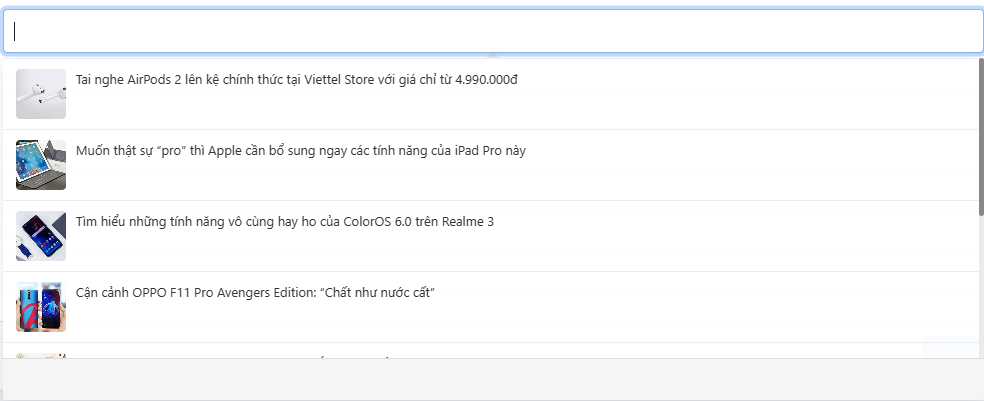

# Field Popover
Popover là dạng field data cho phép bạn tìm kiếm và chọn data với giao diện đẹp mắt

### Field mặc định

#### Popover page
Popover page cho phép bạn tìm kiếm và chọn trang nội dung
```php
$form = form();
$form->popoverAdvance('field_name', [
    'label'     => 'popover page',
    'search'    => 'page',
])
```
Thuộc tính bổ sung

| Params   | Type |                    Description | Default |
|----------|:----:|-------------------------------:|:-------:|
| multiple | bool | Cho phép chọn nhiều đối trượng |  false  |

#### Popover post
Popover post cho phép bạn tìm kiếm và chọn bài viết
```php
$form = form();
$form->popoverAdvance('field_name', [
    'label'     => 'popover post',
    'search'    => 'post',
])
```

Thuộc tính bổ sung

| Params   |  Type  |                    Description | Default |
|----------|:------:|-------------------------------:|:-------:|
| multiple |  bool  | Cho phép chọn nhiều đối trượng |  false  |
| taxonomy | string | post_type của bài viết cần lấy |  post   |


#### Popover Category
Popover Category cho phép bạn tìm kiếm và chọn danh mục bài viết
```php
$form = form();
$form->popoverAdvance('field_name', [
    'label'     => 'popover category',
    'search'    => 'category',
])
```

Thuộc tính bổ sung

| Params   |  Type  |                    Description |     Default     |
|----------|:------:|-------------------------------:|:---------------:|
| multiple |  bool  | Cho phép chọn nhiều đối trượng |      false      |
| taxonomy | string | cate_type của danh mục cần lấy | post_categories |

#### Popover user
Popover user cho phép bạn tìm kiếm và chọn thành viên

```php
$form = form();
$form->popoverAdvance('field_name', [
    'label'     => 'popover user',
    'search'    => 'user',
]);
```

Thuộc tính bổ sung

| Params   |  Type  |                    Description |     Default     |
|----------|:------:|-------------------------------:|:---------------:|
| multiple |  bool  | Cho phép chọn nhiều đối trượng |      false      |

### Thêm Field Popover

#### Bước 1 — Tạo class PopoverHandle

Tạo file PHP trong Plugin của bạn (ví dụ `app/Cms/Form/Popovers/MyPopover.php`) kế thừa class `PopoverHandle`:

```php
<?php
namespace MyPlugin\Cms\Form\Popovers;

use MyPlugin\Models\MyModel;
use SkillDo\Cms\Form\PopoverHandle;
use SkillDo\Cms\Support\Image;
use SkillDo\Http\Request;

class MyPopover extends PopoverHandle
{
    public function __construct()
    {
        $this->setModule('myPopover');
    }

    public function search(Request $request): array
    {
        $items = [];

        $query = MyModel::select('id', 'name', 'image')
            ->limit($this->limit)
            ->offset($this->page * $this->limit);

        if (!empty($this->keyword)) {
            $query->where('name', 'like', '%' . $this->keyword . '%');
        }

        $objects = $query->get();

        if (hasItems($objects)) {
            foreach ($objects as $value) {
                $items[] = [
                    'id'    => $value->id,
                    'name'  => $value->name,
                    'image' => Image::medium($value->image)->link(),
                ];
            }
        }

        return $items;
    }

    public function value(Request $request, $listId): array
    {
        $items = [];

        if (hasItems($listId)) {
            $objects = MyModel::whereIn('id', $listId)->select('id', 'name', 'image')->get();

            foreach ($objects as $value) {
                $items[] = [
                    'id'    => $value->id,
                    'name'  => $value->name,
                    'image' => Image::medium($value->image)->link(),
                ];
            }
        }

        return $items;
    }
}
```

- **`search()`** — xử lý truy vấn khi người dùng gõ từ khoá tìm kiếm. Trả về array các item.
- **`value()`** — truy vấn lại các item theo danh sách ID đã lưu để render lại khi load trang.
- Mỗi item trả về **bắt buộc** có key `id` và `name`. Key `image` là tuỳ chọn — nếu có thì template img sẽ được dùng.

---

#### Bước 2 — Đăng ký vào `plugin.json`

Mở `plugin.json` của Plugin và thêm key `cms.form.popover`:

```json
{
    "cms": {
        "form": {
            "popover": {
                "myPopover": "MyPlugin\\Cms\\Form\\Popovers\\MyPopover"
            }
        }
    }
}
```

- **Key** (`"myPopover"`) là định danh dùng ở thuộc tính `search` khi khai báo field.
- **Value** là Namespace đầy đủ của class vừa tạo (phải được map đúng trong `autoload`).

---

#### Bước 3 — Sử dụng field

```php
$form = form();
$form->popoverAdvance('field_name', [
    'label'  => 'My Popover Field',
    'search' => 'myPopover',
]);
```

---

#### Bước 4 — Tuỳ chỉnh Template (Nâng cao)

Mặc định Popover dùng chung 4 file template của CMS:

| Key template  | Dùng khi                                   | File mặc định của CMS                                              |
|:-------------:|:------------------------------------------:|:------------------------------------------------------------------:|
| `searchNoImg` | Hiển thị item kết quả tìm kiếm (không ảnh) | `resources/components/popover-advance/template-search.blade.php`   |
| `searchImg`   | Hiển thị item kết quả tìm kiếm (có ảnh)    | `resources/components/popover-advance/template-search-img.blade.php` |
| `valueNoImg`  | Hiển thị item đã chọn (không ảnh)          | `resources/components/popover-advance/template-value.blade.php`    |
| `valueImg`    | Hiển thị item đã chọn (có ảnh)             | `resources/components/popover-advance/template-value-img.blade.php` |

Nếu muốn dùng template riêng, khai báo thêm trong `__construct()` và override các method tương ứng:

```php
public function __construct()
{
    $this->setModule('myPopover');

    // Đặt ID duy nhất cho từng template (tránh trùng với các Popover khác)
    $this->setTemplateId('valueImg',    'popover_advance_my_field_value_img');
    $this->setTemplateId('valueNoImg',  'popover_advance_my_field_value');
    $this->setTemplateId('searchImg',   'popover_advance_my_field_search_img');
    $this->setTemplateId('searchNoImg', 'popover_advance_my_field_search');
}

// Dùng Plugin::partial() nếu file template nằm trong Plugin
public function templateValueImg(): string
{
    return Plugin::partial('myPlugin', 'admin/popover/template-value-img');
}

public function templateValueNoImg(): string
{
    return Plugin::partial('myPlugin', 'admin/popover/template-value');
}

public function templateSearchImg(): string
{
    return Plugin::partial('myPlugin', 'admin/popover/template-search-img');
}

public function templateSearchNoImg(): string
{
    return Plugin::partial('myPlugin', 'admin/popover/template-search');
}
```

**Cấu trúc file template:**

File template dùng cú pháp `${key}` để binding dữ liệu từ array item, tương ứng với các key bạn trả về trong `search()` và `value()`.

Template kết quả tìm kiếm (`search`) — phần nội dung bên trong wrapper item:
```html
{{-- template-search-img.blade.php --}}
<div class="item__image"></div>
<div class="item__name line-clamp-2">${name}</div>
```

Template item đã chọn (`value`) — phần nội dung bên trong wrapper item (bao gồm nút xoá do CMS tự thêm):
```html
{{-- template-value-img.blade.php --}}
<div class="item__image"></div>
<div class="item__name line-clamp-2">${name}</div>
```

> Bạn có thể thêm bất kỳ key nào vào array item (ví dụ `price`, `code`...) và dùng `${price}`, `${code}` tương ứng trong template.

---

### Thêm Field Popover Trong Theme

Quy trình tạo class `PopoverHandle` hoàn toàn giống như trong Plugin (xem phần trên). Điểm khác biệt duy nhất là cách **đăng ký** với hệ thống.

Namespace chuẩn của class nên nằm trong thư mục `app/` của theme, ví dụ:
`views/theme-child/app/Cms/Form/Popovers/MyThemePopover.php` với namespace `Theme\Cms\Form\Popovers\MyThemePopover`.

#### Đăng ký qua `theme-child.json`

Mở (hoặc tạo) file `views/theme-child/theme-child.json` và thêm khối `cms.form.popover`:

```json
{
    "cms": {
        "form": {
            "popover": {
                "myThemePopover": "Theme\\Cms\\Form\\Popovers\\MyThemePopover"
            },
            "fields": {
                "myThemeField": {
                    "class": "Theme\\Cms\\Form\\Field\\MyThemeField"
                }
            }
        }
    }
}
```

- **Key** (`"myThemePopover"`) là định danh dùng ở thuộc tính `search` khi gọi `$form->popoverAdvance(...)`.
- **Value** là Namespace đầy đủ của class (phải khớp với cấu trúc thư mục trong `views/theme-child/app/`).

#### Sử dụng field

Sau khi đăng ký trong `theme-child.json`, cách dùng hoàn toàn giống Plugin:

```php
$form->popoverAdvance('field_name', [
    'label'  => 'My Theme Popover',
    'search' => 'myThemePopover',
]);
```

