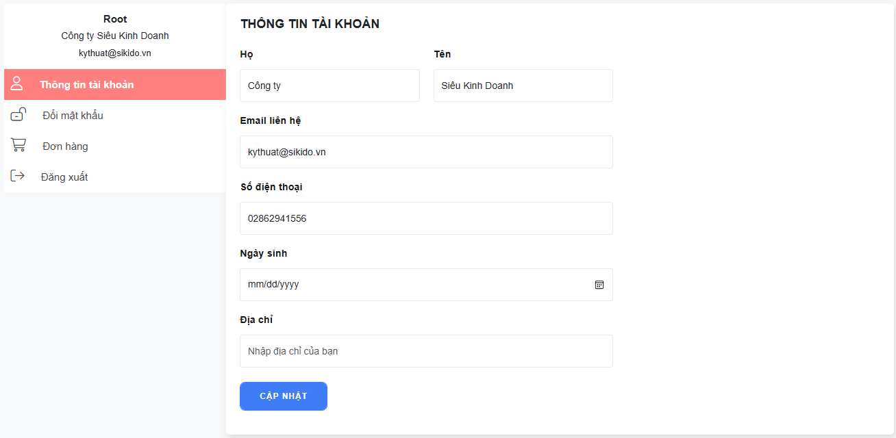

## Menu Location
### Thêm vị trí menu

> Để thêm vị trí hiển thị menu bạn sử dung method `addLocation`, `addLocation` nhận vào 2 tham số

| Params     |  Type  | Description | Mặc định |
|------------|:------:|------------:|---------:|
| $locations | string |   id vị trí |          |
| $label     | string |  tên vị trí |          |

```php
ThemeMenu::addLocation($locations, $label)
```

### Hiển thị menu theo vị trí
Hiển thị menu dựa theo vị trí đã đăng ký
```php
ThemeMenu::render(['theme_location' => $locations, 'walker' => 'store_bootstrap_nav_menu'])
```

## Menu Data
### Lấy data menu theo vị trí
```php
ThemeMenu::getData($locations)
```
### Thêm options vào menu item

> Để thêm option vào menu item bạn sử dung method `addItemOption`, `addItemOption` nhận vào 2 tham số

| Params  |  Type  |    Description | Mặc định |
|---------|:------:|---------------:|---------:|
| $module | string | loại menu item |          |
| $args   | array  |   các cấu hình |          |

Các loại $module hỗ trợ
- menu: tất cả menu item
- post: menu item là bài viêt
- post_categories: menu item là danh mục sản phẩm

params $args chưa thông tin field input cần thêm

```php
ThemeMenu::addItemOption('menu', [
    'field' => 'icon', 
    'label' => 'Icon', 
    'type'  => 'font-icon', 
    'level' => 0
]);
```
 key `level` quy định option được xuất hiện ở cấp mấy