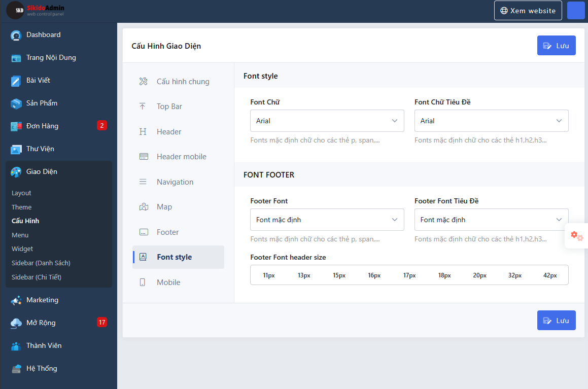

# Theme Option
Theme option chứa một số cấu hình tùy chỉnh giao diện cho website, đi đến admin > Giao diện > Cấu hình
>


## Thêm nhóm option
Để thêm một nhóm option bạn sử dụng method `addGroup`, method `addGroup` nhận vào 2 tham số là `$id` chứa id của nhóm và `$args` là một mãng chưa các thông tin cấu hình cho nhóm
```php
ThemeOption::addGroup('general', [
    'position' => 10,
    'label' => 'Cấu hình chung',
    'icon'  => '<i class="fa-light fa-screwdriver-wrench"></i>',
    'form'  => function(\SkillDo\Form\Form $form) {
        $form->text('general_label', ["label" => "Tên website (shop)"]);
        $form->color('theme_color', ["label" => "Màu chủ đề"]);
        $form->background('bodyBg', ["label" => "Nền website"]);
    }
]);
```
Tham số $args chứa các thông tin

| Key      |       Type        |                                                                        Description | Mặc định |
|----------|:-----------------:|-----------------------------------------------------------------------------------:|---------:|
| position |        int        |                                                 Số thứ tự, sắp xếp từ thấp đến cao |        0 |
| label    |      string       |                                                                    tên nhóm option |          |
| icon     |      string       |                                                                      icon đại diện |          |
| form     | SkillDo\Form\Form | là một object Form hoặc một function trả về Form, chứa thông tin các field options |     null |
| root     |       bool        |                              nếu true sẽ chỉ hiển thị khi thành viên có quyền root |    false |

## Thêm nhóm con option
Để thêm một nhóm con option bạn sử dụng method `addGroupSub`, method `addGroupSub` nhận vào 3 tham số là `$parendId` chứa id nhóm cha, `$id` chứa id của nhóm và `$args` là một mãng chưa các thông tin cấu hình cho nhóm
```php
ThemeOption::addGroupSub('general', 'general-bottom', [
    'label' => 'FOOTER BOTTOM',
    'form' => function(\SkillDo\Form\Form $form) {
        $form->switch('footer_bottom_public', ['label' => 'Hiển thị footer bottom', 'start' => 4, 'options' => 1]);
        $form->color('footer_bottom_bg_color', ['label' => 'Nền footer bottom', 'start' => 4]);
        $form->color('footer_bottom_text_color', ['label' => 'Màu chữ footer bottom', 'start' => 4]);
    }
]);
```

Tham số $args chứa các thông tin

| Key      |       Type        |                                                                        Description | Mặc định |
|----------|:-----------------:|-----------------------------------------------------------------------------------:|---------:|
| label    |      string       |                                                                    tên nhóm option |          |
| form     | SkillDo\Form\Form | là một object Form hoặc một function trả về Form, chứa thông tin các field options |     null |

## Thêm field option
Ngoài cách sử dụng form bên trong params $args bạn còn có thể sử dụng method `addField`,  
method `addField` nhận vào 4 tham số là:
- $groupId : id của nhóm cần thêm có thể id của nhóm cha hoặc nhóm con
- $name: tên của field
- $type: loại field (tham khảo field của SkillDo\Form\Form)
- $args: Cấu hình bao gồm các thông tin của field

```php
ThemeOption::addField('header', 'logo_bg', 'color', [
    'label' => 'Màu khung logo', 'start' => 4
]);
```
## Sử dụng
Để sử dụng option đã lưu bạn dùng `Option::get`
```php
Option::get('logo_bg');
```
## Hooks
Một số hooks liên quan

| Key                                     |  Type  |                                                 Description | Theme version |
|-----------------------------------------|:------:|------------------------------------------------------------:|:-------------:|
| theme_custom_options                    | action |              Hook chỉnh sữa theme option hiện tại của theme |     3.0.0     |
| theme_option_save                       | filter |              Hook giúp bạn chỉnh data options trước khi lưu |     4.0.0     |
| theme_options_general_form              | filter |        Hook chỉnh sữa form của tab general (Cấu hình chung) |     4.0.0     |
| theme_options_header_form               | filter |                 Hook chỉnh sữa form của tab header (Header) |     4.0.0     |
| theme_options_header_mobile_form        | filter |   Hook chỉnh sữa form của tab header mobile (Header mobile) |     4.0.0     |
| theme_options_header_mobile_menu_form   | filter |      Hook chỉnh sữa form của tab header mobile(Menu Mobile) |     4.0.0     |
| theme_options_header_mobile_search_form | filter | Hook chỉnh sữa form của tab header mobile (Tìm kiếm Mobile) |     4.0.0     |
| theme_options_map_form                  | filter |                             Hook chỉnh sữa form của tab map |     4.0.0     |
| theme_options_post_form                 | filter |             Hook chỉnh sữa form của tab bài viết (Bài viết) |     4.0.0     |
| theme_options_post_category_form        | filter |             Hook chỉnh sữa form của tab bài viết (Danh mục) |     4.0.0     |
| theme_options_footer_form               | filter |                 Hook chỉnh sữa form của tab footer (Footer) |     4.0.0     |
| theme_options_footer_bottom_form        | filter |          Hook chỉnh sữa form của tab footer (Footer Bottom) |     4.0.0     |
| theme_options_fonts_form                | filter |              Hook chỉnh sữa form của tab fonts (Font style) |     4.0.0     |
| theme_options_fonts_footer_form         | filter |             Hook chỉnh sữa form của tab fonts (Font footer) |     4.0.0     |

