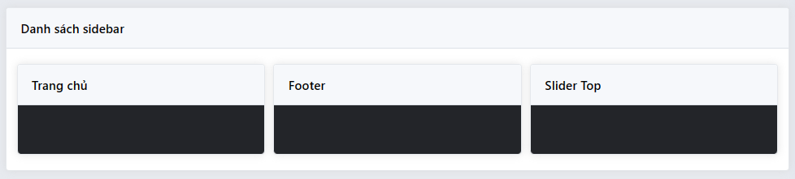
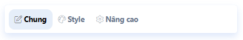

# Widget Home

Widget là các khối chức năng độc lập giúp giải quyết các nhiệm vụ khác nhau. 
Các widget luôn có giao diện người dùng để chuẩn bị dữ liệu widget.
Để cấu hình widget bạn vào `admin > Giao diện > widget`

## Sidebar

### Register Widget Area
Thêm mã dưới đây vào `/views/your-theme/config.php` để tạo vùng chứa cho widget
```php
Sidebar::add('sidebar_id', 'sidebar_name');
```

### Display
Hiển thị widget thuộc sidebar đã đăng ký
```php
Sidebar::render('sidebar_id');
```

## Widget
### Tạo widget
Tạo file widget của bạn trong đường dẫn `/views/<current active theme>/widgets/<widget name>.widget.php`. với widget phải kết thúc bằng `*.widget.php`

### Widget definition
Các lớp widget phải kế thừa từ lớp `SkillDo\Widget\Widget`.

```php
use SkillDo\Widget\Widget;

class Widget_Demo extends Widget {

    function __construct() 
    {
        parent::__construct('Widget_Demo', 'Tên widget');
        $this->configContainer(true);
        $this->configClass('Widget_Demo');
        $this->setTags('about');
    }
    
    public function form(): void 
    {
        $this->tabs('generate');
        $this->tabs('style');
        $this->tabs('advanced');
        parent::form();
    }
    
    public function widget(): void 
    {
    }
    
    public function cssBuilder(): string
    {
        return Template::minifyCss($this->cssBuild());
    }
    
    public function default(): void 
    {
    }
}

Widget::add('Widget_Demo');
```

#### construct
Chứa một số cấu hình cho widget
>
- `configContainer`: sử dụng các trường input mặc định như màu nền widget, box container, margin, padding
```php
$this->configContainer(true);
```

- `configClass`: thêm class custom sẽ bọc widget lại
```php
$this->configClass('class_name');
```

- `setTags`: phân loại widget
```php
$this->setTags('footer');
```

- `setAuthor`: tên tác giả widget mặc định là "SKDSoftware Dev Team"
```php
$this->setAuthor('Team Team');
```

#### widget
method `widget` giúp hiển thị mã html của widget, `$this->options` chứa cấu hình của widget được tạo trong method `form`
Example:
```php
public function widget()
{
    Theme::view($this->getDir().'view', [
        'name'     => $this->name,
        'options'  => $this->options,
        'header'   => ThemeWidget::heading($this->name, $this->options->heading, '.js_'.$this->key.'_'.$this->id, true),
    ]);
}
```

### Widget Form
Để tạo form cấu hình data cho widget bạn sử dụng method `form`, form của widget gồm 2 thành phần form tab và form field
#### Form Tab

##### Form tab mặc định
Mặc định widget cung cấp 3 form mặc định là
- **generate**: Tab chung
- **style**: Tab Style
- **advanced**: Tab nâng cao
Khi form mặc định không chứa field nào sẽ tự động ẩn đi
##### Thêm form tab
Để thêm một tab mới bạn sử dụng method `addTab`

```php
public function form()
{
    $this->addTab('tabId', 'New Tab', '<i class="fa-solid fa-wand-magic-sparkles"></i>', [
        'after' => 'style' //vị trí tab
    ]);
}
```

### Widget Field
Để thêm một field bạn sử dụng `$this->tabs('tab_key')->fields->{Form Builder}` thực hiện như ví dụ sau

```php
public function form()
{   
    //Thêm field vào tab generate
    $this->tabs('generate')->adds(function (Skilldo\Widget\WidgetField $form) {
        $form->color('test', ['label' => 'test label 1']);
    })

    //Thêm field vào tab style
    $this->tabs('style')->adds(function (Skilldo\Widget\WidgetField $form) {
        $form->text('test1', ['label' => 'test label 2']);
    })

    //Thêm field vào tab advanced
    $this->tabs('advanced')->adds(function (Skilldo\Widget\WidgetField $form) {
        $form->number('test2', ['label' => 'test label 3']);
    }) 
}
```