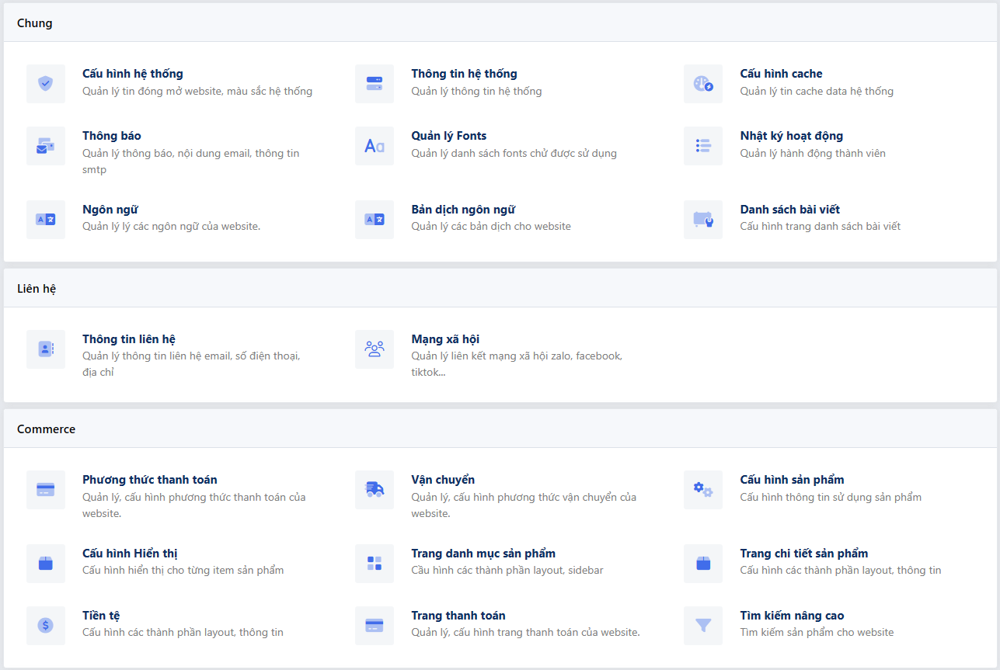

# Cấu Hình Hệ Thống

Trong trang quản trị (Admin Panel) phần **Hệ Thống (System)** nơi lưu trữ các cài đặt cốt lõi của website, nếu bạn code một Plugin hoặc một Module lớn mới và muốn bổ sung cấu hình (Setting) vào giao diện hệ thống cung cấp sẵn thì SkillDo V8 cung cấp hệ thống Hooks rất tiện lợi cho bạn.



Để quản lý trang cài đặt, Framework sử dụng 2 bộ công tắc chính:
- **Group (Nhóm):** Khối điều hướng lớn (Nằm cột Sidebar bên trái) (`common`, `contact`, ...)
- **Tab (Trang con):** Các thành phần Tab nhỏ xếp theo từng Group.

---

## 1. Mở Rộng Thêm Tab Cài Đặt Khác 

Để thêm một Tab cài đặt vào Hệ thống, bạn cần sử dụng Filter có tên là `admin_system_tabs`. 

### Bước 1: Khai Báo (Register)
Ví dụ sau hướng dẫn bạn đăng ký một Tab có ID định danh là `my-plugin-setting` đặt vào trong nhóm `common` hệ thống.

```php
use Application\Supports\Component;
use Admin\Supports\Components\BlockSystem;
use SkillDo\Cms\Support\Option;

class MyPluginConfig 
{
    // Đăng ký Tab
    static function register($tabs)
    {
        $tabs['my-plugin-setting'] = [
            'group'       => 'common', // Nhóm tồn tại sẵn, ví dụ: common, contact
            'label'       => 'Cấu hình My Plugin',
            'description' => 'Quản lý API Key và các thông số kết nối của Plugin',
            'callback'    => [self::class, 'render'], // Hàm sẽ được gọi để Render Form
            'icon'        => '<i class="fad fa-cogs"></i>', // Icon bên sidebar
            'position'    => 50 // Độ ưu tiên thứ tự xếp
        ];
        return $tabs;
    }
}

// Gọi Hook bên ngoài hàm boot() hoặc file init:
add_filter('admin_system_tabs', [MyPluginConfig::class, 'register'], 10);
```

---

### Bước 2: Hiển Thị Form Cấu Hình (Render Data)

Hệ thống sẽ gọi function `render` (mà bạn đã khai ở `callback` phía trên) khi quản trị viên ấn vào tab. Trách nhiệm của hàm này đơn thuần là **In (echo)** ra mã Form HTML. Bạn có thể tự gõ Input HTML hoặc sử dụng Cấu trúc của Admin.

Bên trong khung bao System, Framework thường sử dụng Class Helper `Component::blockSystem` để render Header & Description đồng bộ.

```php
class MyPluginConfig {
    
    // ... code register() ...

    static public function render($tab): void
    {
        // 1. Dùng Form builder chuẩn của hệ thống để xây các input
        $form = form();
        
        // Bạn có thể lấy lại Dữ liệu Settings cũ từ DB bằng Option::get()
        $form->add('my_api_key', 'text', [
            'label' => 'Mã API Key',
            'note'  => 'Lấy từ nền tảng hỗ trợ (Không bắt buộc)'
        ], Option::get('my_api_key'));

        $form->add('enable_feature', 'checkbox', [
            'label' => 'Bật Tính Năng Cao Cấp',
        ], Option::get('enable_feature'));

        // 2. Render khung hộp thoại Bao bọc hệ thống
        echo \Admin\Supports\Component::blockSystem(function (BlockSystem $block) use ($tab, $form)
        {
            // Set thông tin tiêu đề cho hệ hộp
            $block->header($tab['label'])->description($tab['description']);
            // Nhồi HTML các Input vào content
            $block->content($form);
        });
    }
}
```

> **Ghi chú CSS/JS:** Khung System bọc sẵn Form Element và **tự động gọi Ajax đệ trình (submit)** tới Back-End. Việc của bạn chỉ là đảm bảo thẻ Input có thuộc tính `name=""` rõ ràng (nằm ở tham số thứ 1 của method `$form->add`).

---

### Bước 3: Đón Dữ Liệu Khi Người Dùng Lưu (Save)

Khi người dùng nhấn Nút `Lưu Cấu Hình`, trình duyệt sẽ gọi AJAX một cục mảng toàn bộ dữ liệu ở Form về Core CMS. Framework sẽ xác định Form nằm ở Tab Key nào và gởi tới Hook `Action` xử lý của chính Key đó.

Quy định tên Hook tự động: **`admin_system_{tab_key}_save`**
*(⚠️ Cảnh báo: Ký tự dấu gạch ngang (`-`) trong Tab Key CỦA BẠN sẽ luôn bị Framework đổi tự động thành dấu gạch dưới (`_`).)*

Vậy do Tab key của ta là `my-plugin-setting`, nên Framework sẽ sinh ra Action name là: `admin_system_my_plugin_setting_save`.

```php
class MyPluginConfig {

    // ...

    static public function save(\SkillDo\Http\Request $request): void
    {
        // Nhận dữ liệu text tĩnh, làm sạch bằng thẻ Str
        $apiKey = \Illuminate\Support\Str::clear($request->input('my_api_key'));
        $enable = (int)$request->input('enable_feature');

        // Bắn Lỗi Validate ngược về Client nếu muốn ngắt luồng
        if(empty($apiKey) && $enable === 1) {
            response()->error('Bạn phải nhập API Key mới được Bật tính năng cực VIP');
        }

        // Nếu thông qua, chúng ta lưu Database thông qua Option Data
        Option::update('my_api_key', $apiKey);
        Option::update('enable_feature', $enable);
    }
}

// Đừng quên Móc Action này ở hàm init:
add_action('admin_system_my_plugin_setting_save', [MyPluginConfig::class, 'save']);
```

---

## 2. Thêm Nhóm Tab Mới (System Group)

Nếu như Plugin của bạn quá đồ sộ và bạn không muốn nhét Tab vào nhóm có sẵn như `common`, bạn thể trích cắm (Hook) thêm một Group (Menu Mẹ) mới trên thanh trái của Cài Đặt thông qua Filter: `admin_system_groups`.

```php
add_filter('admin_system_groups', function($groups) 
{
    // Tạo khóa key group mới là "my_plugin_group"
    $groups['my_plugin_group'] = [
        'label' => 'Công Cụ Mở Rộng'
    ];
    return $groups;
});
```

Tiếp đó trong mảng `register` Tab phía trên, bạn đổi mục khai báo `group` trỏ về cái Group tên `my_plugin_group` mà bạn thao tác đẻ thêm.

## 3. Quản Lý Validate Dữ Liệu Chặn Đầu

Hệ thống có chuẩn bị trước một lệnh kiểm tra (Pre-Save Check) trước khi nó kích nổ Hook `_save` chính. Chặn đầu bằng Filter tên là: `admin_system_{tab_key}_check` nhằm mục đích check lỗi hoặc bảo mật:

```php
add_filter('admin_system_my_plugin_setting_check', function($error) 
{
    // Ví dụ một quy định chỉ Quản trị viên Max Quyền Mới Được cấu hình
    if(!Auth::hasCap('manage_options')) {
        return new \SkillDo\Support\SKD_Error('permission_error', 'Không có quyền truy cập');
    }
    
    // Yêu cầu trả nguyên vẹn nếu OK
    return $error;
});
```

## 4. Tự Làm Form Giao Diện Và Logic Lưu Riêng

Trong một số trường hợp với các Module phức tạp, bạn muốn giao diện tab cài đặt hoàn toàn do mình chủ động thiết kế HTML (ví dụ: chia thành nhiều form nhỏ, thiết kế giao diện theo ý muốn) cùng thuật toán lưu dữ liệu riêng thay vì phụ thuộc Form API có sẵn. Bạn có thể vô hiệu hoá Form mặc định của hệ thống bằng cách cấu hình thuộc tính `'form' => false`.

```php
class MyPluginConfig {
    static function register($tabs)
    {
        $tabs['my-custom-setting'] = [
            'group'       => 'common', 
            'label'       => 'Cấu hình Nâng Cao',
            'callback'    => [self::class, 'render'], 
            'icon'        => '<i class="fad fa-cogs"></i>',
            'form'        => false, // Tắt thẻ Form mặc định của hệ thống
        ];
        return $tabs;
    }
}
```

### Custom Render View

Trường hợp tham số `form` mang giá trị `false`, hệ thống ngầm hiểu bạn làm chủ giao diện HTML trả ra. Ở bước Render, bạn thường trả về các View riêng thay vì tạo Layout tự động từ biến `$form` của hệ thống.

```php
class MyPluginConfig {
    // ...
    static public function render(\SkillDo\Http\Request $request): void
    {
        // Xử lý lấy Data hiển thị...
        $sampleData = ['item1', 'item2']; 

        // Người dùng có thể tự gọi các file View tuỳ biến 
        echo view('my-plugin::admin.system-setting', compact('sampleData'));
    }
}
```

### Tự Viết Ajax Lưu Dữ Liệu

**Lưu ý quan trọng:** Hành động tắt Form mặc định (`'form' => false`) đồng nghĩa với việc bạn tự chịu trách nhiệm lưu dữ liệu. Framework sẽ **KHÔNG GÁN** method Save vào hook **`admin_system_{tab_key}_save`** của tab này. 

Do đó, bạn phải tự xử lý toàn bộ luồng lưu vào cơ sở dữ liệu:
1. Tự thiết kế các thẻ `<form>` bên trong file view HTML của bạn (Ví dụ file `my-plugin::admin.system-setting` ở trên).
2. Tự viết mã JavaScript để bắt sự kiện Submit.
3. Bắn Data lên các Endpoint kết nối phía Server mà bạn tự viết riêng (Xây dựng Ajax riêng trong Plugin/Ajax của bạn).
