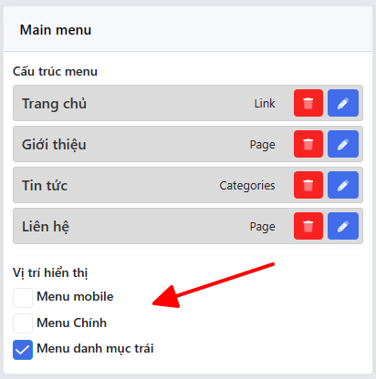
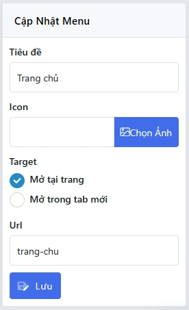
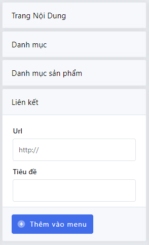

## Menu Location
### Thêm vị trí menu

> Để thêm vị trí hiển thị menu bạn sử dung method `addLocation`, `addLocation` nhận vào 2 tham số

| Params     |  Type  | Description | Mặc định |
|------------|:------:|------------:|---------:|
| $locations | string |   id vị trí |          |
| $label     | string |  tên vị trí |          |

```php
ThemeMenu::addLocation($locations, $label)
```

### Hiển thị menu theo vị trí
Hiển thị menu dựa theo vị trí đã đăng ký
```php
ThemeMenu::render(['theme_location' => $locations, 'walker' => 'store_bootstrap_nav_menu'])
```

## Menu Data
### Lấy data menu theo vị trí
$locations có thể là vị trí bạn đăng ký bằng `ThemeMenu::addLocation` hoặc id menu
```php
ThemeMenu::getData($locations)
```
Data nhận được có dạng
```php
[
    0 => [
        "id" => 44, //id menu item
        "name" => "Giới thiệu",
        "slug" => "gioi-thieu",
        "type" => "page", 
        "object_type" => "page",
        "menu_id" => "1", //id menu
        "parent_id" => 0,
        "object_id" => 1,
        "child" => [],
        "data" => [] //Data mở rộng
    ],
    1 => [
        "id" => 58,
        "name" => "Sản Phẩm",
        "slug" => "san-pham",
        "type" => "products_categories",
        "object_type" => "products_categories",
        "menu_id" => "1",
        "parent_id" => 0,
        "object_id" => 1,
        "child" => [
            0 => [
                "id" => 58,
                "name" => "Bếp chiên điện",
                "slug" => "bep-chien-dien",
                ...
            ]
        ],
        "data" => []
    ],
]
```

### Thêm options vào menu item

> Để thêm option vào menu item bạn sử dung method `addItemOption`, `addItemOption` nhận vào 2 tham số

| Params  |  Type  |    Description | Mặc định |
|---------|:------:|---------------:|---------:|
| $module | string | loại menu item |          |
| $args   | array  |   các cấu hình |          |

Các loại $module hỗ trợ
- menu: tất cả menu item
- post: menu item là bài viêt
- post_categories: menu item là danh mục sản phẩm

params $args chưa thông tin field input cần thêm

```php
ThemeMenu::addItemOption('menu', [
    'field' => 'icon', 
    'label' => 'Icon', 
    'type'  => 'font-icon', 
    'level' => 0
]);
```
key `level` quy định option được xuất hiện ở cấp mấy

## Thêm Menu Type


Bạn sử dụng hook `admin_menu_list_object` để thêm một loại menu mới, ví dụ thêm loại menu thương hiệu
```php
function adminMenuBrands($listObject) {
    $listObject['brands'] = ['label' => trans('admin.brands'), 'type' => 'brands', 'data' => []];
    $data = Brands::gets();
    if(have_posts($data)) {
        foreach ($data as $key => $datum) {
            if(!isset($datum->id)) continue;
            $listObject['brands']['data'][$datum->id] = (object)[]
                'id' => $datum->id, 
                'name' => $datum->name
            ];
        }
    }
    return $listObject;
}

add_filter('admin_menu_list_object',  'adminMenuBrands');
```