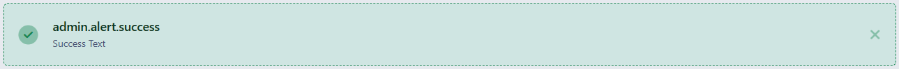
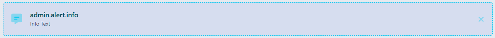
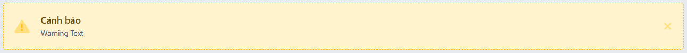
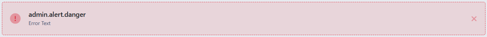

# Alert
Hiển thị thông báo cảnh báo cần chú ý, Để sử dụng component alert bạn sử dụng

```php
Admin::alert($template, $message, $attributes)
```

Các loại template button
- success

```php
echo Admin::alert('success', 'Đây là nội dung thông báo');
```

- info

```php
echo Admin::alert('info', 'Đây là nội dung thông báo');
```

- warning

```php
echo Admin::alert('warning', 'Đây là nội dung thông báo');
```

- error

```php
echo Admin::alert('error', 'Đây là nội dung thông báo');
```
Danh sách attributes:

| Key     |  Type  |        Description |
|---------|:------:|-------------------:|
| icon    | string | icon của thông báo |
| heading | string |  tiêu đề thông báo |

```php
echo Admin::alert('warning', 'Đây là nội dung thông báo', [
    'heading' => 'Header'
]);
```