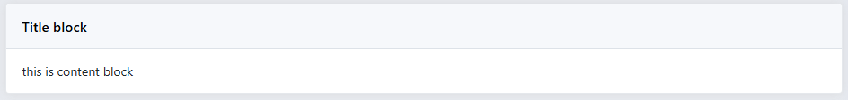

# Block
Tạo một component block cho website

```php
$block = \Admin\Component::block();
$block->wrapper([
    'id' => '',
    'class' => [],
    'mb' => 3
]);
```
Cấu hình thẻ bao ngoài cùng block

```php
$block->wrapper([
    'id' => '',
    'class' => [],
    'mb' => 3
]);
```

Cấu hình tiêu đề

```php
$block->header($text, [
    'id'    => '',
    'class' => [],
    'html'  => ''
]);
```
- html : nếu html không trống sẽ là nội dung của header block, bạn có thể truyền vào là string hoặc Closure

Cấu hình tiêu đề

```php
$block->content([
    'id'    => '',
    'class' => [],
    'html'  => ''
]);
```
- html : nếu html không trống sẽ là nội dung của header block, bạn có thể truyền vào là string, Closure hoặc \Skilldo\Form\Form

Ví dụ:
```php
$block = \Admin\Component::block();
$block->wrapper(['class' => ['class_test']])->header('Title block')->open();
//nội dung html <p>This is content block</p>
$block->close();
```
Hoặc

```php
$block = \Admin\Component::block();
$block
    ->wrapper(['class' => ['class_test']])
    ->header('Title block')
    ->content(['html' => '<p>This is content block</p>'])
    ->open();
$block->close();
```

Hoặc

```php
\Admin\Component::block()->wrapper(['class' => ['class_test']])
    ->header('Title block')
    ->content(['html' => '<p>This is content block</p>'])
    ->open();
\Admin\Component::block()->close();
```

