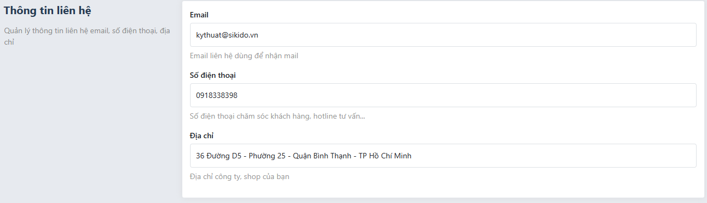

# Hệ thống
Admin > Hệ thống


### Thêm group hệ thống

Để thêm một nhóm system vào hệ thống bạn dùng hook `admin_system_groups`

```php
function systemGroup($group)
{
    $group['system_group_key'] = [
        'label' => 'system group name',
    ];
    
    return $group;
}

add_filter('admin_system_groups', 'systemGroup');
```

### Thêm cấu hình hệ thống

```php
class SystemCustom
{
    static function register($tabs)
    {
        $tabs['system_element_id'] = [
            'label' => 'system_name', //Tên cấu hình
            'group' => 'system_key_group', // group muốn thêm cấu hình nếu không điền sẽ tự động thêm vào group "chung"
            'description' => 'system_description', // mô tả cấu hình
            'callback' => 'SystemCustom::render', // callback hiển thị chi tiết cấu hình
            'icon' => '' //icon,
            'form' => true,
        ];
        return $tabs;
    }

    static function render(\SkillDo\Http\Request $request, $tab): void
    {
        $form = form();
        
        Admin::view('system/views/default', [
            'title' => '',
            'description' => '',
            'form' => $form
        ]);
    }

    static function save(\SkillDo\Http\Request $request)
    {
    }
}

add_filter('skd_system_tab', 'SystemCustom::register', 50);
add_filter('admin_system_${system_element_id}_save', 'SystemCustom::save', 10, 2);
```

Theo mặc định ở trang chi tiết cấu hình sẽ có một form bao lại phần render của system vừa đăng ký để khi click submit form sẽ
gửi data về hook `admin_system_${system_element_id}_save` và chạy method `save` vừa đăng ký, nếu bạn muốn tắt form này thì 
thêm thuộc tính `form` bằng false vào

### Components default
Admin cung cấp một component mặc định cho phàn hệ thống
```php
Admin::view('system/views/default', [
    'title' => '', //Tiêu đề
    'description' => '', //mô tả
    'form' => $form // form có thể là một SkillDo\Form\Form hoặc content html
]);
```

Components hiển thị như sau

