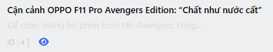

# Table Builder

### Khởi tạo table
Để khởi tạo một table bạn tạo một class kế thừa từ `SKDObjectTable`
```php
class DemoTable extends SKDObjectTable
{
    protected string $module = 'demo'; //Tên module

    protected mixed $model = SkillDo\Model\Demo::class; //class model

    protected bool $trash = false; //Model có sử dụng softDelete hay không, mặc định false
    
    function getColumns()
    {
        return $this->_column_headers;
    }
    
    function actionButton($item, $module, $table): array
    {
        return [];
    }
    
    function headerFilter(Form $form, Request $request)
    {
        return $form;
    }

    function headerSearch(Form $form, Request $request): Form
    {
        return $form;
    }
    
    function headerButton() {
        $buttons = [];
        return $buttons;
    }
    
    public function queryFilter(Qr $query, \SkillDo\Http\Request $request): Qr
    {
        return $query;
    }

    public function queryDisplay(Qr $query, \SkillDo\Http\Request $request, $data = []): Qr
    {
        $query = parent::queryDisplay($query, $request, $data);

        return $query;
    }
    
    public function dataDisplay($objects)
    {
        return $objects;
    }
}
```

- `getColumns` chứa header table và nội dung của column
- `actionButton` trả về danh sách button ở ô action
- `headerSearch` trả về form tìm kiếm hiển thị
- `headerFilter` trả về form tìm kiếm ẩn
- `headerButton` trả về danh sách button của table
- `queryFilter` xử lý query lọc dữ liệu (các điều kiện where, whereIn...)
- `queryDisplay` xử lý query hiển thị dữ liệu (order, limit...)
- `dataDisplay` xử lý data hiển thị

### Header & Column
Khởi tạo một column
```php
function getColumns()
{
    $this->_column_headers = [
        'cb'        => 'cb',
        'title'     => [
            'label'  => trans('admin.table.title'),
            'column' => fn ($item, $args) => ColumnText::make('title', $item, $args)->title()->description(fn ($item): string => $item->excerpt),
        ],
        'order' => [
            'label'  => trans('admin.table.order'),
            'column' => fn ($item, $args) => ColumnEdit::make('order', $item, $args),
        ];
    ];

    return $this->_column_headers;
}

```
### Column Text
Column Text hiển thị văn bản đơn giản từ cơ sở dữ liệu của bạn

```php
ColumnText::make('title', $item, $args)
```
#### `#` Column Text Title
Column Text kiểu title hiển thị id và slug url
```php
ColumnText::make('title', $item, $args)->title()->description(fn ($item): string => $item->excerpt)
```


#### `#` Column Text number
Phương thức `number()` cho phép bạn định dạng một mục nhập dưới dạng số:
```php
ColumnText::make('price', $item, $args)->number()
```

#### `#` Column Text datetime
Phương thức `datetime()` cho phép bạn định dạng một mục nhập dưới dạng thời gian:

```php
ColumnText::make('created', $item, $args)->datetime('d/m/Y')
```

#### `#` Column Text description
Phương thức `description()` thêm mô tả cho nội dung column:

```php
ColumnText::make('created', $item, $args)->datetime('d/m/Y')->description(fn ($item): string => $item->excerpt)
```
### Column Badge
Table hỗ trợ hiển thị các trạng thái, trong đó bạn có thể muốn hiển thị huy hiệu có màu phù hợp với trạng thái:
Hiện tại cms hỗ trợ các loại màu:
- gray
- red (hoặc error)
- pink
- yellow
- orange (hoặc warning)
- cyan
- green (hoặc success)
- lime
- blue (hoặc info)
- purple
- geekblue

```php
ColumnBadge::make('status', $item, $args)
    ->color(fn (string $state): string => match ($state) {
        'pending'   => 'warning',
        'published' => 'success',
        'block'     => 'error',
    })
    ->label(fn (string $state): string => match ($state) {
        'pending'   => 'Đợi duyệt',
        'published' => 'Đã duyệt',
        'block'     => 'Hủy',
    })
```

### Column Checkbox

```php
ColumnCheckbox::make('public', $item, $args)
```

### Column Image
Hình ảnh có thể được hiển thị dễ dàng trong bảng của bạn:
```php
ColumnImage::make('image', $item, $args)
```

#### `#`Tùy chỉnh kích thước
Bạn có thể tùy chỉnh kích thước hình ảnh bằng `width()` và `height()` hoặc cả hai với `size()`:
```php
ColumnImage::make('image', $item, $args)->width(200)

ColumnImage::make('image', $item, $args)->height(200)

ColumnImage::make('image', $item, $args)->size(40)
```

#### `#`Hình ảnh tròn
Bạn có thể làm cho hình ảnh được làm tròn hoàn toàn, điều này rất hữu ích cho việc hiển thị hình đại diện:
```php
ColumnImage::make('image', $item, $args)->circular()
```

### Column tùy chỉnh
#### `#`View tùy chỉnh
Bạn có thể hiển thị chế độ xem tùy chỉnh cho một ô bằng phương thức `html()`
```php
ColumnView::make('image', $item, $args)->html(function(ColumnView $column) {
    //view custom
})
```

#### `#`Classes tùy chỉnh
Bạn có thể tạo các lớp cột tùy chỉnh và chế độ xem ô của riêng mình để bạn có thể sử dụng lại trong dự án của mình và thậm chí phát hành dưới dạng plugin cho cộng đồng.
>
Tạo thư mục sau trong theme hoặc plugin của bạn
```php
core/Table/Columns
```

Tạo class column của bạn kế thừa lại class `SKDColumn` của cms

```php
namespace SkillDo\Table\Columns;

use SkillDo\Table\SKDColumn;

class ColumnCustom extends SKDColumn {

    public function view(): void
    {
        //nội dung column
    }
}
```

Nếu ở chế độ DEBUG = false bạn cần xóa cache `core_files_loader` để cập nhật lại danh sách columns

```php
CacheHandler::delete('core_files_loader')
```

Sau đó bạn có thể sử dụng column mới

```php
ColumnCustom::make('name', $item, $args);
```

### Table child


Để khởi tạo table child bạn set giá trị cho biến `tableChild` là một object `SKDObjectTable`
```php
class DemoTable extends SKDObjectTable
{
    public function __construct($args = [])
    {
        parent::__construct($args);

        $this->tableChild = new InventoriesChild();
    }
}
```