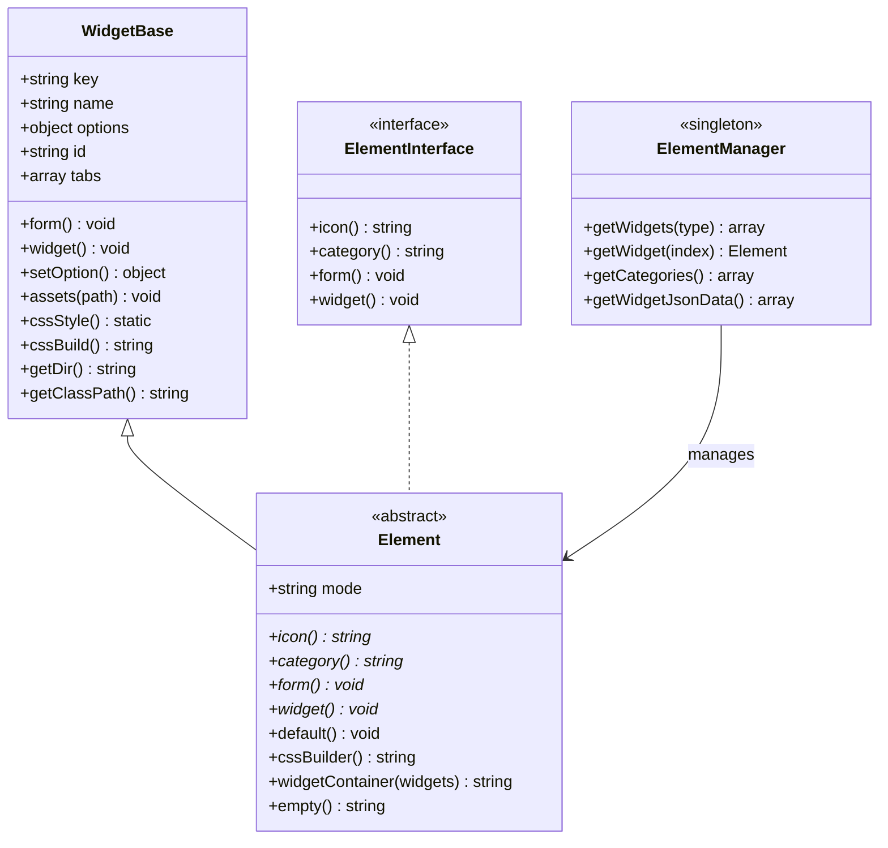
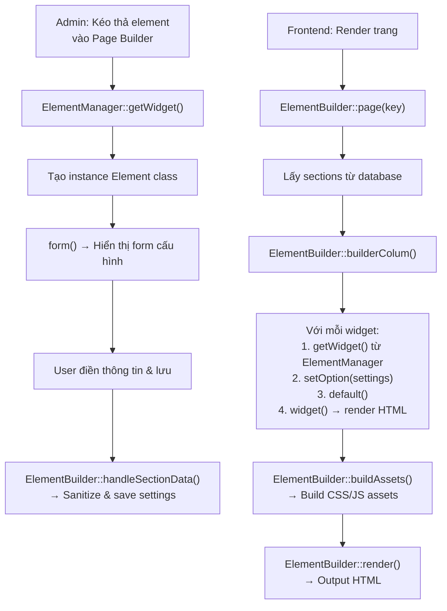

# Widget Element (Builder)

## 1. Tổng Quan Kiến Trúc

### 1.1 Hệ thống phân cấp Class



### 1.2 Ba loại Element trong Builder

| Loại | Vị trí trong widget.json | Sử dụng |
|---|---|---|
| **Header Elements** | `elements.header` | Chỉ dùng trong Header Builder |
| **Footer Elements** | `elements.footer` | Chỉ dùng trong Footer Builder |
| **General Elements** | `elements.general` | Dùng được trong cả Header, Footer và Home/Page Builder |

### 1.3 Các Category mặc định

| Key | Tên hiển thị | Mô tả |
|---|---|---|
| `layout` | Bố cục | Container, Inner Section |
| `basic` | Cơ bản | Heading, Image, Text, Video, Button |
| `general` | Chung | Elements chung |
| header | Header | Logo, Cart, Search |
| `heading` | Tiêu đề | Các kiểu heading |
| footer | Footer | Footer blocks |
| `ecommerce` | Thương mại điện tử | Products, Cart |

---

## 2. Cấu Trúc Thư Mục

### 2.1 Cấu trúc chuẩn cho một Element

```
views/theme-store/widget/elements/{element-name}/
├── {element-name}.widget.php       # Class chính (extends Element)
├── views/
│   └── view.blade.php              # Template hiển thị
└── assets/                         # (Tùy chọn) CSS/LESS/JS riêng
    ├── {element-name}.css
    ├── {element-name}.less
    └── {element-name}.js
```

### 2.2 Ví dụ thực tế

```
widget/elements/video/
├── video.widget.php                # VideoWidgetElement class
├── views/
│   └── view.blade.php
└── assets/
    ├── video-widget.less
    ├── video-widget.css
    └── video-widget.css.map
```

---

## 3. Tạo Element Cơ Bản (Step-by-step)

### Bước 1: Tạo file Widget Class

Tạo file `views/theme-store/widget/elements/my-element/my-element.widget.php`:

```php
<?php

use SkillDo\Cms\Element\Element;
use SkillDo\Cms\Support\Theme;

class MyElementWidget extends Element
{
    function __construct()
    {
        // Tham số 1: Key duy nhất (tên class)
        // Tham số 2: Tên hiển thị trong admin
        parent::__construct('MyElementWidget', 'Tên Element');
    }

    /**
     * Icon hiển thị trong danh sách elements
     * Trả về key trong danh sách icons đã đăng ký (ElementManager::getIcon)
     * Các key có sẵn: heading, image, text-editor, video, button, 
     *                  icon, icon-box, divider, counter, tabs, 
     *                  accordion, form, nav-menu, google-maps, ...
     */
    public function icon(): string
    {
        return 'icon-box';
    }

    /**
     * Category để nhóm element trong sidebar admin
     * Các category có sẵn: layout, basic, general, header, 
     *                       heading, footer, ecommerce
     */
    public function category(): string
    {
        return 'basic';
    }

    /**
     * Khai báo form cấu hình cho element trong admin
     */
    public function form(): void
    {
        // Thêm fields vào tab "Nội dung" (generate)
        $this->tabs('generate')->adds(function (\SkillDo\Cms\Form\Form $form)
        {
            $form->text('title', ['label' => 'Tiêu đề']);
            $form->wysiwyg('content', ['label' => 'Nội dung']);
        });

        // QUAN TRỌNG: Luôn gọi parent::form() ở cuối
        parent::form();
    }

    /**
     * Render HTML đầu ra cho element
     */
    public function widget(): void
    {
        Theme::view($this->getDir().'/views/view', [
            'id'      => $this->id,
            'options' => $this->options,
        ]);
    }

    /**
     * (Tùy chọn) Thiết lập giá trị mặc định
     */
    public function default(): void
    {
        $this->options->title   = $this->options->title ?? 'Tiêu đề mặc định';
        $this->options->content = $this->options->content ?? 'Nội dung mặc định...';
    }
}
```

### Bước 2: Tạo View Template

Tạo file `views/theme-store/widget/elements/my-element/views/view.blade.php`:

```blade
<div class="my-element-widget">
    @if(!empty($options->title))
        <h3 class="title">{!! $options->title !!}</h3>
    @endif

    @if(!empty($options->content))
        <div class="content">{!! $options->content !!}</div>
    @endif
</div>
```

### Bước 3: Đăng ký Element trong widget.json

Mở file **views/theme-store/widget/widget.json** và thêm vào mục `elements`:

```json
{
    "elements": {
        "general": {
            "MyElementWidget": {
                "path": "widget/elements/my-element/my-element.widget.php"
            }
        }
    }
}
```

> [!IMPORTANT]
> **Key trong JSON** (`"MyElementWidget"`) phải **trùng khớp chính xác** với tên class PHP. Hệ thống sử dụng key này để tìm và khởi tạo class.

> [!NOTE]
> - Đăng ký trong `elements.header` → chỉ dùng trong Header Builder
> - Đăng ký trong `elements.footer` → chỉ dùng trong Footer Builder  
> - Đăng ký trong `elements.general` → dùng được **ở mọi builder** (header, footer, home, page)

---

## 4. Hệ Thống Form — Khai Báo Fields

### 4.1 Cấu trúc Tab

Mỗi Element có **3 tab mặc định**:

| Tab | Key | Mục đích |
|---|---|---|
| ✏️ **Nội dung** | `generate` | Dữ liệu chính (text, image, select...) |
| 🎨 **Kiểu dáng** | `style` | Tùy chỉnh giao diện (màu sắc, font, border...) |
| ⚙️ **Nâng cao** | `advanced` | Spacing, Motion Effects (tự động thêm bởi Element) |

### 4.2 Thêm fields vào tab

```php
public function form(): void
{
    // Tab "Nội dung"
    $this->tabs('generate')->adds(function (\SkillDo\Cms\Form\Form $form)
    {
        // Các field input sẽ được thêm ở đây
    });

    // Tab "Kiểu dáng"
    $this->tabs('style')->adds(function (\SkillDo\Cms\Form\Form $form)
    {
        // Các field style sẽ được thêm ở đây
    });

    parent::form();
}
```

### 4.3 Các loại field phổ biến

#### Text & Content

```php
// Text input đơn giản
$form->text('field_name', ['label' => 'Label hiển thị']);

// Text hỗ trợ đa ngôn ngữ
$form->text('field_name', ['label' => 'Label', 'language' => true]);

// WYSIWYG Editor (TinyMCE)
$form->wysiwyg('content', ['label' => 'Nội dung']);

// Textarea
$form->textarea('description', ['label' => 'Mô tả']);

// Number input
$form->number('count', ['value' => 5, 'label' => 'Số lượng', 'start' => 6]);
```

#### Media

```php
// Image picker
$form->image('image', ['label' => 'Chọn ảnh']);

// File upload
$form->file('document', ['label' => 'Tải file']);
```

#### Selection

```php
// Select dropdown
$form->select('position', [
    'label' => 'Vị trí',
    'value' => 'left'     // Giá trị mặc định
])->options([
    'left'   => 'Trái',
    'center' => 'Giữa',
    'right'  => 'Phải',
]);

// Switch (bật/tắt)
$form->switch('show_title', ['label' => 'Hiển thị tiêu đề', 'value' => true]);
```

#### Style Builder Fields

```php
// Box building (border, border-radius, box-shadow)
$form->boxBuilding('boxStyle', [
    'customInput' => [
        'background' => false,
        'hover'      => false,
    ]
])->popup(false);

// Text building (font-size, font-weight, color, line-height...)
$form->textBuilding('titleStyle', [
    'label' => 'Style tiêu đề'
])->popup(false);

// Button building (background, padding, border, hover...)
$form->buttonBuilding('buttonStyle', [
    'label' => 'Style nút bấm'
]);

// Spacing (margin, padding) — đã tự động thêm trong tab Advanced
$form->spacing('spacing', ['label' => 'Khoảng cách', 'start' => 12]);

// Scroll/Motion Effects — đã tự động thêm trong tab Advanced
$form->scrollEffects('scroll_effects', ['label' => 'Motion Effects', 'popup' => true], []);
```

### 4.4 Nhóm Fields (Group)

Sử dụng `addGroup()` + groupFormBox() để tạo các nhóm có thể collapse:

```php
$this->tabs('style')->adds(function (\SkillDo\Cms\Form\Form $form)
{
    // Nhóm "Ảnh" - mở sẵn (active = true)
    $form->addGroup(function (\SkillDo\Cms\Form\Form $form)
    {
        $form->boxBuilding('imageBox', [
            'customInput' => ['background' => false, 'hover' => false]
        ])->popup(false);

    }, $this->groupFormBox('Ảnh', 'imageGroup', true));

    // Nhóm "Tiêu đề" - đóng mặc định
    $form->addGroup(function (\SkillDo\Cms\Form\Form $form)
    {
        $form->textBuilding('titleText', [
            'label' => 'Style tiêu đề'
        ])->popup(false);

    }, $this->groupFormBox('Tiêu đề', 'titleGroup'));
});
```

### 4.5 Thêm Tab tùy chỉnh

```php
// Thêm tab mới sau tab 'generate'
$customTab = $this->addTab(
    'custom_tab',                              // ID
    'Tab tùy chỉnh',                           // Tên hiển thị
    '<i class="fa-thin fa-star"></i>',          // Icon
    ['after' => 'generate']                    // Vị trí (sau tab nào)
);

// Thêm fields vào tab mới
$customTab->adds(function (\SkillDo\Cms\Form\Form $form) {
    $form->text('custom_field', ['label' => 'Field tùy chỉnh']);
});
```

---

## 5. CSS Builder — Tùy Chỉnh Giao Diện (cssSelector)

### 5.1 Tổng quan

Sử dụng cssSelector() để tạo CSS động dựa trên dữ liệu từ các style builder fields. Method này **tự động xử lý responsive** (desktop/tablet/mobile) và **hover/active states** — không cần khai báo device mapping thủ công.

> [!WARNING]
> **Không sử dụng cssStyle()** — đây là API cũ, yêu cầu khai báo `options => ['desktop' => 'css', 'tablet' => 'cssTablet', ...]` thủ công. Hãy dùng cssSelector() cho tất cả element mới.

### 5.2 Cú pháp cssSelector

```php
$this->cssSelector($selectors, ...$properties)
```

**Tham số:**
- `$selectors` — CSS selector (string hoặc array)
- `...$properties` — Một hoặc nhiều mảng `['data' => ..., 'style' => ...]`

### 5.3 Các cách truyền Selectors

#### Cách 1: String selector (đơn giản nhất)

Hệ thống tự sinh `normal` + `hover` (thêm `:hover`) + `active` (thêm `.active`):

```php
// Tự động áp dụng cho:
//   normal: .item
//   hover:  .item:hover
//   active: .item.active
$this->cssSelector('.item', [
    'data'  => $this->options->boxStyle ?? [],
    'style' => 'box',
]);
```

#### Cách 2: Array selector (tùy chỉnh hover target)

Dùng khi hover selector khác với normal selector:

```php
// normal: .item .title .header
// hover:  .item:hover .title .header (tự thêm :hover vào hover selector)
$this->cssSelector([
    'normal' => '.item .title .header',
    'hover'  => '.item:hover .title .header',
], [
    'data'  => $this->options->titleStyle ?? [],
    'style' => 'text',
]);
```

> [!TIP]
> Pattern phổ biến: hover ở phần tử cha (`.item:hover`) nhưng style thay đổi ở phần tử con (`.title .header`). Đây là lý do cần array selector.

#### Cách 3: Nhiều properties trên cùng selector

Truyền nhiều `['data' => ..., 'style' => ...]` dưới dạng **variadic arguments**:

```php
$this->cssSelector('.tab-button',
    [
        'data'  => $this->options->tabButtonBg ?? [],
        'style' => 'background',
    ],
    [
        'data'  => $this->options->tabButtonBorder ?? [],
        'style' => 'border',
    ],
    [
        'data'  => $this->options->tabButtonShadow ?? [],
        'style' => 'boxShadow',
    ],
    [
        'data'  => $this->options->tabButtonTxt ?? [],
        'style' => 'text',
    ],
    [
        'data'  => $this->options->tabSpacing ?? [],
        'style' => 'spacing',
    ]
);
```

### 5.4 Các Style Type

| Style Type | Mô tả | Dùng với field |
|---|---|---|
| `text` | Font-size, font-weight, color, text-align, line-height, letter-spacing | `textBuilding()` |
| `box` | Border, border-radius, box-shadow, background, padding | `boxBuilding()` |
| `background` | Background-color, background-image, gradient | `background()` |
| `border` | Border-width, border-style, border-color, border-radius | `border()` |
| `boxShadow` | Box-shadow | `boxShadow()` |
| `spacing` | Margin, padding | `spacing()` |
| `color` | Color property | `color()` |

> [!NOTE]
> Bạn có thể viết `'style' => 'text'` hoặc `'style' => 'cssText'` — hệ thống tự động thêm prefix css + `ucfirst` nếu chưa có.

### 5.5 Ví dụ đầy đủ cssBuilder()

```php
public function cssBuilder(): string
{
    // 1. CSS Variables
    $this->cssVariables('--img-ration', '56.25%');
    $this->cssVariables('--item-number', $this->options->desktopNumberShow);

    // 2. Box style cho container
    $this->cssSelector('.item', [
        'data'  => $this->options->boxStyle ?? [],
        'style' => 'box',
    ]);

    // 3. Border cho ảnh
    $this->cssSelector('.item .img', [
        'data'  => $this->options->imageBorder ?? [],
        'style' => 'border',
    ]);

    // 4. Text style với hover (hover ở parent, style ở child)
    $this->cssSelector([
        'normal' => '.item .title .header',
        'hover'  => '.item:hover .title .header',
    ], [
        'data'  => $this->options->titleStyle ?? [],
        'style' => 'text',
    ]);

    // 5. Nhiều properties cùng lúc
    $this->cssSelector('.wrapper',
        [
            'data'  => $this->options->wrapperBg ?? [],
            'style' => 'background',
        ],
        [
            'data'  => $this->options->wrapperBorder ?? [],
            'style' => 'border',
        ]
    );

    // QUAN TRỌNG: Luôn return cssBuild() ở cuối
    return $this->cssBuild();
}
```

### 5.6 So sánh cssStyle (cũ) vs cssSelector (mới)

| | cssStyle ❌ (cũ) | cssSelector ✅ (mới) |
|---|---|---|
| **Device mapping** | Phải khai báo thủ công: `'options' => ['desktop' => 'css', 'tablet' => 'cssTablet', 'mobile' => 'cssMobile']` | Tự động xử lý 3 devices |
| **Hover** | Phải khai báo `'hover' => 'cssHover'` hoặc tạo selector riêng | Tự động từ selectors array |
| **Active state** | Không hỗ trợ trực tiếp | Tự động sinh `.active` selector |
| **Nhiều properties** | Gọi nhiều lần cssStyle() | Truyền variadic args |
| **Style name** | `'style' => 'cssText'` | `'style' => 'text'` (hoặc `'cssText'`) |

### 5.7 Sử dụng CSS/LESS Assets

```php
function __construct()
{
    parent::__construct('MyElementWidget', 'Tên Element');

    // Đăng ký LESS file (tự compile sang CSS)
    $this->assets('assets/my-element.less');

    // Hoặc CSS file
    $this->assets('assets/my-element.css');

    // Hoặc JS file
    $this->assets('assets/my-element.js');
}
```

> [!TIP]
> Đường dẫn assets là **tương đối** so với thư mục widget element. Ví dụ nếu widget ở `widget/elements/my-element/` thì `assets/style.less` sẽ trỏ tới `widget/elements/my-element/assets/style.less`.

---

## 6. Ví Dụ Đầy Đủ — Element "Alert Box"

### 6.1 Cấu trúc thư mục

```
widget/elements/alert-box/
├── alert-box.widget.php
├── views/
│   └── view.blade.php
└── assets/
    └── alert-box.less
```

### 6.2 File Widget Class

```php
<?php
// File: views/theme-store/widget/elements/alert-box/alert-box.widget.php

use SkillDo\Cms\Element\Element;
use SkillDo\Cms\Support\Theme;

class AlertBoxWidgetElement extends Element
{
    function __construct()
    {
        parent::__construct('AlertBoxWidgetElement', 'Alert Box');
        $this->assets('assets/alert-box.less');
    }

    public function icon(): string
    {
        return 'toggle'; // Sử dụng icon có sẵn
    }

    public function category(): string
    {
        return 'basic';
    }

    public function form(): void
    {
        // ========== TAB NỘI DUNG ==========
        $this->tabs('generate')->adds(function (\SkillDo\Cms\Form\Form $form)
        {
            $form->select('type', [
                'label' => 'Loại thông báo',
                'value' => 'info'
            ])->options([
                'info'    => 'Thông tin',
                'success' => 'Thành công',
                'warning' => 'Cảnh báo',
                'danger'  => 'Lỗi',
            ]);

            $form->text('title', [
                'label'    => 'Tiêu đề',
                'language' => true
            ]);

            $form->wysiwyg('content', ['label' => 'Nội dung']);

            $form->image('icon_image', ['label' => 'Icon tùy chỉnh (tùy chọn)']);

            $form->switch('dismissible', [
                'label' => 'Cho phép đóng',
                'value' => false
            ]);
        });

        // ========== TAB KIỂU DÁNG ==========
        $this->tabs('style')->adds(function (\SkillDo\Cms\Form\Form $form)
        {
            $form->addGroup(function (\SkillDo\Cms\Form\Form $form)
            {
                $form->textBuilding('titleStyle', [
                    'label' => 'Style tiêu đề'
                ])->popup(false);
            }, $this->groupFormBox('Tiêu đề', 'titleStyleGroup', true));

            $form->addGroup(function (\SkillDo\Cms\Form\Form $form)
            {
                $form->textBuilding('contentStyle', [
                    'label' => 'Style nội dung'
                ])->popup(false);
            }, $this->groupFormBox('Nội dung', 'contentStyleGroup'));

            $form->addGroup(function (\SkillDo\Cms\Form\Form $form)
            {
                $form->boxBuilding('containerBox', [
                    'customInput' => [
                        'background' => true,
                        'hover'      => false,
                    ]
                ])->popup(false);
            }, $this->groupFormBox('Container', 'containerGroup'));
        });

        parent::form();
    }

    public function widget(): void
    {
        Theme::view($this->getDir().'/views/view', [
            'id'      => $this->id,
            'options' => $this->options,
        ]);
    }

    public function cssBuilder(): string
    {
        // CSS cho tiêu đề (text style)
        $this->cssSelector('.alert-title', [
            'data'  => $this->options->titleStyle ?? [],
            'style' => 'text',
        ]);

        // CSS cho nội dung (text style)
        $this->cssSelector('.alert-content', [
            'data'  => $this->options->contentStyle ?? [],
            'style' => 'text',
        ]);

        // CSS cho container (box + background cùng lúc)
        $this->cssSelector('.alert-box',
            [
                'data'  => $this->options->containerBox ?? [],
                'style' => 'box',
            ]
        );

        return $this->cssBuild();
    }

    public function default(): void
    {
        $this->options->type        = $this->options->type ?? 'info';
        $this->options->title       = $this->options->title ?? 'Tiêu đề thông báo';
        $this->options->content     = $this->options->content ?? 'Đây là nội dung thông báo mẫu.';
        $this->options->dismissible = $this->options->dismissible ?? false;
    }
}
```

### 6.3 File Blade View

```blade
{{-- File: views/theme-store/widget/elements/alert-box/views/view.blade.php --}}

@php
    $typeClass = match($options->type ?? 'info') {
        'success' => 'alert-success',
        'warning' => 'alert-warning',
        'danger'  => 'alert-danger',
        default   => 'alert-info',
    };
@endphp

<div class="alert-box {{ $typeClass }}" role="alert">
    @if(!empty($options->icon_image))
        <div class="alert-icon">
            icon_image) }}" alt="{{ $options->title ?? '' }}">
        </div>
    @endif

    <div class="alert-body">
        @if(!empty($options->title))
            <div class="alert-title">{!! $options->title !!}</div>
        @endif

        @if(!empty($options->content))
            <div class="alert-content">{!! $options->content !!}</div>
        @endif
    </div>

    @if(!empty($options->dismissible))
        <button type="button" class="alert-close" aria-label="Close">
            <i class="fa-solid fa-xmark"></i>
        </button>
    @endif
</div>
```

### 6.4 File LESS

```less
// File: views/theme-store/widget/elements/alert-box/assets/alert-box.less

.alert-box {
    display: flex;
    align-items: flex-start;
    gap: 12px;
    padding: 16px 20px;
    border-radius: 8px;
    position: relative;

    &.alert-info {
        background: #e8f4fd;
        border-left: 4px solid #2196f3;
    }
    &.alert-success {
        background: #e8f5e9;
        border-left: 4px solid #4caf50;
    }
    &.alert-warning {
        background: #fff8e1;
        border-left: 4px solid #ff9800;
    }
    &.alert-danger {
        background: #fde8e8;
        border-left: 4px solid #f44336;
    }

    .alert-icon {
        flex-shrink: 0;
        width: 32px;
        height: 32px;

        img {
            width: 100%;
            height: 100%;
            object-fit: contain;
        }
    }

    .alert-body {
        flex: 1;
    }

    .alert-title {
        font-weight: 600;
        font-size: 16px;
        margin-bottom: 4px;
    }

    .alert-content {
        font-size: 14px;
        line-height: 1.5;
    }

    .alert-close {
        background: none;
        border: none;
        cursor: pointer;
        opacity: 0.5;
        transition: opacity 0.2s;

        &:hover {
            opacity: 1;
        }
    }
}
```

### 6.5 Đăng ký trong widget.json

```json
{
    "elements": {
        "general": {
            "AlertBoxWidgetElement": {
                "path": "widget/elements/alert-box/alert-box.widget.php"
            }
        }
    }
}
```

---

## 7. Tính Năng Nâng Cao

### 7.1 Element với AJAX callback

Dùng cho elements cần load dữ liệu động (ví dụ: danh sách sản phẩm):

```json
// widget.json
{
    "elements": {
        "general": {
            "ProductsWidgetElementStyle1": {
                "path": "widget/elements/products/style1/products-style1.widget.php",
                "ajax": {
                    "client": "ProductsWidgetElementStyle1::loadProduct"
                }
            }
        }
    }
}
```

### 7.2 Element chứa Widget con (Widget Container)

Element có thể chứa các widget con bên trong bằng widgetContainer():

```php
public function widget(): void
{
    $html = '';

    // Render các widget con từ options->container
    if (!empty($this->options->container))
    {
        $html = $this->widgetContainer($this->options->container);
    }

    echo '<div class="my-container">' . $html . '</div>';
}
```

### 7.3 Filter Hooks

Hệ thống cung cấp hooks trước khi lưu widget settings:

```php
// Hook chung cho tất cả widgets
apply_filters('before_widget_save', $settings);

// Hook riêng cho widget cụ thể
apply_filters('wg_before_MyElementWidget_save', $settings);
```

### 7.4 Element với Scroll Effects

Tab Advanced đã tự động thêm `spacing` và `scrollEffects`. Hệ thống tự động:
1. Build `data-scroll-effects` attribute trên wrapper div
2. Xử lý CSS spacing responsive (desktop/tablet/mobile)

Các loại scroll effects hỗ trợ:
- `vertical` — Di chuyển dọc
- `horizontal` — Di chuyển ngang
- `rotate` — Xoay
- `scale` — Phóng to/thu nhỏ
- `opacity` — Mờ dần
- `blur` — Làm mờ

---

## 8. Luồng Xử Lý (Request Flow)



---

## 9. Checklist Tạo Element Mới

- [ ] **Tạo thư mục** theo cấu trúc: `widget/elements/{name}/`
- [ ] **Tạo class** extends Element, implement 4 methods bắt buộc:
  - [ ] icon() — trả về icon key
  - [ ] category() — trả về category key
  - [ ] form() — khai báo form fields + gọi `parent::form()`
  - [ ] widget() — render HTML output
- [ ] **Tạo Blade view** trong views/view.blade.php
- [ ] **(Tùy chọn)** Tạo CSS/LESS trong assets/
- [ ] **(Tùy chọn)** Override default() cho giá trị mặc định
- [ ] **(Tùy chọn)** Override cssBuilder() cho CSS động
- [ ] **Đăng ký** trong widget.json với key = tên class
- [ ] **Kiểm tra** trong Admin → Builder

> [!WARNING]
> **Key trong widget.json** phải **giống hệt** tên class PHP. Nếu class là `AlertBoxWidgetElement` thì key phải là `"AlertBoxWidgetElement"`, không phải `"alert_box_widget_element"` hay bất kỳ biến thể nào khác.

> [!CAUTION]
> Luôn gọi `parent::form()` ở **cuối** method form(). Nếu không, các field mặc định trong tab Advanced (spacing, scroll effects) sẽ không hoạt động đúng.