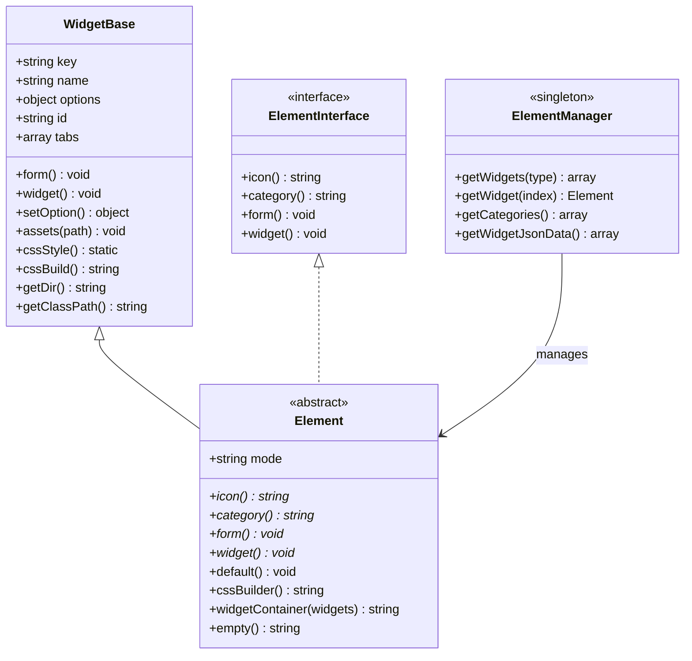
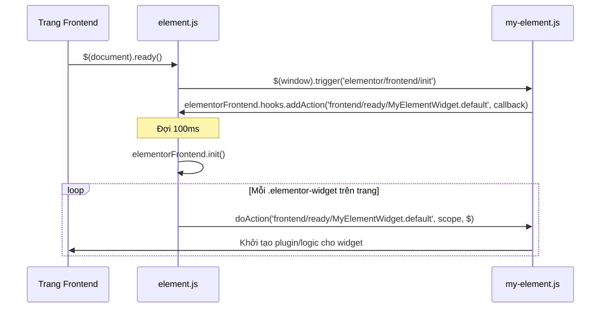
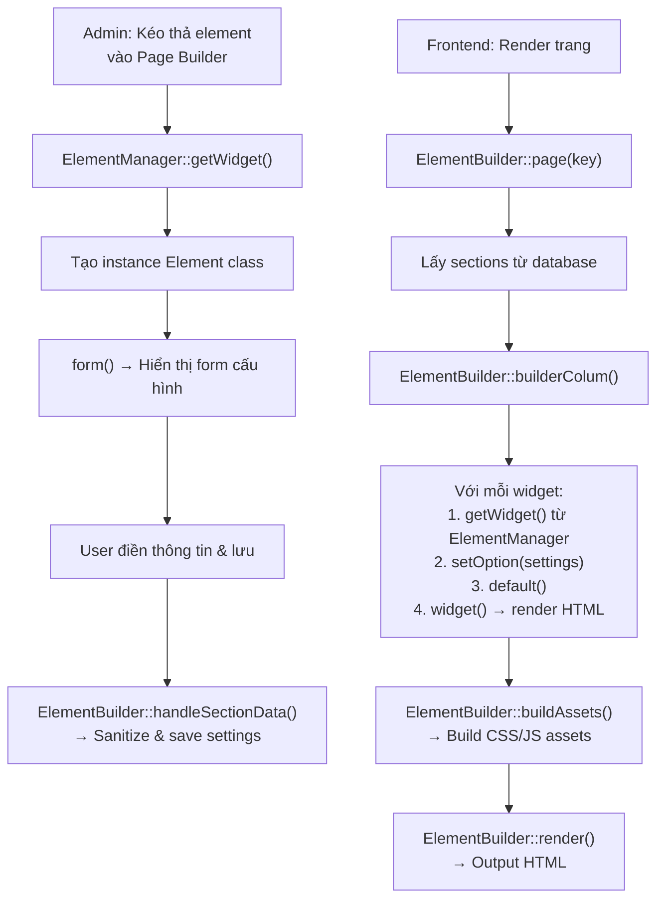

# Widget Element

Element là thành phần cơ bản nhất trong hệ thống Page Builder, đại diện cho một block nội dung có thể cấu hình và tái sử dụng. Mỗi Element được định nghĩa bởi một class PHP, cung cấp form cấu hình trong admin và render HTML trên frontend.

## 1. Tổng Quan Kiến Trúc

### 1.1 Hệ thống phân cấp Class


```mermaid
classDiagram
    class WidgetBase {
        +string key
        +string name
        +object options
        +string id
        +array tabs
        +form() void
        +widget() void
        +setOption() object
        +assets(path) void
        +cssStyle() static
        +cssBuild() string
        +getDir() string
        +getClassPath() string
    }

    class Element {
        <<abstract>>
        +string mode
        +icon() string*
        +category() string*
        +form() void*
        +widget() void*
        +default() void
        +cssBuilder() string
        +widgetContainer(widgets) string
        +empty() string
    }

    class ElementInterface {
        <<interface>>
        +icon() string
        +category() string
        +form() void
        +widget() void
    }

    class ElementManager {
        <<singleton>>
        +getWidgets(type) array
        +getWidget(index) Element
        +getCategories() array
        +getWidgetJsonData() array
    }

    WidgetBase <|-- Element
    ElementInterface <|.. Element
    ElementManager --> Element : manages
```

### 1.2 Ba loại Element trong Builder

| Loại                 | Vị trí trong widget.json | Sử dụng                                                |
|----------------------|--------------------------|--------------------------------------------------------|
| **Header Elements**  | `elements.header`        | Chỉ dùng trong Header Builder                          |
| **Footer Elements**  | `elements.footer`        | Chỉ dùng trong Footer Builder                          |
| **General Elements** | `elements.general`       | Dùng được trong cả Header, Footer và Home/Page Builder |

### 1.3 Element Methods

Một lớp khung xương widget đơn giản sẽ trông như sau:

```php
<?php

use SkillDo\Cms\Element\Element;
use SkillDo\Cms\Support\Theme;

class MyElementWidget extends Element
{
    function __construct() {}

    public function icon(): string {}

    public function category(): string {}

    public function form(): void {}

    public function widget(): void {}

    public function default(): void {}
    
    public function cssBuilder(): string {}
}
```

## 2. Element Data

### 2.1 Id và Name

Để đặt id duy nhất cho element và tên hiển thị trong admin, bạn cần gọi hàm khởi tạo của parent trong constructor:

```php
<?php

use SkillDo\Cms\Element\Element;
use SkillDo\Cms\Support\Theme;

class MyElementWidget extends Element
{
    function __construct()
    {
        // Tham số 1: Key duy nhất (tên class)
        // Tham số 2: Tên hiển thị trong admin
        parent::__construct('MyElementWidget', 'Tên Element');
    }
}
```

### 2.2 Element Category

Danh mục Element được sử dụng để sắp xếp các element thành các nhóm. 

```php
<?php

use SkillDo\Cms\Element\Element;
use SkillDo\Cms\Support\Theme;

class MyElementWidget extends Element
{
    /**
     * Category để nhóm element trong sidebar admin
     * Các category có sẵn: layout, basic, general, header, 
     *                       heading, footer, ecommerce
     */
    public function category(): string
    {
        return 'basic';
    }
}
```
Khi Builder được khởi tạo, nó sẽ đăng ký một số danh mục mặc định.

| Key         | Tên hiển thị       | Mô tả                               |
|-------------|--------------------|-------------------------------------|
| `layout`    | Bố cục             | Container, Inner Section            |
| `basic`     | Cơ bản             | Heading, Image, Text, Video, Button |
| `general`   | Chung              | Elements chung                      |
| `header`    | Header             | Logo, Cart, Search                  |
| `heading`   | Tiêu đề            | Các kiểu heading                    |
| `footer`    | Footer             | Footer blocks                       |
| `ecommerce` | Thương mại điện tử | Products, Cart                      |

---

### 2.3 Element Icon

Mỗi Element không chỉ có tên mà còn có một biểu tượng. Các biểu tượng này được hiển thị ở các vị trí khác nhau trong Trình chỉnh sửa

```php
<?php

use SkillDo\Cms\Element\Element;
use SkillDo\Cms\Support\Theme;

class MyElementWidget extends Element
{
    /**
     * Icon hiển thị trong danh sách elements
     * Trả về key trong danh sách icons đã đăng ký (ElementManager::getIcon)
     * Các key có sẵn: heading, image, text-editor, video, button, 
     *                  icon, icon-box, divider, counter, tabs, 
     *                  accordion, form, nav-menu, google-maps, ...
     */
    public function icon(): string
    {
        return 'icon-box';
    }
}
```
Danh sách icon mặc định 

<div style={{ display: 'grid', gridTemplateColumns: 'repeat(5, 1fr)', gap: '8px', borderRadius: '8px', margin: '16px 0' }}>
<div style={{ display: 'flex', flexDirection: 'column', alignItems: 'center', gap: '6px', padding: '10px 6px', background: '#fff', borderRadius: '6px', border: '1px solid #e5e7eb' }}>
<svg style={{ width: '44px', height: '44px' }} xmlns="http://www.w3.org/2000/svg" viewBox="0 0 65.95 45"><title>Container</title><g id="Layer_2" data-name="Layer 2"><g id="Layer_1-2" data-name="Layer 1"><path d="M63,0a2.79,2.79,0,0,1,2.09.9A3,3,0,0,1,66,3v39a2.94,2.94,0,0,1-3,3H3a2.89,2.89,0,0,1-2.09-.86A2.89,2.89,0,0,1,0,42.05V3A3,3,0,0,1,.86.9,2.81,2.81,0,0,1,3,0Zm0,3H3v39H63Zm-48,3V9H9v3H6v-6ZM9,18v9H6V18Zm0,15v3h6v3H6v-6Zm21-27V9H21V6.05Zm0,30v3H21V36ZM45,6.05V9H36V6.05Zm0,30v3H36V36ZM60,6.05v6H57V9H51V6.05Zm0,27v6H51V36h6v-3Zm0-15v9H57V18Z"></path></g></g></svg>
<span style={{ fontSize: '10px', color: '#6b7280', textAlign: 'center', wordBreak: 'break-all' }}>container</span>
</div>
<div style={{ display: 'flex', flexDirection: 'column', alignItems: 'center', gap: '6px', padding: '10px 6px', background: '#fff', borderRadius: '6px', border: '1px solid #e5e7eb' }}>
<svg style={{ width: '44px', height: '44px' }} xmlns="http://www.w3.org/2000/svg" viewBox="0 0 41 27.31"><title>Asset 336</title><g id="Layer_2" data-name="Layer 2"><g id="Layer_1-2" data-name="Layer 1"><path d="M18.53.23a.74.74,0,0,1,.25.59.83.83,0,0,1-.25.62.78.78,0,0,1-.57.24H.86a.79.79,0,0,1-.61-.27A.81.81,0,0,1,0,.82.75.75,0,0,1,.25.25.81.81,0,0,1,.86,0H18A.81.81,0,0,1,18.53.23Zm0,5.12a.75.75,0,0,1,.25.59.81.81,0,0,1-.25.62.79.79,0,0,1-.57.25H.86a.79.79,0,0,1-.61-.27A.85.85,0,0,1,0,5.94a.78.78,0,0,1,.25-.57.84.84,0,0,1,.61-.24H18A.8.8,0,0,1,18.53,5.35Zm0,5.13a.74.74,0,0,1,.25.59.83.83,0,0,1-.25.62.78.78,0,0,1-.57.24H.86a.79.79,0,0,1-.61-.27A.81.81,0,0,1,0,11.07a.75.75,0,0,1,.25-.57.81.81,0,0,1,.61-.25H18A.81.81,0,0,1,18.53,10.48Zm0,5.12a.75.75,0,0,1,.25.59.81.81,0,0,1-.25.62.79.79,0,0,1-.57.25H.86a.79.79,0,0,1-.61-.27.85.85,0,0,1-.25-.6.78.78,0,0,1,.25-.57.84.84,0,0,1,.61-.24H18A.8.8,0,0,1,18.53,15.6Zm0,5.13a.74.74,0,0,1,.25.59.83.83,0,0,1-.25.62.78.78,0,0,1-.57.24H.86a.79.79,0,0,1-.61-.27A.81.81,0,0,1,0,21.32a.75.75,0,0,1,.25-.57.81.81,0,0,1,.61-.25H18A.81.81,0,0,1,18.53,20.73Zm-5.12,5.12a.78.78,0,0,1,.24.59.84.84,0,0,1-.24.62.83.83,0,0,1-.58.25H.86A.79.79,0,0,1,.25,27a.85.85,0,0,1-.25-.6.78.78,0,0,1,.25-.57.84.84,0,0,1,.61-.24h12A.84.84,0,0,1,13.41,25.85ZM22.47,1.41a.81.81,0,0,1-.25-.59.75.75,0,0,1,.25-.57A.81.81,0,0,1,23.08,0H40.14a.87.87,0,0,1,.61.23A.74.74,0,0,1,41,.82a.84.84,0,0,1-.86.86H23.08A.79.79,0,0,1,22.47,1.41ZM40.75,5.35a.75.75,0,0,1,.25.59.81.81,0,0,1-.25.62.85.85,0,0,1-.61.25H23.08a.79.79,0,0,1-.61-.27.85.85,0,0,1-.25-.6.78.78,0,0,1,.25-.57.84.84,0,0,1,.61-.24H40.14A.86.86,0,0,1,40.75,5.35Zm0,5.13a.74.74,0,0,1,.25.59.84.84,0,0,1-.86.86H23.08a.79.79,0,0,1-.61-.27.81.81,0,0,1-.25-.59.75.75,0,0,1,.25-.57.81.81,0,0,1,.61-.25H40.14A.87.87,0,0,1,40.75,10.48Zm0,5.12a.75.75,0,0,1,.25.59.81.81,0,0,1-.25.62.85.85,0,0,1-.61.25H23.08a.79.79,0,0,1-.61-.27.85.85,0,0,1-.25-.6.78.78,0,0,1,.25-.57.84.84,0,0,1,.61-.24H40.14A.86.86,0,0,1,40.75,15.6Zm0,5.13a.74.74,0,0,1,.25.59.84.84,0,0,1-.86.86H23.08a.79.79,0,0,1-.61-.27.81.81,0,0,1-.25-.59.75.75,0,0,1,.25-.57.81.81,0,0,1,.61-.25H40.14A.87.87,0,0,1,40.75,20.73Zm-5.12,5.12a.78.78,0,0,1,.25.59.85.85,0,0,1-.25.62.87.87,0,0,1-.62.25H23.08a.79.79,0,0,1-.61-.27.85.85,0,0,1-.25-.6.78.78,0,0,1,.25-.57.84.84,0,0,1,.61-.24H35A.89.89,0,0,1,35.63,25.85Z"></path></g></g></svg>
<span style={{ fontSize: '10px', color: '#6b7280', textAlign: 'center', wordBreak: 'break-all' }}>inner-section</span>
</div>
<div style={{ display: 'flex', flexDirection: 'column', alignItems: 'center', gap: '6px', padding: '10px 6px', background: '#fff', borderRadius: '6px', border: '1px solid #e5e7eb' }}>
<svg style={{ width: '44px', height: '44px' }} xmlns="http://www.w3.org/2000/svg" viewBox="0 0 37.56 37.56"><title>Asset 264</title><g id="Layer_2" data-name="Layer 2"><g id="Layer_1-2" data-name="Layer 1"><path d="M24.8,37.56h-12a.87.87,0,0,1-.59-.25.75.75,0,0,1-.27-.57.83.83,0,0,1,.27-.6.8.8,0,0,1,.59-.26,2.59,2.59,0,0,0,2.59-2.59V6.81H4.26a2.48,2.48,0,0,0-1.82.75,2.49,2.49,0,0,0-.76,1.83.84.84,0,0,1-.24.59.77.77,0,0,1-.58.27A.79.79,0,0,1,.27,10,.79.79,0,0,1,0,9.39V.82A.75.75,0,0,1,.25.25.79.79,0,0,1,.86,0H36.74a.77.77,0,0,1,.57.25.79.79,0,0,1,.25.57V9.39a.85.85,0,0,1-.25.59.75.75,0,0,1-.57.27.83.83,0,0,1-.6-.27.78.78,0,0,1-.26-.59,2.58,2.58,0,0,0-2.59-2.58H22.18V33.29a2.59,2.59,0,0,0,2.58,2.59h0a.88.88,0,0,1,.6.24.81.81,0,0,1,.27.62.78.78,0,0,1-.25.59A.88.88,0,0,1,24.8,37.56Zm-8.56-1.68h5.12a4.37,4.37,0,0,1-.86-2.59V6a.79.79,0,0,1,.25-.58.82.82,0,0,1,.61-.24H33.29A4.34,4.34,0,0,1,35.88,6V1.68H1.68V6a4.33,4.33,0,0,1,2.58-.82h12a.8.8,0,0,1,.57.24.83.83,0,0,1,.25.58V33.29A4.41,4.41,0,0,1,16.24,35.88Z"></path></g></g></svg>
<span style={{ fontSize: '10px', color: '#6b7280', textAlign: 'center', wordBreak: 'break-all' }}>heading</span>
</div>
<div style={{ display: 'flex', flexDirection: 'column', alignItems: 'center', gap: '6px', padding: '10px 6px', background: '#fff', borderRadius: '6px', border: '1px solid #e5e7eb' }}>
<svg style={{ width: '44px', height: '44px' }} xmlns="http://www.w3.org/2000/svg" viewBox="0 0 41.16 30.91"><title>Asset 256</title><g id="Layer_2" data-name="Layer 2"><g id="Layer_1-2" data-name="Layer 1"><path d="M1,30.91a1.11,1.11,0,0,1-.71-.24A.76.76,0,0,1,0,30.05V1A1,1,0,0,1,.29.27,1,1,0,0,1,1,0H40.3a.86.86,0,0,1,.64.23.85.85,0,0,1,.22.63v29a.85.85,0,0,1-.22.63.86.86,0,0,1-.64.23H1Zm.87-4.59L10.58,14a1,1,0,0,1,1.39-.2l5.62,3.93L25.46,8.2A.91.91,0,0,1,27,8.2L39.44,26.81V1.89H1.89ZM38.62,29,26,10.25l-7.5,9.22a1.12,1.12,0,0,1-.59.33.6.6,0,0,1-.6-.16L11.77,15.7,2.38,29ZM13,7.5a3.75,3.75,0,0,1-.52,1.93,4,4,0,0,1-1.39,1.45,3.5,3.5,0,0,1-1.89.56,3.56,3.56,0,0,1-1.9-.56A4.31,4.31,0,0,1,5.84,9.43,3.6,3.6,0,0,1,5.29,7.5,3.83,3.83,0,0,1,5.8,5.58,4,4,0,0,1,7.2,4.12a3.43,3.43,0,0,1,1.88-.55A3.75,3.75,0,0,1,11,4.1a4.22,4.22,0,0,1,1.45,1.43A3.72,3.72,0,0,1,13,7.5Zm-1.89,0a2.05,2.05,0,0,0-.57-1.41A1.79,1.79,0,0,0,9.2,5.45a2,2,0,0,0-1.39.6A1.91,1.91,0,0,0,7.18,7.5,2.06,2.06,0,0,0,7.73,9a1.77,1.77,0,0,0,1.33.59,2,2,0,0,0,1.42-.63A2,2,0,0,0,11.11,7.5Z"></path></g></g></svg>
<span style={{ fontSize: '10px', color: '#6b7280', textAlign: 'center', wordBreak: 'break-all' }}>image</span>
</div>
<div style={{ display: 'flex', flexDirection: 'column', alignItems: 'center', gap: '6px', padding: '10px 6px', background: '#fff', borderRadius: '6px', border: '1px solid #e5e7eb' }}>
<svg style={{ width: '44px', height: '44px' }} xmlns="http://www.w3.org/2000/svg" viewBox="0 0 41 27.31"><title>Asset 262</title><g id="Layer_2" data-name="Layer 2"><g id="Layer_1-2" data-name="Layer 1"><path d="M40.14,1.68H.86a.81.81,0,0,1-.61-.25A.79.79,0,0,1,0,.82.74.74,0,0,1,.25.23.87.87,0,0,1,.86,0H40.14a.81.81,0,0,1,.61.25A.75.75,0,0,1,41,.82a.81.81,0,0,1-.25.59A.79.79,0,0,1,40.14,1.68ZM28.21,6.81H.86a.85.85,0,0,1-.61-.25A.81.81,0,0,1,0,6a.76.76,0,0,1,.25-.6.86.86,0,0,1,.61-.22H28.21a.78.78,0,0,1,.57.24A.79.79,0,0,1,29,6a.84.84,0,0,1-.25.59A.74.74,0,0,1,28.21,6.81Zm11.93,5.12H.86a.81.81,0,0,1-.61-.25A.79.79,0,0,1,0,11.07a.74.74,0,0,1,.25-.59.87.87,0,0,1,.61-.23H40.14a.81.81,0,0,1,.61.25.75.75,0,0,1,.25.57.81.81,0,0,1-.25.59A.79.79,0,0,1,40.14,11.93ZM28.21,17.06H.86a.85.85,0,0,1-.61-.25A.81.81,0,0,1,0,16.2a.76.76,0,0,1,.25-.6.86.86,0,0,1,.61-.22H28.21a.78.78,0,0,1,.57.24.79.79,0,0,1,.25.58.84.84,0,0,1-.25.59A.74.74,0,0,1,28.21,17.06Zm11.93,5.12H.86a.81.81,0,0,1-.61-.25A.79.79,0,0,1,0,21.32a.74.74,0,0,1,.25-.59.87.87,0,0,1,.61-.23H40.14a.81.81,0,0,1,.61.25.75.75,0,0,1,.25.57.81.81,0,0,1-.25.59A.79.79,0,0,1,40.14,22.18ZM28.21,27.31H.86a.85.85,0,0,1-.61-.25A.81.81,0,0,1,0,26.45a.76.76,0,0,1,.25-.6.86.86,0,0,1,.61-.22H28.21a.78.78,0,0,1,.57.24.79.79,0,0,1,.25.58.84.84,0,0,1-.25.59A.74.74,0,0,1,28.21,27.31Z"></path></g></g></svg>
<span style={{ fontSize: '10px', color: '#6b7280', textAlign: 'center', wordBreak: 'break-all' }}>text-editor</span>
</div>
<div style={{ display: 'flex', flexDirection: 'column', alignItems: 'center', gap: '6px', padding: '10px 6px', background: '#fff', borderRadius: '6px', border: '1px solid #e5e7eb' }}>
<svg style={{ width: '44px', height: '44px' }} xmlns="http://www.w3.org/2000/svg" viewBox="0 0 41 30.26"><title>Asset 253</title><g id="Layer_2" data-name="Layer 2"><g id="Layer_1-2" data-name="Layer 1"><path d="M20.5,30.26q-3,0-6-.25l-9.06-.82a5.73,5.73,0,0,1-2.76-.94,5.91,5.91,0,0,1-2.69-5V7A5.91,5.91,0,0,1,2.69,2a5.73,5.73,0,0,1,2.76-.94L14.51.29a61.48,61.48,0,0,1,12,0l9.06.78A5.73,5.73,0,0,1,38.31,2,5.91,5.91,0,0,1,41,7V23.25a5.91,5.91,0,0,1-2.69,5,5.73,5.73,0,0,1-2.76.94L26.49,30Q23.54,30.27,20.5,30.26Zm0-28.54c-1.94,0-3.9.08-5.86.25l-9,.78A4.21,4.21,0,0,0,2.85,4.12,4.11,4.11,0,0,0,1.72,7V23.25a4.11,4.11,0,0,0,1.13,2.89,4.26,4.26,0,0,0,2.77,1.37l9,.78a69.5,69.5,0,0,0,11.72,0l9-.78a4.26,4.26,0,0,0,2.77-1.37,4.11,4.11,0,0,0,1.13-2.89V7a4.11,4.11,0,0,0-1.13-2.89,4.21,4.21,0,0,0-2.77-1.37l-9-.78C24.4,1.8,22.44,1.72,20.5,1.72ZM16.24,23.66a.69.69,0,0,1-.41-.09.77.77,0,0,1-.45-.73V7.46a.78.78,0,0,1,.47-.76.81.81,0,0,1,.84,0l12,7.71a.68.68,0,0,1,.37.68.87.87,0,0,1-.37.76l-12,7.66A.69.69,0,0,1,16.24,23.66ZM17.1,9V21.24l9.51-6.11Z"></path></g></g></svg>
<span style={{ fontSize: '10px', color: '#6b7280', textAlign: 'center', wordBreak: 'break-all' }}>video</span>
</div>
<div style={{ display: 'flex', flexDirection: 'column', alignItems: 'center', gap: '6px', padding: '10px 6px', background: '#fff', borderRadius: '6px', border: '1px solid #e5e7eb' }}>
<svg style={{ width: '44px', height: '44px' }} xmlns="http://www.w3.org/2000/svg" id="Layer_1" data-name="Layer 1" viewBox="0 0 12 10.51"><path d="M11.75,10.51H.25a.22.22,0,0,1-.18-.08A.23.23,0,0,1,0,10.26v-8a.21.21,0,0,1,.07-.18A.25.25,0,0,1,.25,2h11.5a.25.25,0,0,1,.18.08.21.21,0,0,1,.07.18v8a.23.23,0,0,1-.07.17A.22.22,0,0,1,11.75,10.51ZM.5,10h11V2.51H.5ZM10.85,1a.29.29,0,0,1,.21.08.29.29,0,0,1,.09.22v.2H.85v-.2a.31.31,0,0,1,.3-.3ZM10,0a.29.29,0,0,1,.21.09.29.29,0,0,1,.09.21V.5H1.72V.3A.29.29,0,0,1,1.81.09.29.29,0,0,1,2,0ZM4.88,3.78a.28.28,0,0,1,.22,0h0l3.5,2.26a.24.24,0,0,1,.11.2.27.27,0,0,1-.07.19L5.14,8.71a.3.3,0,0,1-.14,0,.19.19,0,0,1-.12,0,.27.27,0,0,1-.13-.16V4A.25.25,0,0,1,4.88,3.78Zm.38.68V8.05L8,6.26Z"></path></svg>
<span style={{ fontSize: '10px', color: '#6b7280', textAlign: 'center', wordBreak: 'break-all' }}>video-list</span>
</div>
<div style={{ display: 'flex', flexDirection: 'column', alignItems: 'center', gap: '6px', padding: '10px 6px', background: '#fff', borderRadius: '6px', border: '1px solid #e5e7eb' }}>
<svg style={{ width: '44px', height: '44px' }} xmlns="http://www.w3.org/2000/svg" viewBox="0 0 41 30.75"><title>Asset 341</title><g id="Layer_2" data-name="Layer 2"><g id="Layer_1-2" data-name="Layer 1"><path d="M38.87.57a4.48,4.48,0,0,1,1.56,1.56A4.2,4.2,0,0,1,41,4.26V14.51a4.21,4.21,0,0,1-.57,2.14,4.37,4.37,0,0,1-1.56,1.55,4.11,4.11,0,0,1-2.13.58h-6a.79.79,0,0,1-.59-.27.81.81,0,0,1-.27-.59.77.77,0,0,1,.27-.58.84.84,0,0,1,.59-.24h6a2.43,2.43,0,0,0,1.8-.76,2.54,2.54,0,0,0,.74-1.83V4.26a2.45,2.45,0,0,0-.74-1.8,2.45,2.45,0,0,0-1.8-.74H4.26a2.49,2.49,0,0,0-1.78.74,2.4,2.4,0,0,0-.76,1.8V14.51a2.54,2.54,0,0,0,.74,1.83,2.43,2.43,0,0,0,1.8.76H14.51a.89.89,0,0,1,.62.22.79.79,0,0,1,.25.6.85.85,0,0,1-.25.61.83.83,0,0,1-.62.25H4.26a4.11,4.11,0,0,1-2.13-.58A4.37,4.37,0,0,1,.57,16.65,4.21,4.21,0,0,1,0,14.51V4.26A4.2,4.2,0,0,1,.57,2.13,4.48,4.48,0,0,1,2.13.57,4.2,4.2,0,0,1,4.26,0H36.74A4.2,4.2,0,0,1,38.87.57ZM30.46,20.71a.88.88,0,0,1,.27.45.91.91,0,0,1,0,.49.88.88,0,0,1-.31.41.84.84,0,0,1-.51.16H26.28l3,5a1.12,1.12,0,0,1,.13.66,1.21,1.21,0,0,1-.41.53l-3.82,2.22a.71.71,0,0,1-.45.12.49.49,0,0,1-.24,0A.63.63,0,0,1,24,30.3l-2.91-5.78L18.53,27.1a.94.94,0,0,1-.45.21,1.06,1.06,0,0,1-.47,0,.79.79,0,0,1-.37-.31.83.83,0,0,1-.14-.47V11.11a1,1,0,0,1,.12-.47.75.75,0,0,1,.35-.33.76.76,0,0,1,.47-.06,1,1,0,0,1,.45.21Zm-2.87-.21L18.78,13V24.4l2-1.93a.81.81,0,0,1,.61-.25h.12a.93.93,0,0,1,.66.45l3,6,2.3-1.35L24,21.81a.82.82,0,0,1,0-.88.78.78,0,0,1,.73-.43Z"></path></g></g></svg>
<span style={{ fontSize: '10px', color: '#6b7280', textAlign: 'center', wordBreak: 'break-all' }}>button</span>
</div>
<div style={{ display: 'flex', flexDirection: 'column', alignItems: 'center', gap: '6px', padding: '10px 6px', background: '#fff', borderRadius: '6px', border: '1px solid #e5e7eb' }}>
<svg style={{ width: '44px', height: '44px' }} xmlns="http://www.w3.org/2000/svg" viewBox="0 0 39.36 21.96"><title>Asset 123</title><g id="Layer_2" data-name="Layer 2"><g id="Layer_1-2" data-name="Layer 1"><path d="M12.59,7.17,16,6.68,19.07.53a.88.88,0,0,1,.8-.53.79.79,0,0,1,.75.53L23.7,6.68l3.24.49,2.91-5.12a.71.71,0,0,1,.74-.45,1,1,0,0,1,.78.45l2.05,5.12,5.33,1a.74.74,0,0,1,.59.63,1,1,0,0,1-.26.93l-3.94,3.57.7,5.45a1,1,0,0,1-.45.84.84.84,0,0,1-1,0l-4.59-2.71-2.91,1.36h-.16L27.27,21a.66.66,0,0,1-.11.58.85.85,0,0,1-.51.32.66.66,0,0,1-.57-.08l-6.32-3.4-6.15,3.24a.79.79,0,0,1-.92,0,.76.76,0,0,1-.26-.84l.49-2.71h-.33L9.68,16.73,5.09,19.47a.91.91,0,0,1-1,0,.94.94,0,0,1-.43-.82l.7-5.28L.29,9.76A1,1,0,0,1,0,8.83a.76.76,0,0,1,.6-.63L6,7.17l2.21-5a.83.83,0,0,1,1.52,0ZM10.7,7.5,9,4.43,7.3,8.2A1,1,0,0,1,7,8.61a.66.66,0,0,1-.41.12l-3.93.82L5.74,12.3a.89.89,0,0,1,.27.35.9.9,0,0,1,.1.35l-.53,4.1,3.61-2.05c.16-.17.45-.17.86,0l3.24,1.51.32-2.37-5-4.8a.79.79,0,0,1-.18-.88.94.94,0,0,1,.72-.64Zm3.61,11.81,5-2.58a.48.48,0,0,1,.35-.13,1.08,1.08,0,0,1,.47.13l5,2.58-1-5.66a2.19,2.19,0,0,1,0-.41.43.43,0,0,1,.14-.24l4.1-3.94L22.68,8.2a.75.75,0,0,1-.7-.49L19.44,2.58,16.85,7.71a2.52,2.52,0,0,1-.65.49l-5.66.86L14.64,13a.59.59,0,0,1,.22.33.27.27,0,0,1-.06.32Zm14.35-12,1.68.16a1,1,0,0,1,.72.66.82.82,0,0,1-.19.9l-5,4.8.33,2.38,3.08-1.36c.22-.22.5-.22.86,0l3.61,2L33.42,13a1.14,1.14,0,0,1,.06-.45.59.59,0,0,1,.31-.25l3.07-2.75-4.1-.82a.69.69,0,0,1-.41-.12,1.05,1.05,0,0,1-.29-.41L30.34,4.43Z"></path></g></g></svg>
<span style={{ fontSize: '10px', color: '#6b7280', textAlign: 'center', wordBreak: 'break-all' }}>star-rating</span>
</div>
<div style={{ display: 'flex', flexDirection: 'column', alignItems: 'center', gap: '6px', padding: '10px 6px', background: '#fff', borderRadius: '6px', border: '1px solid #e5e7eb' }}>
<svg style={{ width: '44px', height: '44px' }} xmlns="http://www.w3.org/2000/svg" viewBox="0 0 39.28 39.28"><title>Asset 334</title><g id="Layer_2" data-name="Layer 2"><g id="Layer_1-2" data-name="Layer 1"><path d="M.25,15.13A.83.83,0,0,1,0,14.51a.81.81,0,0,1,.25-.61.81.81,0,0,1,.61-.25H38.42a.79.79,0,0,1,.61.27.83.83,0,0,1,0,1.19.79.79,0,0,1-.61.27H.86A.85.85,0,0,1,.25,15.13Zm38.78,9a.83.83,0,0,1,0,1.19.79.79,0,0,1-.61.27H.86a.85.85,0,0,1-.61-.25A.83.83,0,0,1,0,24.76a.81.81,0,0,1,.25-.61.81.81,0,0,1,.61-.25H38.42A.79.79,0,0,1,39,24.17ZM13.74,8a.83.83,0,0,1,.08-.87L18.94.33a.91.91,0,0,1,1.4,0l5.12,6.84a.73.73,0,0,1,.08.87.88.88,0,0,1-.78.49H14.51A.88.88,0,0,1,13.74,8ZM25.54,31.2a.85.85,0,0,1,.06.45,1,1,0,0,1-.14.45L20.34,39a.91.91,0,0,1-1.4,0L13.82,32.1a1.09,1.09,0,0,1-.15-.45,1,1,0,0,1,.07-.45.81.81,0,0,1,.77-.45H24.76A.82.82,0,0,1,25.54,31.2ZM16.24,6.81H23l-3.4-4.56ZM23,32.43h-6.8L19.64,37Z"></path></g></g></svg>
<span style={{ fontSize: '10px', color: '#6b7280', textAlign: 'center', wordBreak: 'break-all' }}>divider</span>
</div>
<div style={{ display: 'flex', flexDirection: 'column', alignItems: 'center', gap: '6px', padding: '10px 6px', background: '#fff', borderRadius: '6px', border: '1px solid #e5e7eb' }}>
<svg style={{ width: '44px', height: '44px' }} xmlns="http://www.w3.org/2000/svg" viewBox="0 0 39.28 41"><title>Asset 257</title><g id="Layer_2" data-name="Layer 2"><g id="Layer_1-2" data-name="Layer 1"><path d="M33.29,41h-29a4.2,4.2,0,0,1-2.13-.57A4.48,4.48,0,0,1,.57,38.87,4.2,4.2,0,0,1,0,36.74V9.39A4.15,4.15,0,0,1,.57,7.26,4.32,4.32,0,0,1,2.13,5.7a4.2,4.2,0,0,1,2.13-.57h17.1a.88.88,0,0,1,.6.24A.86.86,0,0,1,22,6.6a.89.89,0,0,1-.6.25H4.26a2.48,2.48,0,0,0-1.78.73,2.43,2.43,0,0,0-.76,1.81V36.74a2.43,2.43,0,0,0,.76,1.78,2.47,2.47,0,0,0,1.78.76h29a2.55,2.55,0,0,0,1.83-.74,2.43,2.43,0,0,0,.76-1.8V15.38a.84.84,0,0,1,.24-.62.87.87,0,0,1,.62-.25.85.85,0,0,1,.61.25.81.81,0,0,1,.25.62V36.74A4.11,4.11,0,0,1,37,38.87,4.32,4.32,0,0,1,33.29,41ZM2.54,39.28A.75.75,0,0,1,2,39a.78.78,0,0,1-.25-.59.8.8,0,0,1,.25-.6L23.29,16.48a1,1,0,0,1,.63-.24.82.82,0,0,1,.84.84.81.81,0,0,1-.24.59L3.16,39A.83.83,0,0,1,2.54,39.28ZM7.67,22.22a5.06,5.06,0,0,1-2.42-.57,3.88,3.88,0,0,1-1.4-1.36,2.85,2.85,0,0,1-.45-1.51c0-1.59,1.51-2.65,4.51-3.2a3.25,3.25,0,0,1-.24-1,.89.89,0,0,1,.26-.63.83.83,0,0,1,.6-.27.93.93,0,0,1,.86.84,1,1,0,0,0,.25.64,7.06,7.06,0,0,0,.69.7,8.16,8.16,0,0,1,1.11,1.23A3.13,3.13,0,0,1,12,18.78a3.13,3.13,0,0,1-1.31,2.87A6.13,6.13,0,0,1,7.67,22.22Zm0-6.84A3.45,3.45,0,0,1,4.26,12,3.43,3.43,0,0,1,7.69,8.53,3.41,3.41,0,0,1,11.11,12a3.3,3.3,0,0,1-1,2.42A3.34,3.34,0,0,1,7.67,15.38ZM9.18,17.1A12.16,12.16,0,0,0,6,17.88q-.9.45-.9.9a1.13,1.13,0,0,0,.2.61,1.88,1.88,0,0,0,.74.74,3.16,3.16,0,0,0,1.6.37,6.12,6.12,0,0,0,1.74-.18,1.11,1.11,0,0,0,.72-.6,2.66,2.66,0,0,0,.12-.94A1.41,1.41,0,0,0,10,18,6.64,6.64,0,0,0,9.18,17.1ZM7.67,10.25a1.59,1.59,0,0,0-1.19.51A1.68,1.68,0,0,0,6,12a1.67,1.67,0,0,0,1.68,1.68,1.7,1.7,0,0,0,1.21-.49A1.59,1.59,0,0,0,9.39,12a1.74,1.74,0,0,0-1.72-1.72Zm3.44,0H7.67A.79.79,0,0,1,7.09,10a.84.84,0,0,1-.24-.61.86.86,0,0,1,.24-.62.82.82,0,0,1,.58-.24h3.44a.89.89,0,0,1,.86.86.82.82,0,0,1-.26.59A.83.83,0,0,1,11.11,10.25Zm23.9,29A.81.81,0,0,1,34.4,39L18.16,22.8a.85.85,0,0,1-.24-.6.81.81,0,0,1,.24-.59.83.83,0,0,1,.62-.25.81.81,0,0,1,.61.25L35.63,37.84a.84.84,0,0,1,.25.6.85.85,0,0,1-.87.84Zm-5.12-8.53a.79.79,0,0,1-.51-.18,1,1,0,0,1-.31-.52,36,36,0,0,0-1.64-5.7,33.31,33.31,0,0,0-2-4.26c-.44-.82-1.09-1.9-2-3.24l0-.08c-.54-.85-1-1.56-1.35-2.13A9.14,9.14,0,0,1,20.66,11a7.51,7.51,0,0,1-.16-1.56,9.06,9.06,0,0,1,1.27-4.7,9.66,9.66,0,0,1,3.42-3.42,9.31,9.31,0,0,1,9.39,0A9.61,9.61,0,0,1,38,4.69a9.16,9.16,0,0,1,1.27,4.7A7.53,7.53,0,0,1,39.11,11a8.78,8.78,0,0,1-1.47,3.73,12.88,12.88,0,0,1-.82,1.39l-.45.7a46.39,46.39,0,0,0-3,5.25,35.84,35.84,0,0,0-2.62,8,.8.8,0,0,1-.27.49A.77.77,0,0,1,29.89,30.75Zm0-29a7.45,7.45,0,0,0-3.85,1,7.62,7.62,0,0,0-3.82,6.64,6.61,6.61,0,0,0,.13,1.23,7.3,7.3,0,0,0,1.18,3.11c.36.58.81,1.29,1.36,2.14q1.68,2.66,2.58,4.34a34.87,34.87,0,0,1,2.42,6.11,34.61,34.61,0,0,1,2.42-6.07,50.27,50.27,0,0,1,2.58-4.34l.45-.74c.41-.63.7-1.09.86-1.39a7.25,7.25,0,0,0,1.23-3.12,5.23,5.23,0,0,0,.17-1.27,7.41,7.41,0,0,0-1.05-3.86,7.72,7.72,0,0,0-2.81-2.78A7.45,7.45,0,0,0,29.89,1.72Zm0,11.93a4.26,4.26,0,0,1-3.69-2.13,4.2,4.2,0,0,1-.57-2.13,4.26,4.26,0,1,1,8.52,0,4.26,4.26,0,0,1-4.26,4.26Zm0-6.8a2.46,2.46,0,0,0-1.78.73,2.55,2.55,0,0,0,0,3.63,2.51,2.51,0,0,0,3.6,0,2.55,2.55,0,0,0,0-3.63A2.5,2.5,0,0,0,29.89,6.85Z"></path></g></g></svg>
<span style={{ fontSize: '10px', color: '#6b7280', textAlign: 'center', wordBreak: 'break-all' }}>google-maps</span>
</div>
<div style={{ display: 'flex', flexDirection: 'column', alignItems: 'center', gap: '6px', padding: '10px 6px', background: '#fff', borderRadius: '6px', border: '1px solid #e5e7eb' }}>
<svg style={{ width: '44px', height: '44px' }} xmlns="http://www.w3.org/2000/svg" viewBox="0 0 41.08 35.23"><title>Asset 209</title><g id="Layer_2" data-name="Layer 2"><g id="Layer_1-2" data-name="Layer 1"><path d="M20.27,32.68a.78.78,0,0,1,.23.61.86.86,0,0,1-.23.64.85.85,0,0,1-.63.22H3.77a3.43,3.43,0,0,1-2.7-1.21A4.17,4.17,0,0,1,0,30.05V4.1A4.27,4.27,0,0,1,1.05,1.21,3.24,3.24,0,0,1,3.61,0H30.42a3.38,3.38,0,0,1,2.69,1.21,4.31,4.31,0,0,1,1,2.89V17.92a.93.93,0,0,1-.2.63.8.8,0,0,1-.62.23.8.8,0,0,1-.86-.86V4.1a2.47,2.47,0,0,0-.63-1.72,1.89,1.89,0,0,0-1.42-.7H3.61a1.86,1.86,0,0,0-1.48.68A2.6,2.6,0,0,0,1.56,4.1v26a2.47,2.47,0,0,0,.63,1.7,1.88,1.88,0,0,0,1.42.72h16A.89.89,0,0,1,20.27,32.68ZM11.69,16.83a.76.76,0,0,1-.25-.61.79.79,0,0,1,.25-.62.85.85,0,0,1,.61-.22h8.9a.84.84,0,0,1,.86.86.75.75,0,0,1-.25.59.87.87,0,0,1-.61.23H12.3A.85.85,0,0,1,11.69,16.83ZM22,8.77a.86.86,0,0,1,.24.62.84.84,0,0,1-.86.86,4.34,4.34,0,0,0-3.22,1.07,4.68,4.68,0,0,0-1,3.36V24.76a.88.88,0,0,1-.23.62.93.93,0,0,1-1.27,0,.87.87,0,0,1-.22-.62V14.68a6.31,6.31,0,0,1,1.51-4.61,6,6,0,0,1,4.47-1.54A.86.86,0,0,1,22,8.77ZM28.76,26.4a1.11,1.11,0,0,1-.39.74l-2.58,2.75,2.58,2.75a.78.78,0,0,1,.25.59.82.82,0,0,1-.25.6.89.89,0,0,1-1,0l-3.24-3.45a.73.73,0,0,1-.29-.57.88.88,0,0,1,.29-.62l3.24-3.4a.82.82,0,0,1,.59-.25.86.86,0,0,1,.6.25A.78.78,0,0,1,28.76,26.4Zm5.07-4.2a.68.68,0,0,1,.71-.18,1.14,1.14,0,0,1,.6.41.56.56,0,0,1,0,.61L32.47,34.52a1.09,1.09,0,0,1-.39.6.69.69,0,0,1-.63.06c-.63-.19-.86-.53-.7-1L33.5,22.88A.92.92,0,0,1,33.83,22.2Zm2.33,4.2a1.29,1.29,0,0,0,.41.74l2.54,2.75-2.54,2.75a.74.74,0,0,0-.28.59.78.78,0,0,0,.28.6.74.74,0,0,0,.51.16.75.75,0,0,0,.52-.16l3.24-3.45a.78.78,0,0,0,.24-.57,1,1,0,0,0-.24-.62l-3.24-3.4a1,1,0,0,0-.62-.25.79.79,0,0,0-.57.25A.66.66,0,0,0,36.16,26.4Z"></path></g></g></svg>
<span style={{ fontSize: '10px', color: '#6b7280', textAlign: 'center', wordBreak: 'break-all' }}>facebook</span>
</div>
<div style={{ display: 'flex', flexDirection: 'column', alignItems: 'center', gap: '6px', padding: '10px 6px', background: '#fff', borderRadius: '6px', border: '1px solid #e5e7eb' }}>
<svg style={{ width: '44px', height: '44px' }} xmlns="http://www.w3.org/2000/svg" viewBox="0 0 41 41"><title>Asset 258</title><g id="Layer_2" data-name="Layer 2"><g id="Layer_1-2" data-name="Layer 1"><path d="M20.5,41a20,20,0,0,1-10.33-2.79,20.71,20.71,0,0,1-7.38-7.38A20,20,0,0,1,0,20.5,20,20,0,0,1,2.79,10.17a20.71,20.71,0,0,1,7.38-7.38A20,20,0,0,1,20.5,0,20,20,0,0,1,30.83,2.79a20.71,20.71,0,0,1,7.38,7.38A20,20,0,0,1,41,20.5a20,20,0,0,1-2.79,10.33,20.71,20.71,0,0,1-7.38,7.38A20,20,0,0,1,20.5,41Zm0-39.28A18.34,18.34,0,0,0,11,4.3,18,18,0,0,0,4.31,11,18.61,18.61,0,0,0,4.31,30,18,18,0,0,0,11,36.69a18.61,18.61,0,0,0,18.94,0A18,18,0,0,0,36.69,30a18.61,18.61,0,0,0,0-18.94A18,18,0,0,0,30,4.3,18.34,18.34,0,0,0,20.5,1.72Zm7.71,30.75a1.18,1.18,0,0,1-.49-.16l-7.22-4.8-7.22,4.8a.74.74,0,0,1-.49.16.76.76,0,0,1-.49-.16A1,1,0,0,1,12,31.9a.83.83,0,0,1,0-.54l2.42-8.81L7.17,16.89a.85.85,0,0,1-.28-.43.74.74,0,0,1,0-.51.73.73,0,0,1,.31-.41.84.84,0,0,1,.51-.16h8.81l3.2-8A.67.67,0,0,1,20.17,7a1.06,1.06,0,0,1,.66,0,.67.67,0,0,1,.45.43l3.2,8h8.85a.76.76,0,0,1,.47.16.78.78,0,0,1,.31.41.74.74,0,0,1,0,.51.85.85,0,0,1-.28.43l-7.22,5.66L29,31.36a.83.83,0,0,1,0,.54,1,1,0,0,1-.31.41A1.22,1.22,0,0,1,28.21,32.47ZM20.5,25.63a1.11,1.11,0,0,1,.49.12l5.78,3.89-2-7.21a1.06,1.06,0,0,1,0-.5.78.78,0,0,1,.26-.41l5.74-4.42H23.9a.8.8,0,0,1-.47-.17.89.89,0,0,1-.31-.37L20.5,10l-2.62,6.52a.84.84,0,0,1-.31.41.8.8,0,0,1-.47.17H10.17l5.74,4.42a.78.78,0,0,1,.26.41,1.06,1.06,0,0,1,0,.5l-2,7.21L20,25.75A1.11,1.11,0,0,1,20.5,25.63Z"></path></g></g></svg>
<span style={{ fontSize: '10px', color: '#6b7280', textAlign: 'center', wordBreak: 'break-all' }}>icon</span>
</div>
<div style={{ display: 'flex', flexDirection: 'column', alignItems: 'center', gap: '6px', padding: '10px 6px', background: '#fff', borderRadius: '6px', border: '1px solid #e5e7eb' }}>
<svg style={{ width: '44px', height: '44px' }} xmlns="http://www.w3.org/2000/svg" viewBox="0 0 30.75 41"><title>Asset 316</title><g id="Layer_2" data-name="Layer 2"><g id="Layer_1-2" data-name="Layer 1"><path d="M30.75,19.68l-.08.33-.21.28h0v.05h0a.86.86,0,0,1-.49.16H.86a.81.81,0,0,1-.61-.25A.83.83,0,0,1,.08,20l0-.12a1,1,0,0,1,0-.25V.86A.81.81,0,0,1,.25.25.81.81,0,0,1,.86,0h29a.81.81,0,0,1,.61.25.81.81,0,0,1,.25.61Zm-29-18V17.59L8,11.44a.86.86,0,0,1,.5-.25.92.92,0,0,1,.57.13l4.51,2.87,6.35-7.06a.83.83,0,0,1,.68-.3.71.71,0,0,1,.6.35l7.87,10V1.72ZM20.46,9l-6.15,6.85a.77.77,0,0,1-.51.28.91.91,0,0,1-.6-.12L8.65,13.12,3,18.78H28.13Zm6.62,15.13a.84.84,0,0,1,0,1.23.89.89,0,0,1-.59.25H4.26a.81.81,0,0,1-.59-.27.79.79,0,0,1,0-1.19.81.81,0,0,1,.59-.27H26.49A.84.84,0,0,1,27.08,24.15Zm0,5.12a.81.81,0,0,1,.27.62.78.78,0,0,1-.27.61.84.84,0,0,1-.59.25H4.26a.81.81,0,0,1-.59-.27.79.79,0,0,1-.27-.59.83.83,0,0,1,.27-.6A.84.84,0,0,1,4.26,29H26.49A.88.88,0,0,1,27.08,29.27Zm0,5.13a.84.84,0,0,1,0,1.23.89.89,0,0,1-.59.25H4.26a.81.81,0,0,1-.59-.27.79.79,0,0,1,0-1.19.81.81,0,0,1,.59-.27H26.49A.84.84,0,0,1,27.08,34.4Zm0,5.12a.81.81,0,0,1,.27.62.78.78,0,0,1-.27.61.84.84,0,0,1-.59.25H4.26a.81.81,0,0,1-.59-.27.79.79,0,0,1-.27-.59.83.83,0,0,1,.27-.6.84.84,0,0,1,.59-.26H26.49A.88.88,0,0,1,27.08,39.52ZM6.13,9.25a3.3,3.3,0,0,1-1-2.42,3.28,3.28,0,0,1,1-2.42,3.4,3.4,0,0,1,4.84,0,3.28,3.28,0,0,1,1,2.42,3.41,3.41,0,0,1-3.44,3.42A3.27,3.27,0,0,1,6.13,9.25ZM7.34,5.64a1.67,1.67,0,0,0-.49,1.21A1.62,1.62,0,0,0,7.34,8a1.65,1.65,0,0,0,1.19.49A1.73,1.73,0,0,0,9.74,8a1.6,1.6,0,0,0,.51-1.19A1.74,1.74,0,0,0,8.53,5.13,1.59,1.59,0,0,0,7.34,5.64Z"></path></g></g></svg>
<span style={{ fontSize: '10px', color: '#6b7280', textAlign: 'center', wordBreak: 'break-all' }}>image-box</span>
</div>
<div style={{ display: 'flex', flexDirection: 'column', alignItems: 'center', gap: '6px', padding: '10px 6px', background: '#fff', borderRadius: '6px', border: '1px solid #e5e7eb' }}>
<svg style={{ width: '44px', height: '44px' }} xmlns="http://www.w3.org/2000/svg" viewBox="0 0 30.75 41"><title>Asset 314</title><g id="Layer_2" data-name="Layer 2"><g id="Layer_1-2" data-name="Layer 1"><path d="M29.89,35a.83.83,0,0,1,.63.25.94.94,0,0,1,0,1.23.83.83,0,0,1-.63.25H.86a.85.85,0,0,1-.63-.23,1,1,0,0,1,0-1.27A.85.85,0,0,1,.86,35Zm0,4.27a.82.82,0,0,1,.63.24.9.9,0,0,1,.23.62.76.76,0,0,1-.21.49,1.28,1.28,0,0,1-.49.37H.86a.85.85,0,0,1-.63-.23A.91.91,0,0,1,0,40.1c0-.3.23-.58.7-.82ZM15.38,0a12.49,12.49,0,0,1,6.43,1.76A13,13,0,0,1,26.44,6.4a12.19,12.19,0,0,1,1.77,6.39,12.44,12.44,0,0,1-1.77,6.44,12.92,12.92,0,0,1-4.63,4.63,12.58,12.58,0,0,1-12.87,0,13,13,0,0,1-4.59-4.63,12.44,12.44,0,0,1-1.77-6.44A12.19,12.19,0,0,1,4.35,6.4,13,13,0,0,1,8.94,1.76,12.5,12.5,0,0,1,15.38,0Zm0,1.72A10.83,10.83,0,0,0,9.8,3.2a11,11,0,0,0-4,4,10.75,10.75,0,0,0-1.5,5.57,10.78,10.78,0,0,0,1.5,5.58,11.25,11.25,0,0,0,4,4,10.84,10.84,0,0,0,5.58,1.49A10.83,10.83,0,0,0,21,22.41a11.25,11.25,0,0,0,4-4,10.78,10.78,0,0,0,1.5-5.58A10.75,10.75,0,0,0,25,7.22a11,11,0,0,0-4-4A10.82,10.82,0,0,0,15.38,1.72ZM23.08,29a.78.78,0,0,1,.6.24.89.89,0,0,1,.22.62.85.85,0,0,1-.22.61.76.76,0,0,1-.6.25H7.71a.82.82,0,0,1-.64-.23.85.85,0,0,1-.22-.63.87.87,0,0,1,.22-.64A.86.86,0,0,1,7.71,29Zm-7.7-23.9a1,1,0,0,1,.49.12.4.4,0,0,1,.2.37L18,9.23l4.1.49c.16,0,.34.12.53.37l.12.16a.55.55,0,0,1,.07.45.92.92,0,0,1-.23.41L19.64,14l.7,4.1a1.44,1.44,0,0,1-.05.45.63.63,0,0,1-.28.37c-.41.22-.7.22-.86,0l-3.77-1.68-3.57,1.89c-.41.16-.7.16-.86,0a.63.63,0,0,1-.33-.37,2,2,0,0,1,0-.49l.69-4.1L8.2,11.27c-.11-.1-.16-.39-.16-.86A1.09,1.09,0,0,1,8.32,10a.69.69,0,0,1,.41-.12l4.1-.53,1.85-3.57a.66.66,0,0,1,.2-.53A.77.77,0,0,1,15.38,5.13Zm0,2.74-1.19,2.54a3.46,3.46,0,0,1-.7.54l-2.71.32,2.05,1.89a.6.6,0,0,1,.23.33.32.32,0,0,1-.06.33l-.54,2.74,2.59-1.35c.16-.16.45-.16.86,0l2.54,1.35L18,13.82a2.13,2.13,0,0,1,0-.41.46.46,0,0,1,.14-.25l2.05-1.89L17.42,11a.52.52,0,0,1-.38-.13,1.35,1.35,0,0,1-.31-.41Z"></path></g></g></svg>
<span style={{ fontSize: '10px', color: '#6b7280', textAlign: 'center', wordBreak: 'break-all' }}>icon-box</span>
</div>
<div style={{ display: 'flex', flexDirection: 'column', alignItems: 'center', gap: '6px', padding: '10px 6px', background: '#fff', borderRadius: '6px', border: '1px solid #e5e7eb' }}>
<svg style={{ width: '44px', height: '44px' }} xmlns="http://www.w3.org/2000/svg" viewBox="0 0 70 95" width="200" height="270">
<defs>
<g id="box-icon">
<path d="M29.89,35a.83.83,0,0,1,.63.25.94.94,0,0,1,0,1.23.83.83,0,0,1-.63.25H.86a.85.85,0,0,1-.63-.23,1,1,0,0,1,0-1.27A.85.85,0,0,1,.86,35Zm0,4.27a.82.82,0,0,1,.63.24.9.9,0,0,1,.23.62.76.76,0,0,1-.21.49,1.28,1.28,0,0,1-.49.37H.86a.85.85,0,0,1-.63-.23A.91.91,0,0,1,0,40.1c0-.3.23-.58.7-.82ZM15.38,0a12.49,12.49,0,0,1,6.43,1.76A13,13,0,0,1,26.44,6.4a12.19,12.19,0,0,1,1.77,6.39,12.44,12.44,0,0,1-1.77,6.44,12.92,12.92,0,0,1-4.63,4.63,12.58,12.58,0,0,1-12.87,0,13,13,0,0,1-4.59-4.63,12.44,12.44,0,0,1-1.77-6.44A12.19,12.19,0,0,1,4.35,6.4,13,13,0,0,1,8.94,1.76,12.5,12.5,0,0,1,15.38,0Zm0,1.72A10.83,10.83,0,0,0,9.8,3.2a11,11,0,0,0-4,4,10.75,10.75,0,0,0-1.5,5.57,10.78,10.78,0,0,0,1.5,5.58,11.25,11.25,0,0,0,4,4,10.84,10.84,0,0,0,5.58,1.49A10.83,10.83,0,0,0,21,22.41a11.25,11.25,0,0,0,4-4,10.78,10.78,0,0,0,1.5-5.58A10.75,10.75,0,0,0,25,7.22a11,11,0,0,0-4-4A10.82,10.82,0,0,0,15.38,1.72ZM23.08,29a.78.78,0,0,1,.6.24.89.89,0,0,1,.22.62.85.85,0,0,1-.22.61.76.76,0,0,1-.6.25H7.71a.82.82,0,0,1-.64-.23.85.85,0,0,1-.22-.63.87.87,0,0,1,.22-.64A.86.86,0,0,1,7.71,29Zm-7.7-23.9a1,1,0,0,1,.49.12.4.4,0,0,1,.2.37L18,9.23l4.1.49c.16,0,.34.12.53.37l.12.16a.55.55,0,0,1,.07.45.92.92,0,0,1-.23.41L19.64,14l.7,4.1a1.44,1.44,0,0,1-.05.45.63.63,0,0,1-.28.37c-.41.22-.7.22-.86,0l-3.77-1.68-3.57,1.89c-.41.16-.7.16-.86,0a.63.63,0,0,1-.33-.37,2,2,0,0,1,0-.49l.69-4.1L8.2,11.27c-.11-.1-.16-.39-.16-.86A1.09,1.09,0,0,1,8.32,10a.69.69,0,0,1,.41-.12l4.1-.53,1.85-3.57a.66.66,0,0,1,.2-.53A.77.77,0,0,1,15.38,5.13Zm0,2.74-1.19,2.54a3.46,3.46,0,0,1-.7.54l-2.71.32,2.05,1.89a.6.6,0,0,1,.23.33.32.32,0,0,1-.06.33l-.54,2.74,2.59-1.35c.16-.16.45-.16.86,0l2.54,1.35L18,13.82a2.13,2.13,0,0,1,0-.41.46.46,0,0,1,.14-.25l2.05-1.89L17.42,11a.52.52,0,0,1-.38-.13,1.35,1.35,0,0,1-.31-.41Z"></path>
</g>
</defs>
<use href="#box-icon" x="0" y="0" />
<use href="#box-icon" x="40" y="0" />
<use href="#box-icon" x="0" y="50" />
<use href="#box-icon" x="40" y="50" />
</svg>
<span style={{ fontSize: '10px', color: '#6b7280', textAlign: 'center', wordBreak: 'break-all' }}>icons-box</span>
</div>
<div style={{ display: 'flex', flexDirection: 'column', alignItems: 'center', gap: '6px', padding: '10px 6px', background: '#fff', borderRadius: '6px', border: '1px solid #e5e7eb' }}>
<svg style={{ width: '44px', height: '44px' }} xmlns="http://www.w3.org/2000/svg" viewBox="0 0 39.28 25.63"><title>Asset 321</title><g id="Layer_2" data-name="Layer 2"><g id="Layer_1-2" data-name="Layer 1"><path d="M11.71.27A.82.82,0,0,1,12,.86V11.11a.84.84,0,0,1-.26.62.88.88,0,0,1-.6.24H.86A.84.84,0,0,1,0,11.11V.86A.81.81,0,0,1,.25.27.79.79,0,0,1,.86,0H11.11A.83.83,0,0,1,11.71.27Zm0,13.67a.82.82,0,0,1,.26.62V24.81a.78.78,0,0,1-.26.57.89.89,0,0,1-.6.25H.86a.85.85,0,0,1-.61-.25A.77.77,0,0,1,0,24.81V14.56a.81.81,0,0,1,.25-.62.85.85,0,0,1,.61-.25H11.11A.89.89,0,0,1,11.71,13.94ZM10.25,1.72H1.72v8.53h8.53Zm0,13.66H1.72v8.56h8.53ZM25.38.27a.85.85,0,0,1,.25.59V11.11a.87.87,0,0,1-.25.62.84.84,0,0,1-.62.24H14.51a.86.86,0,0,1-.59-.24.81.81,0,0,1-.27-.62V.86a.79.79,0,0,1,.27-.59A.81.81,0,0,1,14.51,0H24.76A.8.8,0,0,1,25.38.27Zm0,13.67a.85.85,0,0,1,.25.62V24.81a.81.81,0,0,1-.25.57.85.85,0,0,1-.62.25H14.51a.87.87,0,0,1-.59-.25.75.75,0,0,1-.27-.57V14.56a.8.8,0,0,1,.27-.62.87.87,0,0,1,.59-.25H24.76A.85.85,0,0,1,25.38,13.94ZM23.9,1.72H15.38v8.53H23.9Zm0,13.66H15.38v8.56H23.9ZM39,.27a.81.81,0,0,1,.25.59V11.11a.84.84,0,0,1-.86.86H28.17a.82.82,0,0,1-.58-.24.86.86,0,0,1-.24-.62V.86a.84.84,0,0,1,.24-.59A.77.77,0,0,1,28.17,0H38.42A.79.79,0,0,1,39,.27Zm0,13.67a.81.81,0,0,1,.25.62V24.81a.77.77,0,0,1-.25.57.85.85,0,0,1-.61.25H28.17a.83.83,0,0,1-.58-.25.8.8,0,0,1-.24-.57V14.56a.84.84,0,0,1,.24-.62.83.83,0,0,1,.58-.25H38.42A.85.85,0,0,1,39,13.94ZM37.6,1.72H29v8.53H37.6Zm0,13.66H29v8.56H37.6Z"></path></g></g></svg>
<span style={{ fontSize: '10px', color: '#6b7280', textAlign: 'center', wordBreak: 'break-all' }}>basic-gallery</span>
</div>
<div style={{ display: 'flex', flexDirection: 'column', alignItems: 'center', gap: '6px', padding: '10px 6px', background: '#fff', borderRadius: '6px', border: '1px solid #e5e7eb' }}>
<svg style={{ width: '44px', height: '44px' }} xmlns="http://www.w3.org/2000/svg" viewBox="0 0 39.28 18.78"><title>Asset 281</title><g id="Layer_2" data-name="Layer 2"><g id="Layer_1-2" data-name="Layer 1"><path d="M4.88.25a.85.85,0,0,1,.25.61V18a.79.79,0,0,1-.25.57.81.81,0,0,1-.62.25H.86a.81.81,0,0,1-.61-.25A.78.78,0,0,1,0,17.94a.82.82,0,0,1,.25-.6.84.84,0,0,1,.61-.24H3.4V1.72H.86A.84.84,0,0,1,0,.86.81.81,0,0,1,.25.25.81.81,0,0,1,.86,0h3.4A.81.81,0,0,1,4.88.25Zm27.33,0a.82.82,0,0,1,.26.61V18a.76.76,0,0,1-.26.57.85.85,0,0,1-.6.25H7.67a.79.79,0,0,1-.58-.25A.78.78,0,0,1,6.85,18V.86A.84.84,0,0,1,7.09.25.79.79,0,0,1,7.67,0H31.61A.85.85,0,0,1,32.21.25ZM30.75,1.72H8.53V17.1H30.75ZM39,17.36a.85.85,0,0,1,.25.6.75.75,0,0,1-.25.57.81.81,0,0,1-.61.25H35a.83.83,0,0,1-.59-.25.74.74,0,0,1-.27-.57V.86a.79.79,0,0,1,.27-.61A.83.83,0,0,1,35,0h3.41A.79.79,0,0,1,39,.27a.81.81,0,0,1,.25.59.85.85,0,0,1-.25.6.82.82,0,0,1-.61.26H35.88V17.1h2.54A.82.82,0,0,1,39,17.36Z"></path></g></g></svg>
<span style={{ fontSize: '10px', color: '#6b7280', textAlign: 'center', wordBreak: 'break-all' }}>image-carousel</span>
</div>
<div style={{ display: 'flex', flexDirection: 'column', alignItems: 'center', gap: '6px', padding: '10px 6px', background: '#fff', borderRadius: '6px', border: '1px solid #e5e7eb' }}>
<svg style={{ width: '44px', height: '44px' }} xmlns="http://www.w3.org/2000/svg" viewBox="0 0 41 35.92"><title>Asset 260</title><g id="Layer_2" data-name="Layer 2"><g id="Layer_1-2" data-name="Layer 1"><path d="M4.26,8.57A4.11,4.11,0,0,1,2.13,8,4.37,4.37,0,0,1,.57,6.44,4.21,4.21,0,0,1,0,4.3,4.2,4.2,0,0,1,.57,2.17,4.62,4.62,0,0,1,2.13.59,4.12,4.12,0,0,1,4.26,0,4.21,4.21,0,0,1,6.4.57,4.27,4.27,0,0,1,8,2.15,4.21,4.21,0,0,1,8.53,4.3a4.16,4.16,0,0,1-1.23,3A4.1,4.1,0,0,1,4.26,8.57Zm0,13.65a4.2,4.2,0,0,1-2.13-.57A4.32,4.32,0,0,1,.57,20.09,4.2,4.2,0,0,1,0,18a4.15,4.15,0,0,1,.57-2.13,4.32,4.32,0,0,1,1.56-1.56,4.11,4.11,0,0,1,2.13-.58,4.12,4.12,0,0,1,2.14.58A4.22,4.22,0,0,1,8,15.83,4.06,4.06,0,0,1,8.53,18,4.11,4.11,0,0,1,8,20.09a4.23,4.23,0,0,1-3.69,2.13Zm0,13.7a4.21,4.21,0,0,1-2.13-.58A4.32,4.32,0,0,1,0,31.61a4.17,4.17,0,0,1,.57-2.13,4.32,4.32,0,0,1,1.56-1.56,4.2,4.2,0,0,1,2.13-.57A4.23,4.23,0,0,1,8,29.48a4.2,4.2,0,0,1,0,4.26A4.43,4.43,0,0,1,6.4,35.32,4,4,0,0,1,4.26,35.92Zm0-34.2a2.4,2.4,0,0,0-1.8.76A2.53,2.53,0,0,0,1.72,4.3a2.46,2.46,0,0,0,.74,1.81,2.45,2.45,0,0,0,1.8.74,2.53,2.53,0,0,0,1.83-.76,2.52,2.52,0,0,0,0-3.61A2.49,2.49,0,0,0,4.26,1.72Zm0,13.66a2.42,2.42,0,0,0-1.8.75A2.55,2.55,0,0,0,1.72,18a2.45,2.45,0,0,0,.74,1.8,2.45,2.45,0,0,0,1.8.74,2.49,2.49,0,0,0,1.83-.76,2.52,2.52,0,0,0,0-3.61A2.52,2.52,0,0,0,4.26,15.38Zm0,13.69a2.45,2.45,0,0,0-1.78.74,2.4,2.4,0,0,0-.76,1.8,2.49,2.49,0,0,0,.76,1.83,2.49,2.49,0,0,0,1.8.75,2.49,2.49,0,0,0,1.81-.75,2.53,2.53,0,0,0,.76-1.83,2.43,2.43,0,0,0-.76-1.8A2.51,2.51,0,0,0,4.26,29.07ZM40.14,5.13h-29a.85.85,0,0,1-.61-.25.79.79,0,0,1-.25-.58.84.84,0,0,1,.25-.59.79.79,0,0,1,.61-.27h29a.85.85,0,0,1,.61.25A.81.81,0,0,1,41,4.3a.76.76,0,0,1-.25.6A.87.87,0,0,1,40.14,5.13Zm0,13.69h-29a.79.79,0,0,1-.61-.27.81.81,0,0,1-.25-.59.85.85,0,0,1,.25-.6.82.82,0,0,1,.61-.26h29A.84.84,0,0,1,41,18a.85.85,0,0,1-.86.86Zm0,13.65h-29a.84.84,0,0,1-.86-.86A.79.79,0,0,1,10.5,31a.81.81,0,0,1,.61-.25h29a.79.79,0,0,1,.61.27.81.81,0,0,1,.25.59.85.85,0,0,1-.25.6A.82.82,0,0,1,40.14,32.47Z"></path></g></g></svg>
<span style={{ fontSize: '10px', color: '#6b7280', textAlign: 'center', wordBreak: 'break-all' }}>icon-list</span>
</div>
<div style={{ display: 'flex', flexDirection: 'column', alignItems: 'center', gap: '6px', padding: '10px 6px', background: '#fff', borderRadius: '6px', border: '1px solid #e5e7eb' }}>
<svg style={{ width: '44px', height: '44px' }} xmlns="http://www.w3.org/2000/svg" viewBox="0 0 40.99 29.93"><title>Asset 331</title><g id="Layer_2" data-name="Layer 2"><g id="Layer_1-2" data-name="Layer 1"><path d="M5,8.88a.9.9,0,0,1,.17.55V23.08a.83.83,0,0,1-.27.6.8.8,0,0,1-.59.26.89.89,0,0,1-.86-.86V12.22L1.55,15a.79.79,0,0,1-.51.37.83.83,0,0,1-.66-.13A.85.85,0,0,1,0,14.7a.82.82,0,0,1,.15-.64l3.4-5.12A.78.78,0,0,1,4,8.61a.89.89,0,0,1,.51,0A.64.64,0,0,1,5,8.88Zm10,.26a4.4,4.4,0,0,1,1.56,1.56,4.2,4.2,0,0,1,.57,2.13v.49A4.05,4.05,0,0,1,16.15,16l-5,6.23h5a.79.79,0,0,1,.59.27.81.81,0,0,1,.27.59.83.83,0,0,1-.27.6.78.78,0,0,1-.59.26H9.38a.86.86,0,0,1-.78-.49A1.14,1.14,0,0,1,8.54,23a.69.69,0,0,1,.19-.43l6.06-7.63a2.39,2.39,0,0,0,.58-1.6v-.49A2.51,2.51,0,0,0,14.63,11a2.4,2.4,0,0,0-1.8-.76,2.59,2.59,0,0,0-2.59,2.58.86.86,0,0,1-.26.6.82.82,0,0,1-.6.26.8.8,0,0,1-.59-.26.83.83,0,0,1-.27-.6,4.12,4.12,0,0,1,1.25-3A4.33,4.33,0,0,1,15,9.14Zm13.61,5.6a4.47,4.47,0,0,1-1.23,1.5,4.53,4.53,0,0,1,1.23,1.49A4.24,4.24,0,0,1,29,19.68a4.15,4.15,0,0,1-.57,2.13,4.24,4.24,0,0,1-1.56,1.56,4.2,4.2,0,0,1-2.13.57,4.26,4.26,0,0,1-3.69-2.13,4.06,4.06,0,0,1-.58-2.13.81.81,0,0,1,.27-.62.86.86,0,0,1,1.19,0,.81.81,0,0,1,.27.62,2.51,2.51,0,0,0,2.54,2.54,2.47,2.47,0,0,0,1.82-.74,2.4,2.4,0,0,0,.76-1.8,2.59,2.59,0,0,0-2.58-2.58.83.83,0,0,1-.6-.27.8.8,0,0,1-.26-.59.89.89,0,0,1,.86-.86,2.51,2.51,0,0,0,1.82-.74,2.42,2.42,0,0,0,.76-1.81A2.57,2.57,0,0,0,23,11a2.5,2.5,0,0,0-.73,1.82.89.89,0,0,1-.25.6.86.86,0,0,1-1.23,0,.89.89,0,0,1-.25-.6,4.1,4.1,0,0,1,1.25-3,4.19,4.19,0,0,1,3-1.23A4.2,4.2,0,0,1,29,12.83,4.13,4.13,0,0,1,28.57,14.74ZM41,6a.81.81,0,0,1-.24.59.79.79,0,0,1-.58.25,1,1,0,0,1-.65-.25L35.87,3V29.07a.79.79,0,0,1-.27.59.81.81,0,0,1-.59.27.83.83,0,0,1-.6-.27.78.78,0,0,1-.26-.59V3L30.5,6.6a.79.79,0,0,1-.58.25.89.89,0,0,1-.61-.25A.75.75,0,0,1,29,6a.88.88,0,0,1,.29-.64L34.39.29a1.27,1.27,0,0,1,.29-.21c.08,0,.14,0,.16,0L35,0l.16,0a.45.45,0,0,1,.19,0l.18.13.08,0,5.13,5.12A1,1,0,0,1,41,6Z"></path></g></g></svg>
<span style={{ fontSize: '10px', color: '#6b7280', textAlign: 'center', wordBreak: 'break-all' }}>counter</span>
</div>
<div style={{ display: 'flex', flexDirection: 'column', alignItems: 'center', gap: '6px', padding: '10px 6px', background: '#fff', borderRadius: '6px', border: '1px solid #e5e7eb' }}>
<svg style={{ width: '44px', height: '44px' }} xmlns="http://www.w3.org/2000/svg" viewBox="0 0 41 30.75"><title>Asset 274</title><g id="Layer_2" data-name="Layer 2"><g id="Layer_1-2" data-name="Layer 1"><path d="M41,7.67v20.5A2.51,2.51,0,0,1,40.26,30a2.4,2.4,0,0,1-1.8.76H2.58A2.45,2.45,0,0,1,.76,30,2.45,2.45,0,0,1,0,28.17V8.57a5.63,5.63,0,0,1,.37-2L2.21,1.64a2.52,2.52,0,0,1,1-1.19A2.45,2.45,0,0,1,4.59,0h7.83a2.6,2.6,0,0,1,1.21.29,2.29,2.29,0,0,1,.88.78A2.55,2.55,0,0,1,16.6,0h7.8a2.47,2.47,0,0,1,2.09,1.07,2.22,2.22,0,0,1,.88-.78A2.6,2.6,0,0,1,28.58,0h7.83a2.45,2.45,0,0,1,1.43.45,2.58,2.58,0,0,1,.95,1.19l1.72,4.55A2.52,2.52,0,0,1,41,7.67Zm-1.72,0a.76.76,0,0,0,0-.25A1.18,1.18,0,0,1,39,7.17l0-.12a.74.74,0,0,0-.53-.2H15.38a.85.85,0,0,1-.52-.17.79.79,0,0,1-.3-.45L13.24,2.3a.66.66,0,0,0-.3-.43.93.93,0,0,0-.52-.15H4.59a.78.78,0,0,0-.78.53L2,7.17a3.86,3.86,0,0,0-.25,1.4v19.6a.81.81,0,0,0,.25.61.81.81,0,0,0,.61.25H38.46a.75.75,0,0,0,.57-.25.81.81,0,0,0,.25-.61ZM16.09,1.87a.66.66,0,0,0-.3.43l-.37,1.1L16,5.13H26.16L25.21,2.3a.66.66,0,0,0-.3-.43.9.9,0,0,0-.51-.15H16.6A.9.9,0,0,0,16.09,1.87Zm12,0a.66.66,0,0,0-.3.43l-.37,1.1L28,5.13H38.29L37.23,2.25a.86.86,0,0,0-.82-.53H28.58A.93.93,0,0,0,28.06,1.87Z"></path></g></g></svg>
<span style={{ fontSize: '10px', color: '#6b7280', textAlign: 'center', wordBreak: 'break-all' }}>tabs</span>
</div>
<div style={{ display: 'flex', flexDirection: 'column', alignItems: 'center', gap: '6px', padding: '10px 6px', background: '#fff', borderRadius: '6px', border: '1px solid #e5e7eb' }}>
<svg style={{ width: '44px', height: '44px' }} xmlns="http://www.w3.org/2000/svg" viewBox="0 0 41 41"><title>Asset 350</title><g id="Layer_2" data-name="Layer 2"><g id="Layer_1-2" data-name="Layer 1"><path d="M40.26,11a2.45,2.45,0,0,1,.74,1.8V28.17A2.51,2.51,0,0,1,40.26,30a2.4,2.4,0,0,1-1.8.76H2.58A2.45,2.45,0,0,1,.76,30,2.45,2.45,0,0,1,0,28.17V12.79A2.4,2.4,0,0,1,.76,11a2.51,2.51,0,0,1,1.82-.74H38.46A2.45,2.45,0,0,1,40.26,11Zm-1,1.8a.86.86,0,0,0-.82-.82H2.58a.81.81,0,0,0-.61.25.75.75,0,0,0-.25.57V28.17a.81.81,0,0,0,.25.61.81.81,0,0,0,.61.25H38.46a.75.75,0,0,0,.57-.25.81.81,0,0,0,.25-.61ZM3.67,1.48A.81.81,0,0,1,3.4.86.79.79,0,0,1,3.67.25.83.83,0,0,1,4.26,0H36.74a.83.83,0,0,1,.59.27.79.79,0,0,1,.27.59.83.83,0,0,1-.27.6.86.86,0,0,1-.59.26H4.26A.86.86,0,0,1,3.67,1.48Zm0,5.12A.79.79,0,0,1,3.4,6a.81.81,0,0,1,.27-.62.86.86,0,0,1,.59-.24H36.74a.81.81,0,0,1,.59.26.83.83,0,0,1,.27.6.81.81,0,0,1-.27.59.83.83,0,0,1-.59.27H4.26A.83.83,0,0,1,3.67,6.6ZM37.33,34.4a.84.84,0,0,1,0,1.23.89.89,0,0,1-.59.25H4.26a.81.81,0,0,1-.59-.27.79.79,0,0,1,0-1.19.81.81,0,0,1,.59-.27H36.74A.84.84,0,0,1,37.33,34.4Zm0,5.12a.81.81,0,0,1,.27.62.78.78,0,0,1-.27.61.84.84,0,0,1-.59.25H4.26a.81.81,0,0,1-.59-.27.79.79,0,0,1-.27-.59.83.83,0,0,1,.27-.6.84.84,0,0,1,.59-.26H36.74A.88.88,0,0,1,37.33,39.52Z"></path></g></g></svg>
<span style={{ fontSize: '10px', color: '#6b7280', textAlign: 'center', wordBreak: 'break-all' }}>accordion</span>
</div>
<div style={{ display: 'flex', flexDirection: 'column', alignItems: 'center', gap: '6px', padding: '10px 6px', background: '#fff', borderRadius: '6px', border: '1px solid #e5e7eb' }}>
<svg style={{ width: '44px', height: '44px' }} xmlns="http://www.w3.org/2000/svg" viewBox="0 0 41 39.28"><title>Asset 266</title><g id="Layer_2" data-name="Layer 2"><g id="Layer_1-2" data-name="Layer 1"><path d="M11.21.74A2.4,2.4,0,0,1,12,2.54V9.39a2.4,2.4,0,0,1-.76,1.8,2.47,2.47,0,0,1-1.82.74H2.58a2.47,2.47,0,0,1-1.82-.74A2.4,2.4,0,0,1,0,9.39V2.54A2.4,2.4,0,0,1,.76.74,2.51,2.51,0,0,1,2.58,0H9.39A2.51,2.51,0,0,1,11.21.74Zm0,13.67A2.49,2.49,0,0,1,12,16.24V23a2.59,2.59,0,0,1-2.58,2.59H2.58a2.49,2.49,0,0,1-1.82-.76A2.49,2.49,0,0,1,0,23v-6.8a2.49,2.49,0,0,1,.76-1.83,2.49,2.49,0,0,1,1.82-.76H9.39A2.49,2.49,0,0,1,11.21,14.41Zm0,13.65A2.49,2.49,0,0,1,12,29.89v6.85a2.4,2.4,0,0,1-.76,1.8,2.51,2.51,0,0,1-1.82.74H2.58a2.51,2.51,0,0,1-1.82-.74A2.4,2.4,0,0,1,0,36.74V29.89a2.49,2.49,0,0,1,.76-1.83,2.48,2.48,0,0,1,1.82-.75H9.39A2.48,2.48,0,0,1,11.21,28.06Zm-1-25.52A.83.83,0,0,0,10,2a.79.79,0,0,0-.61-.27H2.58A.79.79,0,0,0,2,2a.83.83,0,0,0-.25.59V9.39A.81.81,0,0,0,2,10a.79.79,0,0,0,.61.27H9.39A.79.79,0,0,0,10,10a.81.81,0,0,0,.25-.59Zm0,13.7a.84.84,0,0,0-.86-.86H2.58a.84.84,0,0,0-.86.86V23a.84.84,0,0,0,.86.86H9.39a.84.84,0,0,0,.86-.86Zm0,13.65A.84.84,0,0,0,9.39,29H2.58a.84.84,0,0,0-.86.86v6.85a.83.83,0,0,0,.25.59.79.79,0,0,0,.61.27H9.39a.79.79,0,0,0,.61-.27.83.83,0,0,0,.25-.59Zm-2-24.5a.85.85,0,0,1,.25.6.75.75,0,0,1-.25.57.79.79,0,0,1-.57.25H6.85v.86A.85.85,0,0,1,6,8.53a.84.84,0,0,1-.86-.86V6.81H4.26a.87.87,0,0,1-.61-.23A.75.75,0,0,1,3.4,6a.81.81,0,0,1,.27-.62.86.86,0,0,1,.59-.24h.87V4.26a.78.78,0,0,1,.26-.61.83.83,0,0,1,1.19,0,.79.79,0,0,1,.27.61v.87h.86A.73.73,0,0,1,8.28,5.39ZM8.28,19a.85.85,0,0,1,.25.6.81.81,0,0,1-.25.59.74.74,0,0,1-.57.27H6.85v.86a.79.79,0,0,1-.25.58.84.84,0,0,1-.61.24.86.86,0,0,1-.62-.24.82.82,0,0,1-.24-.58V20.5H4.26a.83.83,0,0,1-.59-.25.78.78,0,0,1-.27-.61A.81.81,0,0,1,3.67,19a.86.86,0,0,1,.59-.24h.87v-.86a.82.82,0,0,1,.26-.6.81.81,0,0,1,1.19,0,.83.83,0,0,1,.27.6v.86h.86A.76.76,0,0,1,8.28,19Zm0,13.64a.81.81,0,0,1,.25.61.83.83,0,0,1-.25.62.78.78,0,0,1-.57.24H6.85V35a.83.83,0,0,1-.25.62.85.85,0,0,1-.61.25A.84.84,0,0,1,5.13,35v-.86H4.26a.84.84,0,0,1-.59-.26.83.83,0,0,1-.27-.6.81.81,0,0,1,.27-.59.81.81,0,0,1,.59-.27h.87v-.82A.78.78,0,0,1,5.39,31a.83.83,0,0,1,1.19,0,.79.79,0,0,1,.27.61v.82h.86A.75.75,0,0,1,8.28,32.68Zm7.34-26.1A.78.78,0,0,1,15.38,6a.82.82,0,0,1,.86-.86h23.9a.78.78,0,0,1,.61.26A.85.85,0,0,1,41,6a.75.75,0,0,1-.25.57.85.85,0,0,1-.61.25H16.24A.9.9,0,0,1,15.62,6.58ZM40.75,19a.85.85,0,0,1,.25.6.81.81,0,0,1-.25.59.79.79,0,0,1-.61.27H16.24a.84.84,0,0,1-.86-.86.82.82,0,0,1,.86-.86h23.9A.82.82,0,0,1,40.75,19Zm0,13.64a.81.81,0,0,1,.25.61.84.84,0,0,1-.86.86H16.24a.84.84,0,0,1-.62-.26.88.88,0,0,1-.24-.6.86.86,0,0,1,.24-.59.81.81,0,0,1,.62-.27h23.9A.81.81,0,0,1,40.75,32.68Z"></path></g></g></svg>
<span style={{ fontSize: '10px', color: '#6b7280', textAlign: 'center', wordBreak: 'break-all' }}>toggle</span>
</div>
<div style={{ display: 'flex', flexDirection: 'column', alignItems: 'center', gap: '6px', padding: '10px 6px', background: '#fff', borderRadius: '6px', border: '1px solid #e5e7eb' }}>
<svg style={{ width: '44px', height: '44px' }} xmlns="http://www.w3.org/2000/svg" viewBox="0 0 41 37.56"><title>Asset 277</title><g id="Layer_2" data-name="Layer 2"><g id="Layer_1-2" data-name="Layer 1"><path d="M18,.74a2.45,2.45,0,0,1,.74,1.8V16.2A2.53,2.53,0,0,1,18,18a2.4,2.4,0,0,1-1.8.76H2.58A2.45,2.45,0,0,1,.76,18,2.47,2.47,0,0,1,0,16.2V2.54A2.4,2.4,0,0,1,.76.74,2.51,2.51,0,0,1,2.58,0H16.24A2.45,2.45,0,0,1,18,.74Zm.55,21.65a.79.79,0,0,1,.21.51.88.88,0,0,1-.15.55,6.47,6.47,0,0,1-1.59,1.68,9.43,9.43,0,0,1-1.21,4.94,10.85,10.85,0,0,1-3.63,4,10.12,10.12,0,0,1-5.78,1.76,11.34,11.34,0,0,1-6-1.64.69.69,0,0,1-.39-.41.9.9,0,0,1,.31-1,.8.8,0,0,1,.57-.15,6.79,6.79,0,0,0,2.83-.28,4.67,4.67,0,0,1-2.13-2.22.77.77,0,0,1-.08-.49.91.91,0,0,1,.2-.45l0,0a4,4,0,0,1-1.31-3A.88.88,0,0,1,1,25.3H1v0c-.05-.14-.1-.32-.16-.54a3.86,3.86,0,0,1,.49-3.19A.73.73,0,0,1,2,21.09a1,1,0,0,1,.76.31,8.49,8.49,0,0,0,5.61,3.2,4.84,4.84,0,0,1,.45-1.85,3.77,3.77,0,0,1,1.44-1.55A5,5,0,0,1,13,20.5a4.4,4.4,0,0,1,2.5,1c.27-.08.56-.18.88-.3a5.47,5.47,0,0,0,.66-.31.79.79,0,0,1,.45-.12.74.74,0,0,1,.47.16,1.14,1.14,0,0,1,.31.41.75.75,0,0,1,0,.49.68.68,0,0,1-.09.33A.71.71,0,0,1,18.59,22.39ZM17.1,2.54A.81.81,0,0,0,16.83,2a.83.83,0,0,0-.59-.27H2.58A.79.79,0,0,0,2,2a.83.83,0,0,0-.25.59V16.2a.81.81,0,0,0,.25.61.85.85,0,0,0,.61.25H8.53V10.25H7.71a.84.84,0,0,1-.86-.86.82.82,0,0,1,.86-.86h.82a3.27,3.27,0,0,1,1-2.4,3.33,3.33,0,0,1,2.44-1h.86a.84.84,0,0,1,.58.22.78.78,0,0,1,.24.6.84.84,0,0,1-.24.61.83.83,0,0,1-.58.25H12a1.74,1.74,0,0,0-1.72,1.72H12a.89.89,0,0,1,.86.86.82.82,0,0,1-.26.59.83.83,0,0,1-.6.27H10.25v6.81h6a.89.89,0,0,0,.59-.25.79.79,0,0,0,.27-.61ZM14.45,29.11a7.35,7.35,0,0,0,.88-4.31.65.65,0,0,1,.17-.61.86.86,0,0,1-.37-.57.77.77,0,0,1,0-.37,1,1,0,0,1-.45-.21,2.77,2.77,0,0,0-3.57-.33,2.07,2.07,0,0,0-1,1.36,2.78,2.78,0,0,0,0,1.27.78.78,0,0,1-.17.74.87.87,0,0,1-.33.26.49.49,0,0,1-.36.06,10.6,10.6,0,0,1-6.81-2.82,4,4,0,0,0,.1.75,2.25,2.25,0,0,0,.47,1,2,2,0,0,0,.52.49.86.86,0,0,1,.43.88.81.81,0,0,1-.23.45.93.93,0,0,1-.41.25,2.86,2.86,0,0,1-.68.06,2.84,2.84,0,0,0,1,.94,1.78,1.78,0,0,0,.76.35.93.93,0,0,1,.49.19.68.68,0,0,1,.29.4.94.94,0,0,1,0,.5.91.91,0,0,1-.29.41,3.13,3.13,0,0,1-.66.37A3.3,3.3,0,0,0,6,31.12a.93.93,0,0,1,.78.57,1.18,1.18,0,0,1,0,.49.84.84,0,0,1-.25.46,7.5,7.5,0,0,1-2.29,1.27,9,9,0,0,0,4.18,0,8.59,8.59,0,0,0,2.78-1.23A9.57,9.57,0,0,0,14.45,29.11ZM40.14,1.56A3.18,3.18,0,0,1,41,3.77v7.79a3.18,3.18,0,0,1-.88,2.26,3.11,3.11,0,0,1-2.15,1l-4.31.41c-1,.08-1.95.13-2.91.13s-1.93-.05-2.91-.13l-4.31-.41a3.11,3.11,0,0,1-2.15-1,3.18,3.18,0,0,1-.88-2.26V3.77a3.18,3.18,0,0,1,.86-2.21A3.26,3.26,0,0,1,23.53.49L27.84.12a35.34,35.34,0,0,1,5.82,0L38,.49A3.26,3.26,0,0,1,40.14,1.56ZM38,17.86a5.85,5.85,0,0,1,2.17,2.19,6,6,0,0,1,.8,3v8.53a5.89,5.89,0,0,1-.8,3,5.93,5.93,0,0,1-5.19,3H26.49a6,6,0,0,1-6-6V23a6,6,0,0,1,.8-3,5.91,5.91,0,0,1,5.19-3H35A5.83,5.83,0,0,1,38,17.86ZM39.28,3.77a1.6,1.6,0,0,0-.41-1.08,1.46,1.46,0,0,0-1-.52L33.5,1.8c-.9-.08-1.82-.12-2.75-.12s-1.85,0-2.75.12l-4.34.37a1.44,1.44,0,0,0-1,.52,1.6,1.6,0,0,0-.41,1.08v7.79a1.64,1.64,0,0,0,.41,1.09,1.47,1.47,0,0,0,1,.51l4.34.37a31.57,31.57,0,0,0,5.5,0l4.34-.37a1.48,1.48,0,0,0,1-.51,1.64,1.64,0,0,0,.41-1.09Zm0,19.27a4.11,4.11,0,0,0-.58-2.13,4.29,4.29,0,0,0-1.55-1.56A4.21,4.21,0,0,0,35,18.78H26.49a4.21,4.21,0,0,0-2.14.57,4.29,4.29,0,0,0-1.55,1.56A4.11,4.11,0,0,0,22.22,23v8.53a4.16,4.16,0,0,0,1.25,3,4.11,4.11,0,0,0,3,1.26H35a4.11,4.11,0,0,0,3-1.26,4.16,4.16,0,0,0,1.25-3Zm-6-.16a5.29,5.29,0,0,1,1.87,1.86,5,5,0,0,1,0,5.13,5.29,5.29,0,0,1-1.87,1.86,5,5,0,0,1-5.12,0,5.29,5.29,0,0,1-1.87-1.86,5.11,5.11,0,0,1,0-5.13,5.29,5.29,0,0,1,1.87-1.86,5,5,0,0,1,5.12,0ZM33.78,7a.79.79,0,0,1,.37.72.7.7,0,0,1-.37.67l-5.12,3.45a.75.75,0,0,1-.45.12,1.46,1.46,0,0,1-.41-.08.83.83,0,0,1-.45-.78V4.26a.81.81,0,0,1,.45-.77,1.06,1.06,0,0,1,.45-.09.63.63,0,0,1,.41.13Zm-.63,22.78a3.33,3.33,0,0,0,1-2.44,3.36,3.36,0,0,0-3.38-3.41,3.33,3.33,0,0,0-2.42,1,3.24,3.24,0,0,0-1,2.42,3.33,3.33,0,0,0,1,2.44,3.38,3.38,0,0,0,4.8,0ZM31.77,7.67,29,5.86V9.51Z"></path></g></g></svg>
<span style={{ fontSize: '10px', color: '#6b7280', textAlign: 'center', wordBreak: 'break-all' }}>social-icons</span>
</div>
<div style={{ display: 'flex', flexDirection: 'column', alignItems: 'center', gap: '6px', padding: '10px 6px', background: '#fff', borderRadius: '6px', border: '1px solid #e5e7eb' }}>
<svg style={{ width: '44px', height: '44px' }} xmlns="http://www.w3.org/2000/svg" viewBox="0 0 41 39.28"><title>Asset 286</title><g id="Layer_2" data-name="Layer 2"><g id="Layer_1-2" data-name="Layer 1"><path d="M40.26.74A2.45,2.45,0,0,1,41,2.54V6a2.49,2.49,0,0,1-.74,1.78,2.4,2.4,0,0,1-1.8.76H2.58A2.51,2.51,0,0,1,.76,7.79,2.4,2.4,0,0,1,0,6V2.54A2.4,2.4,0,0,1,.76.74,2.51,2.51,0,0,1,2.58,0H38.46A2.45,2.45,0,0,1,40.26.74Zm0,10.25a2.45,2.45,0,0,1,.74,1.8v3.45A2.49,2.49,0,0,1,40.26,18a2.4,2.4,0,0,1-1.8.76H2.58A2.51,2.51,0,0,1,.76,18,2.4,2.4,0,0,1,0,16.24V12.79A2.4,2.4,0,0,1,.76,11a2.51,2.51,0,0,1,1.82-.74H38.46A2.45,2.45,0,0,1,40.26,11Zm0,10.25A2.45,2.45,0,0,1,41,23v3.45a2.49,2.49,0,0,1-.74,1.78,2.4,2.4,0,0,1-1.8.76H2.58a2.51,2.51,0,0,1-1.82-.74A2.4,2.4,0,0,1,0,26.49V23a2.4,2.4,0,0,1,.76-1.8,2.51,2.51,0,0,1,1.82-.74H38.46A2.45,2.45,0,0,1,40.26,21.24Zm0,10.25a2.45,2.45,0,0,1,.74,1.8v3.45a2.49,2.49,0,0,1-.74,1.78,2.4,2.4,0,0,1-1.8.76H2.58a2.51,2.51,0,0,1-1.82-.74A2.4,2.4,0,0,1,0,36.74V33.29a2.4,2.4,0,0,1,.76-1.8,2.51,2.51,0,0,1,1.82-.74H38.46A2.45,2.45,0,0,1,40.26,31.49ZM2,2a.83.83,0,0,0-.25.59V5.62l3.9-3.94h-3A.79.79,0,0,0,2,2ZM2,12.2a.83.83,0,0,0-.25.59v3.08l3.9-3.94h-3A.79.79,0,0,0,2,12.2ZM2,22.45a.83.83,0,0,0-.25.59v3.08l3.9-3.94h-3A.79.79,0,0,0,2,22.45ZM2,32.7a.83.83,0,0,0-.25.59v3.08l3.9-3.94h-3A.79.79,0,0,0,2,32.7ZM5.62,6.81l5.12-5.13H8L2.91,6.81Zm0,10.25,5.12-5.13H8L2.91,17.06Zm0,10.25,5.12-5.13H8L2.91,27.31Zm5.12,5.12H8L2.91,37.6H5.62Zm0-25.62,5.13-5.13H13.16L8,6.81Zm0,10.25,5.13-5.13H13.16L8,17.06Zm0,10.25,5.13-5.13H13.16L8,27.31ZM12,33.66,8,37.6H12Zm3.9-26.85L21,1.68h-2.7L13.16,6.81ZM21,11.93h-2.7l-5.13,5.13h2.71ZM15.87,27.31,21,22.18h-2.7l-5.13,5.13Zm23.41,6A.83.83,0,0,0,39,32.7a.74.74,0,0,0-.57-.27H13.65V37.6H38.46a.74.74,0,0,0,.57-.27.83.83,0,0,0,.25-.59ZM21,6.81l5.13-5.13H23.41L18.29,6.81Zm1.23,6.35-3.93,3.9h3.93Zm3.9,9H23.41l-5.12,5.13H21Zm5.12-20.5h-2.7L23.41,6.81h2.71ZM27.35,23.41l-3.94,3.9h3.94ZM39.28,12.79A.83.83,0,0,0,39,12.2a.74.74,0,0,0-.57-.27H23.9v5.13H38.46a.79.79,0,0,0,.57-.25.75.75,0,0,0,.25-.57ZM32.47,2.91l-3.93,3.9h3.93ZM39.28,23a.83.83,0,0,0-.25-.59.74.74,0,0,0-.57-.27H29v5.13h9.43a.79.79,0,0,0,.57-.25.75.75,0,0,0,.25-.57Zm0-20.5A.83.83,0,0,0,39,2a.74.74,0,0,0-.57-.27H34.15V6.81h4.31A.79.79,0,0,0,39,6.56.75.75,0,0,0,39.28,6Z"></path></g></g></svg>
<span style={{ fontSize: '10px', color: '#6b7280', textAlign: 'center', wordBreak: 'break-all' }}>progress-bar</span>
</div>
<div style={{ display: 'flex', flexDirection: 'column', alignItems: 'center', gap: '6px', padding: '10px 6px', background: '#fff', borderRadius: '6px', border: '1px solid #e5e7eb' }}>
<svg style={{ width: '44px', height: '44px' }} xmlns="http://www.w3.org/2000/svg" viewBox="0 0 37.56 41"><title>Asset 261</title><g id="Layer_2" data-name="Layer 2"><g id="Layer_1-2" data-name="Layer 1"><path d="M18.78,41a.84.84,0,0,1-.54-.21A.73.73,0,0,1,18,40.3,7.51,7.51,0,0,0,16,39.52l-.57-.2c-1.51-.47-2.71-.88-3.61-1.23A15.89,15.89,0,0,1,8.2,36a9.81,9.81,0,0,1-2.79-3.49H4.26a1.4,1.4,0,0,1-.36-.08,5.3,5.3,0,0,1-2.1-2.21Q0,27,0,21.36a.85.85,0,0,1,.53-.82.82.82,0,0,1,.47,0,.89.89,0,0,1,.44.23,51.19,51.19,0,0,0,8.28,6.64l.12.08a.79.79,0,0,1,.37.47,1.09,1.09,0,0,1,0,.64l-.58,1.14a11.84,11.84,0,0,0,3.28,2.34,4.31,4.31,0,0,0,1.64.41.81.81,0,0,0,.7-.49,1.59,1.59,0,0,0,.17-.53V15.38H12.79a4.35,4.35,0,0,1-1.52,1.27,4.16,4.16,0,0,1-1.88.45,4.1,4.1,0,0,1-3-1.25,4.14,4.14,0,0,1-1.25-3.06,4.06,4.06,0,0,1,1.25-3,4.12,4.12,0,0,1,3-1.23,4.28,4.28,0,0,1,3.4,1.72h2.59V8.94A5.23,5.23,0,0,1,14.1,7.22a5,5,0,0,1-.45-2.09,4.89,4.89,0,0,1,.7-2.57A5.21,5.21,0,0,1,16.22.7a5,5,0,0,1,5.12,0,5.29,5.29,0,0,1,1.87,1.86,5,5,0,0,1,.69,2.57,5,5,0,0,1-.45,2.09,5.2,5.2,0,0,1-1.27,1.72v1.31h2.58A4.23,4.23,0,0,1,26.28,9a4.23,4.23,0,0,1,4,.12,4.32,4.32,0,0,1,1.56,1.56,4.2,4.2,0,0,1,.57,2.13,4.15,4.15,0,0,1-.57,2.13A4.46,4.46,0,0,1,30.3,16.5a4,4,0,0,1-2.13.6,4.17,4.17,0,0,1-1.89-.45,4.44,4.44,0,0,1-1.52-1.27H22.18V31.61l0,.08c.22.52.49.78.82.78a4.27,4.27,0,0,0,1.64-.41A12.26,12.26,0,0,0,28,29.72l-.57-1.14a.86.86,0,0,1-.08-.64.69.69,0,0,1,.35-.45c.17-.1.62-.39,1.33-.88,1-.68,2-1.45,3.07-2.3a46.74,46.74,0,0,0,4-3.56.85.85,0,0,1,.45-.25,1,1,0,0,1,.49,0,.91.91,0,0,1,.5.82c0,3.77-.61,6.71-1.81,8.82a5.29,5.29,0,0,1-2.09,2.21,1.45,1.45,0,0,1-.37.08H32.14A9.78,9.78,0,0,1,29.36,36a16.11,16.11,0,0,1-3.65,2.13q-1.32.52-3.57,1.23l-.45.16a8.25,8.25,0,0,0-2.05.82,1,1,0,0,1-.33.49A.79.79,0,0,1,18.78,41ZM4.51,30.75H6a.92.92,0,0,1,.47.14.72.72,0,0,1,.3.39,8,8,0,0,0,2.34,3.2,13.72,13.72,0,0,0,3.36,2,32.13,32.13,0,0,0,3.37,1.23l.41.12c.68.22,1.16.38,1.43.49a6.27,6.27,0,0,1,1.11.5,6.13,6.13,0,0,1,1.1-.5c.28-.11.76-.27,1.44-.49l.41-.12a31,31,0,0,0,3.36-1.23,13.72,13.72,0,0,0,3.36-2,7.8,7.8,0,0,0,2.34-3.2.79.79,0,0,1,.31-.39,1,1,0,0,1,.51-.14h1.44a4.94,4.94,0,0,0,1.39-1.85,13.8,13.8,0,0,0,1.35-5.49,52.65,52.65,0,0,1-6.52,5.08l.54,1a.84.84,0,0,1-.17,1,16.66,16.66,0,0,1-3.5,2.71,6.51,6.51,0,0,1-3.1.94,2.28,2.28,0,0,1-1.84-.9,2.81,2.81,0,0,1-.7-1.52V14.51a.83.83,0,0,1,.25-.59.78.78,0,0,1,.61-.27h3.85a.74.74,0,0,1,.74.45,2.88,2.88,0,0,0,1,.93,2.43,2.43,0,0,0,1.25.35,2.59,2.59,0,0,0,2.58-2.59A2.4,2.4,0,0,0,30,11a2.51,2.51,0,0,0-1.82-.74,2.43,2.43,0,0,0-1.25.35,2.85,2.85,0,0,0-1,.92.74.74,0,0,1-.74.45H21.36a.8.8,0,0,1-.61-.26.85.85,0,0,1-.25-.6V8.53a.82.82,0,0,1,.33-.7,3.34,3.34,0,0,0,1-1.21,3.43,3.43,0,0,0,.35-1.49,3.3,3.3,0,0,0-1-2.42,3.27,3.27,0,0,0-2.4-1,3.33,3.33,0,0,0-2.42,1,3.24,3.24,0,0,0-1,2.42,3.41,3.41,0,0,0,.34,1.49,3.36,3.36,0,0,0,1,1.21.82.82,0,0,1,.33.7v2.58a.89.89,0,0,1-.25.6.78.78,0,0,1-.57.26h-3.9a.75.75,0,0,1-.74-.45,2.73,2.73,0,0,0-1-.92,2.46,2.46,0,0,0-1.25-.35A2.55,2.55,0,0,0,7.56,11a2.42,2.42,0,0,0-.75,1.8,2.58,2.58,0,0,0,2.58,2.59A2.46,2.46,0,0,0,10.64,15a2.76,2.76,0,0,0,1-.93.75.75,0,0,1,.74-.45h3.9a.75.75,0,0,1,.57.27.87.87,0,0,1,.25.59v17.1a3.24,3.24,0,0,1-.7,1.64,2.23,2.23,0,0,1-1.85.9,6.44,6.44,0,0,1-3.09-.94A16.7,16.7,0,0,1,7.91,30.5a.83.83,0,0,1-.16-1l.53-1a53.4,53.4,0,0,1-6.52-5.08A14.56,14.56,0,0,0,3.07,28.9,4.8,4.8,0,0,0,4.51,30.75Z"></path></g></g></svg>
<span style={{ fontSize: '10px', color: '#6b7280', textAlign: 'center', wordBreak: 'break-all' }}>menu-anchor</span>
</div>
<div style={{ display: 'flex', flexDirection: 'column', alignItems: 'center', gap: '6px', padding: '10px 6px', background: '#fff', borderRadius: '6px', border: '1px solid #e5e7eb' }}>
<svg style={{ width: '44px', height: '44px' }} xmlns="http://www.w3.org/2000/svg" viewBox="0 0 39.28 25.63"><title>Asset 321</title><g id="Layer_2" data-name="Layer 2"><g id="Layer_1-2" data-name="Layer 1"><path d="M11.71.27A.82.82,0,0,1,12,.86V11.11a.84.84,0,0,1-.26.62.88.88,0,0,1-.6.24H.86A.84.84,0,0,1,0,11.11V.86A.81.81,0,0,1,.25.27.79.79,0,0,1,.86,0H11.11A.83.83,0,0,1,11.71.27Zm0,13.67a.82.82,0,0,1,.26.62V24.81a.78.78,0,0,1-.26.57.89.89,0,0,1-.6.25H.86a.85.85,0,0,1-.61-.25A.77.77,0,0,1,0,24.81V14.56a.81.81,0,0,1,.25-.62.85.85,0,0,1,.61-.25H11.11A.89.89,0,0,1,11.71,13.94ZM10.25,1.72H1.72v8.53h8.53Zm0,13.66H1.72v8.56h8.53ZM25.38.27a.85.85,0,0,1,.25.59V11.11a.87.87,0,0,1-.25.62.84.84,0,0,1-.62.24H14.51a.86.86,0,0,1-.59-.24.81.81,0,0,1-.27-.62V.86a.79.79,0,0,1,.27-.59A.81.81,0,0,1,14.51,0H24.76A.8.8,0,0,1,25.38.27Zm0,13.67a.85.85,0,0,1,.25.62V24.81a.81.81,0,0,1-.25.57.85.85,0,0,1-.62.25H14.51a.87.87,0,0,1-.59-.25.75.75,0,0,1-.27-.57V14.56a.8.8,0,0,1,.27-.62.87.87,0,0,1,.59-.25H24.76A.85.85,0,0,1,25.38,13.94ZM23.9,1.72H15.38v8.53H23.9Zm0,13.66H15.38v8.56H23.9ZM39,.27a.81.81,0,0,1,.25.59V11.11a.84.84,0,0,1-.86.86H28.17a.82.82,0,0,1-.58-.24.86.86,0,0,1-.24-.62V.86a.84.84,0,0,1,.24-.59A.77.77,0,0,1,28.17,0H38.42A.79.79,0,0,1,39,.27Zm0,13.67a.81.81,0,0,1,.25.62V24.81a.77.77,0,0,1-.25.57.85.85,0,0,1-.61.25H28.17a.83.83,0,0,1-.58-.25.8.8,0,0,1-.24-.57V14.56a.84.84,0,0,1,.24-.62.83.83,0,0,1,.58-.25H38.42A.85.85,0,0,1,39,13.94ZM37.6,1.72H29v8.53H37.6Zm0,13.66H29v8.56H37.6Z"></path></g></g></svg>
<span style={{ fontSize: '10px', color: '#6b7280', textAlign: 'center', wordBreak: 'break-all' }}>gallery</span>
</div>
<div style={{ display: 'flex', flexDirection: 'column', alignItems: 'center', gap: '6px', padding: '10px 6px', background: '#fff', borderRadius: '6px', border: '1px solid #e5e7eb' }}>
<svg style={{ width: '44px', height: '44px' }} id="_x31_" enableBackground="new 0 0 24 24" height="512" viewBox="0 0 24 24" width="512" xmlns="http://www.w3.org/2000/svg"><g><path d="m17.453 24c-.168 0-.34-.021-.51-.066l-15.463-4.141c-1.06-.292-1.692-1.39-1.414-2.45l1.951-7.272c.072-.267.346-.422.612-.354.267.071.425.346.354.612l-1.95 7.27c-.139.53.179 1.082.71 1.229l15.457 4.139c.531.14 1.079-.176 1.217-.704l.781-2.894c.072-.267.346-.426.613-.353.267.072.424.347.353.613l-.78 2.89c-.235.89-1.045 1.481-1.931 1.481z"/></g><g><path d="m22 18h-16c-1.103 0-2-.897-2-2v-12c0-1.103.897-2 2-2h16c1.103 0 2 .897 2 2v12c0 1.103-.897 2-2 2zm-16-15c-.551 0-1 .449-1 1v12c0 .551.449 1 1 1h16c.551 0 1-.449 1-1v-12c0-.551-.449-1-1-1z"/></g><g><path d="m9 9c-1.103 0-2-.897-2-2s.897-2 2-2 2 .897 2 2-.897 2-2 2zm0-3c-.551 0-1 .449-1 1s.449 1 1 1 1-.449 1-1-.449-1-1-1z"/></g><g><path d="m4.57 16.93c-.128 0-.256-.049-.354-.146-.195-.195-.195-.512 0-.707l4.723-4.723c.566-.566 1.555-.566 2.121 0l1.406 1.406 3.892-4.67c.283-.339.699-.536 1.142-.54h.011c.438 0 .853.19 1.139.523l5.23 6.102c.18.209.156.525-.054.705-.209.18-.524.157-.705-.054l-5.23-6.102c-.097-.112-.231-.174-.38-.174-.104-.009-.287.063-.384.18l-4.243 5.091c-.09.108-.221.173-.362.179-.142.01-.277-.046-.376-.146l-1.793-1.793c-.189-.188-.518-.188-.707 0l-4.723 4.723c-.097.097-.225.146-.353.146z"/></g></svg>
<span style={{ fontSize: '10px', color: '#6b7280', textAlign: 'center', wordBreak: 'break-all' }}>dual-image</span>
</div>
<div style={{ display: 'flex', flexDirection: 'column', alignItems: 'center', gap: '6px', padding: '10px 6px', background: '#fff', borderRadius: '6px', border: '1px solid #e5e7eb' }}>
<svg style={{ width: '44px', height: '44px' }} xmlns="http://www.w3.org/2000/svg" viewBox="0 0 41 39.28"><title>Asset 304</title><g id="Layer_2" data-name="Layer 2"><g id="Layer_1-2" data-name="Layer 1"><path d="M11.71.25A.8.8,0,0,1,12,.86V11.11a.76.76,0,0,1-.26.57.85.85,0,0,1-.6.25H.86a.81.81,0,0,1-.61-.25A.75.75,0,0,1,0,11.11V.86A.79.79,0,0,1,.25.25.81.81,0,0,1,.86,0H11.11A.85.85,0,0,1,11.71.25Zm0,13.65a.82.82,0,0,1,.26.61V24.76a.86.86,0,0,1-.26.6.83.83,0,0,1-.6.27H.86a.79.79,0,0,1-.61-.27.85.85,0,0,1-.25-.6V14.51a.81.81,0,0,1,.25-.61.81.81,0,0,1,.61-.25H11.11A.85.85,0,0,1,11.71,13.9Zm0,13.67a.86.86,0,0,1,.26.6V38.42a.82.82,0,0,1-.26.61.85.85,0,0,1-.6.25H.86A.81.81,0,0,1,.25,39,.81.81,0,0,1,0,38.42V28.17a.85.85,0,0,1,.25-.6.82.82,0,0,1,.61-.26H11.11A.86.86,0,0,1,11.71,27.57ZM10.25,1.68H1.72v8.57h8.53Zm0,13.7H1.72V23.9h8.53Zm0,13.65H1.72V37.6h8.53ZM15.62,3.14a.88.88,0,0,1-.24-.6A.86.86,0,0,1,15.62,2a.81.81,0,0,1,.62-.27H26.49a.84.84,0,0,1,.59.25.79.79,0,0,1,.27.61.81.81,0,0,1-.27.62.88.88,0,0,1-.59.24H16.24A.84.84,0,0,1,15.62,3.14Zm0,3.44A.78.78,0,0,1,15.38,6a.84.84,0,0,1,.24-.62.86.86,0,0,1,.62-.24h23.9a.78.78,0,0,1,.61.26A.85.85,0,0,1,41,6a.75.75,0,0,1-.25.57.85.85,0,0,1-.61.25H16.24A.9.9,0,0,1,15.62,6.58ZM40.75,8.79a.85.85,0,0,1,.25.6.81.81,0,0,1-.25.59.79.79,0,0,1-.61.27H16.24a.84.84,0,0,1-.86-.86.82.82,0,0,1,.86-.86h23.9A.82.82,0,0,1,40.75,8.79Zm-25.13,8a.78.78,0,0,1-.24-.59.84.84,0,0,1,.24-.62.86.86,0,0,1,.62-.24H26.49a.81.81,0,0,1,.59.26.83.83,0,0,1,.27.6.74.74,0,0,1-.27.57.89.89,0,0,1-.59.25H16.24A.9.9,0,0,1,15.62,16.83ZM40.75,19a.85.85,0,0,1,.25.6.81.81,0,0,1-.25.59.79.79,0,0,1-.61.27H16.24a.84.84,0,0,1-.86-.86.82.82,0,0,1,.86-.86h23.9A.82.82,0,0,1,40.75,19Zm0,3.39A.81.81,0,0,1,41,23a.84.84,0,0,1-.86.86H16.24a.84.84,0,0,1-.62-.26.88.88,0,0,1-.24-.6.86.86,0,0,1,.24-.59.81.81,0,0,1,.62-.27h23.9A.81.81,0,0,1,40.75,22.43ZM15.62,30.5a.84.84,0,0,1-.24-.61.82.82,0,0,1,.86-.86H26.49a.86.86,0,0,1,.59.26.83.83,0,0,1,.27.6.79.79,0,0,1-.27.59.83.83,0,0,1-.59.27H16.24A.83.83,0,0,1,15.62,30.5Zm25.13,2.18a.81.81,0,0,1,.25.61.84.84,0,0,1-.86.86H16.24a.84.84,0,0,1-.62-.26.88.88,0,0,1-.24-.6.86.86,0,0,1,.24-.59.81.81,0,0,1,.62-.27h23.9A.81.81,0,0,1,40.75,32.68Zm0,3.46a.83.83,0,0,1,0,1.19.79.79,0,0,1-.61.27H16.24a.87.87,0,0,1-.62-.25.91.91,0,0,1,0-1.23.86.86,0,0,1,.62-.24h23.9A.78.78,0,0,1,40.75,36.14Z"></path></g></g></svg>
<span style={{ fontSize: '10px', color: '#6b7280', textAlign: 'center', wordBreak: 'break-all' }}>list</span>
</div>
<div style={{ display: 'flex', flexDirection: 'column', alignItems: 'center', gap: '6px', padding: '10px 6px', background: '#fff', borderRadius: '6px', border: '1px solid #e5e7eb' }}>
<svg style={{ width: '44px', height: '44px' }} xmlns="http://www.w3.org/2000/svg" viewBox="0 0 41 41"><title>Asset 325</title><g id="Layer_2" data-name="Layer 2"><g id="Layer_1-2" data-name="Layer 1"><path d="M.25,1.48A.83.83,0,0,1,0,.86.81.81,0,0,1,.25.25.81.81,0,0,1,.86,0H40.14a.79.79,0,0,1,.61.27A.81.81,0,0,1,41,.86a.85.85,0,0,1-.25.6.82.82,0,0,1-.61.26H.86A.84.84,0,0,1,.25,1.48Zm40.5,3.91A.85.85,0,0,1,41,6a.83.83,0,0,1-.25.59.79.79,0,0,1-.61.27H.86A.81.81,0,0,1,.25,6.6.81.81,0,0,1,0,6a.84.84,0,0,1,.86-.86H40.14A.78.78,0,0,1,40.75,5.39Zm0,5.11a.81.81,0,0,1,.25.61v20.5a.85.85,0,0,1-.25.6.82.82,0,0,1-.61.26H.86a.82.82,0,0,1-.61-.26.85.85,0,0,1-.25-.6V11.11a.81.81,0,0,1,.25-.61.81.81,0,0,1,.61-.25H40.14A.81.81,0,0,1,40.75,10.5ZM14.37,35.16a3.29,3.29,0,0,1,1,2.42,3.33,3.33,0,0,1-1,2.42A3.24,3.24,0,0,1,12,41H3.4A3.27,3.27,0,0,1,1,40a3.43,3.43,0,0,1,0-4.84,3.28,3.28,0,0,1,2.4-1H12A3.28,3.28,0,0,1,14.37,35.16ZM1.72,30.75h33l4.59-4.63V12H1.72Zm11.44,8a1.62,1.62,0,0,0,.49-1.19,1.67,1.67,0,0,0-.49-1.21A1.59,1.59,0,0,0,12,35.88H3.4a1.6,1.6,0,0,0-1.19.51,1.71,1.71,0,0,0-.49,1.21A1.67,1.67,0,0,0,3.4,39.28H12A1.65,1.65,0,0,0,13.16,38.79Zm26.12-8V28.54l-2.17,2.21Z"></path></g></g></svg>
<span style={{ fontSize: '10px', color: '#6b7280', textAlign: 'center', wordBreak: 'break-all' }}>form</span>
</div>
<div style={{ display: 'flex', flexDirection: 'column', alignItems: 'center', gap: '6px', padding: '10px 6px', background: '#fff', borderRadius: '6px', border: '1px solid #e5e7eb' }}>
<svg style={{ width: '44px', height: '44px' }} xmlns="http://www.w3.org/2000/svg" viewBox="0 0 39.28 27.31"><title>Asset 309</title><g id="Layer_2" data-name="Layer 2"><g id="Layer_1-2" data-name="Layer 1"><path d="M39,.25a.75.75,0,0,1,.25.57V5.94a.81.81,0,0,1-.25.62.85.85,0,0,1-.61.25H30.75V26.44a.81.81,0,0,1-.25.62.83.83,0,0,1-.61.25H12.79a.79.79,0,0,1-.57-.25.81.81,0,0,1-.25-.62V6.81H.86a.85.85,0,0,1-.61-.25A.81.81,0,0,1,0,5.94V.82A.75.75,0,0,1,.25.25.81.81,0,0,1,.86,0H38.42A.81.81,0,0,1,39,.25ZM1.72,5.13H12V1.68H1.72ZM25.63,1.68h-12V5.13h12ZM29,6.81H13.65V25.63H29Zm-2.54,3.44a.87.87,0,0,1,.61.23.74.74,0,0,1,.25.59.81.81,0,0,1-.27.62.88.88,0,0,1-.59.24H16.24a.81.81,0,0,1-.62-.27.84.84,0,0,1-.24-.59.78.78,0,0,1,.24-.57.83.83,0,0,1,.62-.25Zm.61,5.35a.75.75,0,0,1,.25.59.8.8,0,0,1-.27.62.89.89,0,0,1-.59.25H16.24a.81.81,0,0,1-.62-.27.88.88,0,0,1-.24-.6.81.81,0,0,1,.24-.57.86.86,0,0,1,.62-.24H26.49A.86.86,0,0,1,27.1,15.6Zm0,5.13a.74.74,0,0,1,.25.59.81.81,0,0,1-.27.62.88.88,0,0,1-.59.24H16.24a.81.81,0,0,1-.62-.27.84.84,0,0,1-.24-.59.78.78,0,0,1,.24-.57.83.83,0,0,1,.62-.25H26.49A.87.87,0,0,1,27.1,20.73Zm10.5-19H27.35V5.13H37.6Z"></path></g></g></svg>
<span style={{ fontSize: '10px', color: '#6b7280', textAlign: 'center', wordBreak: 'break-all' }}>nav-menu</span>
</div>
<div style={{ display: 'flex', flexDirection: 'column', alignItems: 'center', gap: '6px', padding: '10px 6px', background: '#fff', borderRadius: '6px', border: '1px solid #e5e7eb' }}>
<svg style={{ width: '44px', height: '44px' }} xmlns="http://www.w3.org/2000/svg" viewBox="0 0 64 64" fill="none"><path d="M22 19C22 18.4477 22.4477 18 23 18H37C37.5523 18 38 18.4477 38 19C38 19.5523 37.5523 20 37 20H23C22.4477 20 22 19.5523 22 19Z"></path><path d="M22 23C22 22.4477 22.4477 22 23 22H33C33.5523 22 34 22.4477 34 23C34 23.5523 33.5523 24 33 24H23C22.4477 24 22 23.5523 22 23Z"></path><path d="M22 27C22 26.4477 22.4477 26 23 26H37C37.5523 26 38 26.4477 38 27C38 27.5523 37.5523 28 37 28H23C22.4477 28 22 27.5523 22 27Z"></path><path d="M22 31C22 30.4477 22.4477 30 23 30H33C33.5523 30 34 30.4477 34 31C34 31.5523 33.5523 32 33 32H23C22.4477 32 22 31.5523 22 31Z"></path><path d="M22 35C22 34.4477 22.4477 34 23 34H37C37.5523 34 38 34.4477 38 35C38 35.5523 37.5523 36 37 36H23C22.4477 36 22 35.5523 22 35Z"></path><path d="M42 19C42 18.4477 42.4477 18 43 18H57C57.5523 18 58 18.4477 58 19C58 19.5523 57.5523 20 57 20H43C42.4477 20 42 19.5523 42 19Z"></path><path d="M42 23C42 22.4477 42.4477 22 43 22H53C53.5523 22 54 22.4477 54 23C54 23.5523 53.5523 24 53 24H43C42.4477 24 42 23.5523 42 23Z"></path><path d="M42 27C42 26.4477 42.4477 26 43 26H57C57.5523 26 58 26.4477 58 27C58 27.5523 57.5523 28 57 28H43C42.4477 28 42 27.5523 42 27Z"></path><path d="M42 31C42 30.4477 42.4477 30 43 30H53C53.5523 30 54 30.4477 54 31C54 31.5523 53.5523 32 53 32H43C42.4477 32 42 31.5523 42 31Z"></path><path d="M42 35C42 34.4477 42.4477 34 43 34H57C57.5523 34 58 34.4477 58 35C58 35.5523 57.5523 36 57 36H43C42.4477 36 42 35.5523 42 35Z"></path><path fillRule="evenodd" clipRule="evenodd" d="M64 16C64 13.7909 62.2091 12 60 12H4C1.92893 12 0.225492 13.574 0.0206516 15.591C0.00699555 15.7255 0 15.8619 0 16V48C0 50.2091 1.79086 52 4 52H14C16.2091 52 18 50.2091 18 48V42H60C62.2091 42 64 40.2091 64 38V16ZM2.01033 15.7955C2.11275 14.787 2.96447 14 4 14H16V22H2V16C2 15.931 2.0035 15.8627 2.01033 15.7955ZM2 24H16V48C16 49.1046 15.1046 50 14 50H4C2.89543 50 2 49.1046 2 48V24ZM60 40H18V14H60C61.1046 14 62 14.8954 62 16V38C62 39.1046 61.1046 40 60 40Z"></path></svg>
<span style={{ fontSize: '10px', color: '#6b7280', textAlign: 'center', wordBreak: 'break-all' }}>menu-mega-vertical</span>
</div>
<div style={{ display: 'flex', flexDirection: 'column', alignItems: 'center', gap: '6px', padding: '10px 6px', background: '#fff', borderRadius: '6px', border: '1px solid #e5e7eb' }}>
<svg style={{ width: '44px', height: '44px' }} xmlns="http://www.w3.org/2000/svg" id="Layer_2" data-name="Layer 2" viewBox="0 0 69.77 52.42"><g id="Layer_1-2" data-name="Layer 1"><path className="cls-1" d="m69.77,6.12v25.42c0,.38-.12.72-.36,1.01s-.55.48-.94.58h-7.49v3.02c0,.34-.12.65-.36.94-.24.29-.55.48-.94.58H10.37c-.34,0-.65-.12-.94-.36-.29-.24-.48-.55-.58-.94v-3.24H1.58c-.38,0-.72-.12-1.01-.36-.29-.24-.46-.55-.5-.94v-.29s-.07-4.25-.07-12.74V6.12c0-.38.12-.72.36-1.01.24-.29.55-.48.94-.58h7.49V1.51c0-.38.12-.71.36-.97.24-.26.55-.44.94-.54h49.32c.38,0,.72.12,1.01.36.29.24.46.53.5.86v.29s.07.5.07,1.51v1.51h7.2c.38,0,.72.12,1.01.36.29.24.48.55.58.94v.29ZM8.78,30.02V7.63H3.17v22.32h5.69l-.07.07Zm49.1,1.51V3.1H11.95v31.46h45.94v-3.02Zm-30.1,17.57c0,.91-.31,1.69-.94,2.34-.62.65-1.39.97-2.3.97s-1.68-.32-2.3-.97c-.62-.65-.94-1.43-.94-2.34s.31-1.68.94-2.3c.62-.62,1.39-.94,2.3-.94s1.68.31,2.3.94c.62.62.94,1.39.94,2.3Zm7.13-3.24c-.91,0-1.68.31-2.3.94-.62.62-.94,1.39-.94,2.3s.31,1.69.94,2.34c.62.65,1.39.97,2.3.97s1.68-.32,2.3-.97c.62-.65.94-1.43.94-2.34s-.31-1.68-.94-2.3c-.62-.62-1.39-.94-2.3-.94Zm10.37,0c-.91,0-1.68.31-2.3.94-.62.62-.94,1.39-.94,2.3s.31,1.69.94,2.34c.62.65,1.39.97,2.3.97s1.68-.32,2.3-.97c.62-.65.94-1.43.94-2.34s-.31-1.68-.94-2.3c-.62-.62-1.39-.94-2.3-.94ZM66.67,7.7h-5.69v22.32h5.69V7.63v.07Z"></path></g></svg>
<span style={{ fontSize: '10px', color: '#6b7280', textAlign: 'center', wordBreak: 'break-all' }}>loop-carousel</span>
</div>
<div style={{ display: 'flex', flexDirection: 'column', alignItems: 'center', gap: '6px', padding: '10px 6px', background: '#fff', borderRadius: '6px', border: '1px solid #e5e7eb' }}>
<svg style={{ width: '44px', height: '44px' }} xmlns="http://www.w3.org/2000/svg" viewBox="0 0 39.12 22.22"><title>Asset 220</title><g id="Layer_2" data-name="Layer 2"><g id="Layer_1-2" data-name="Layer 1"><path d="M4.27,1.76a.42.42,0,0,1,.33.13A.84.84,0,0,1,5,2.58V16.24a.37.37,0,0,1,0,.39,1.38,1.38,0,0,1-.39.3l-.33.17L4,16.73.5,15.05A.73.73,0,0,1,0,14.66.71.71,0,0,1,.17,14a.77.77,0,0,1,.39-.51.71.71,0,0,1,.64.14l2.21,1V3.94L1.2,5a.53.53,0,0,1-.58.14.69.69,0,0,1-.45-.47A.58.58,0,0,1,0,4,.68.68,0,0,1,.5,3.61L4,1.89A.41.41,0,0,1,4.27,1.76ZM32.48,18a.78.78,0,0,1-.24.59.9.9,0,0,1-.62.23H7.68a.81.81,0,0,1-.6-.23A.8.8,0,0,1,6.86,18V.86A.85.85,0,0,1,7.08.23.81.81,0,0,1,7.68,0H31.62a.9.9,0,0,1,.62.23.82.82,0,0,1,.24.63ZM30.76,1.72H8.54V17.1H30.76Zm-15.15,19a.85.85,0,0,1,.62-.23.9.9,0,0,1,.63.23.8.8,0,0,1,.25.61.9.9,0,0,1-.25.64.87.87,0,0,1-.63.24.81.81,0,0,1-.62-.24.9.9,0,0,1-.23-.62A.85.85,0,0,1,15.61,20.73Zm8-11.67a.85.85,0,0,1,.23.37.31.31,0,0,1-.06.33l-.17.16-5.45,3.41a.31.31,0,0,1-.33.06.92.92,0,0,1-.37-.23V6a.31.31,0,0,1,.13-.23.55.55,0,0,1,.37-.1h.2Zm-3.3,11.67a.82.82,0,0,1,.23.61.93.93,0,0,1-.23.64.79.79,0,0,1-.61.24.83.83,0,0,1-.88-.88.79.79,0,0,1,.24-.61.9.9,0,0,1,.62-.23A.85.85,0,0,1,20.28,20.73Zm3.41,0a.82.82,0,0,1,.22.61.92.92,0,0,1-.22.64.81.81,0,0,1-.62.24.79.79,0,0,1-.61-.24.93.93,0,0,1-.23-.64.82.82,0,0,1,.23-.61.81.81,0,0,1,.59-.23A.88.88,0,0,1,23.69,20.73Zm12.19-5.68,2-1a.49.49,0,0,1,.58-.16.72.72,0,0,1,.45.49c.3.52.19.86-.33,1l-3.77,1.88-.53-.16c-.08,0-.16-.08-.23-.23a1.1,1.1,0,0,1-.1-.47V2.75a1,1,0,0,1,.33-.7,1.25,1.25,0,0,1,.45-.12,1,1,0,0,1,.41.12l3.44,1.72c.52.17.63.51.33,1a.7.7,0,0,1-.39.47.71.71,0,0,1-.64-.14l-2-1Z"></path></g></g></svg>
<span style={{ fontSize: '10px', color: '#6b7280', textAlign: 'center', wordBreak: 'break-all' }}>media-carousel</span>
</div>
<div style={{ display: 'flex', flexDirection: 'column', alignItems: 'center', gap: '6px', padding: '10px 6px', background: '#fff', borderRadius: '6px', border: '1px solid #e5e7eb' }}>
<svg style={{ width: '44px', height: '44px' }} xmlns="http://www.w3.org/2000/svg" viewBox="0 0 40.34 25.55"><title>Asset 122</title><g id="Layer_2" data-name="Layer 2"><g id="Layer_1-2" data-name="Layer 1"><path d="M4.55,7.5,2.17,9.92,4.55,12.3a.82.82,0,0,1,.25.59.9.9,0,0,1-.25.62.76.76,0,0,1-.59.27.77.77,0,0,1-.6-.29L.29,10.41A.75.75,0,0,1,0,9.82a.79.79,0,0,1,.29-.6L3.36,6.15A.84.84,0,0,1,4,5.9a.82.82,0,0,1,.59.25.93.93,0,0,1,.25.68A.92.92,0,0,1,4.55,7.5ZM10,20.83a4.16,4.16,0,0,1-2.17-.62,4.68,4.68,0,0,1-1.64-1.64,4.12,4.12,0,0,1-.61-2.17v-12a4.4,4.4,0,0,1,.57-2.2A4.49,4.49,0,0,1,7.75.62,4.28,4.28,0,0,1,10,0H30.18a4.16,4.16,0,0,1,2.17.62A4.74,4.74,0,0,1,34,2.25a4.18,4.18,0,0,1,.61,2.18v12A4.36,4.36,0,0,1,34,18.59a4.44,4.44,0,0,1-1.6,1.62,4.28,4.28,0,0,1-2.25.62H18.57l-8.2,4.63a1,1,0,0,1-1.23-.39.64.64,0,0,1,0-.63l1.72-3.61Zm7.88-1.52a.46.46,0,0,0,.24-.08l.08-.08h12a2.73,2.73,0,0,0,2.74-2.75v-12a2.56,2.56,0,0,0-.8-1.93,2.67,2.67,0,0,0-1.94-.78H10A2.66,2.66,0,0,0,7.3,4.43v12a2.69,2.69,0,0,0,.78,2,2.59,2.59,0,0,0,1.92.8h2.42a.77.77,0,0,1,.72.39.7.7,0,0,1-.06.8l-1.19,2.37ZM17,16.4a.86.86,0,0,1-.92,0,.72.72,0,0,1-.26-.82l.49-3.4L13.78,9.76a.81.81,0,0,1-.19-.9.93.93,0,0,1,.68-.66l3.44-.49,1.52-3.08a.84.84,0,0,1,1.56,0L22.3,7.71l3.45.49a.91.91,0,0,1,.67.66.79.79,0,0,1-.18.9L23.7,12.14l.49,3.4a.68.68,0,0,1-.12.59.92.92,0,0,1-.52.35A.63.63,0,0,1,23,16.4l-3.07-1.72ZM19.76,13c.17-.17.45-.17.86,0l2.05,1-.37-2.21a4,4,0,0,1,0-.45.56.56,0,0,1,.15-.25L24,9.55l-2.22-.33a.69.69,0,0,1-.41-.12,1,1,0,0,1-.29-.37l-1-2.05-1,2.05a2.09,2.09,0,0,1-.69.49l-2.22.33,1.56,1.56a.85.85,0,0,1,.23.37.31.31,0,0,1-.06.33L17.55,14Zm16-5.5a.78.78,0,0,1-.24-.57.89.89,0,0,1,.86-.86.92.92,0,0,1,.61.24L40.1,9.39a.94.94,0,0,1,.24.61.82.82,0,0,1-.24.58L37,13.65a.86.86,0,0,1-.61.29.83.83,0,0,1-.6-.27.82.82,0,0,1-.26-.59,1,1,0,0,1,.24-.62l2.42-2.37Z"></path></g></g></svg>
<span style={{ fontSize: '10px', color: '#6b7280', textAlign: 'center', wordBreak: 'break-all' }}>reviews</span>
</div>
<div style={{ display: 'flex', flexDirection: 'column', alignItems: 'center', gap: '6px', padding: '10px 6px', background: '#fff', borderRadius: '6px', border: '1px solid #e5e7eb' }}>
<svg style={{ width: '44px', height: '44px' }} xmlns="http://www.w3.org/2000/svg" viewBox="0 0 41 39.28"><title>Asset 170</title><g id="Layer_2" data-name="Layer 2"><g id="Layer_1-2" data-name="Layer 1"><path d="M41,34.85a4.47,4.47,0,0,1-.57,2.21,4.34,4.34,0,0,1-1.56,1.62,4,4,0,0,1-2.13.6H4.26a4,4,0,0,1-2.13-.6A4.34,4.34,0,0,1,.57,37.06,4.47,4.47,0,0,1,0,34.85V4.43A4.36,4.36,0,0,1,1.25,1.29,4,4,0,0,1,4.26,0H36.74a4,4,0,0,1,3,1.29A4.36,4.36,0,0,1,41,4.43Zm-1.72-28V4.43a2.77,2.77,0,0,0-.74-1.95,2.36,2.36,0,0,0-1.8-.8H4.26a2.36,2.36,0,0,0-1.8.8,2.77,2.77,0,0,0-.74,1.95V6.81Zm0,1.72H1.72V34.85a2.7,2.7,0,0,0,.74,1.93,2.38,2.38,0,0,0,1.8.78H36.74a2.38,2.38,0,0,0,1.8-.78,2.7,2.7,0,0,0,.74-1.93ZM5.13,4.26a.89.89,0,0,1-.25.6.81.81,0,0,1-.62.27.79.79,0,0,1-.61-.27.85.85,0,0,1-.25-.6.83.83,0,0,1,.27-.59.81.81,0,0,1,.59-.27.89.89,0,0,1,.6.25A.79.79,0,0,1,5.13,4.26ZM35,18.78H6a.84.84,0,0,1-.86-.86A.82.82,0,0,1,6,17.06H35a.84.84,0,0,1,.87.86.85.85,0,0,1-.25.61A.83.83,0,0,1,35,18.78Zm0,12H6a.81.81,0,0,1-.62-.27.84.84,0,0,1-.24-.59.88.88,0,0,1,.24-.6A.84.84,0,0,1,6,29H35a.84.84,0,0,1,.87.86.85.85,0,0,1-.25.61A.83.83,0,0,1,35,30.75ZM8.53,4.26a.85.85,0,0,1-.25.6.74.74,0,0,1-.57.27.83.83,0,0,1-.6-.27.86.86,0,0,1-.26-.6.88.88,0,0,1,.24-.59.81.81,0,0,1,.62-.27.78.78,0,0,1,.59.25A.87.87,0,0,1,8.53,4.26ZM7.34,20.58h.45a.46.46,0,0,1,.35.17.57.57,0,0,1,.14.37v4.22a.47.47,0,0,0,.17.35.54.54,0,0,0,.36.14H10a.5.5,0,0,1,.37.16.53.53,0,0,1,.17.37v.41a.45.45,0,0,1-.15.35.49.49,0,0,1-.39.14H7.38A.52.52,0,0,1,7,27.12a.43.43,0,0,1-.16-.35V21.12A.52.52,0,0,1,7,20.75.46.46,0,0,1,7.34,20.58ZM12,4.26a.88.88,0,0,1-.24.6.81.81,0,0,1-.62.27.79.79,0,0,1-.61-.27.83.83,0,0,1,0-1.19.79.79,0,0,1,.61-.27.87.87,0,0,1,.62.25A.84.84,0,0,1,12,4.26Zm.21,22.1a3.38,3.38,0,0,1,0-4.9,3.62,3.62,0,0,1,2.58-1,3.68,3.68,0,0,1,2.6,1,3.36,3.36,0,0,1,0,4.88,3.6,3.6,0,0,1-2.56,1A3.76,3.76,0,0,1,12.18,26.36Zm4.71-2.46a2.09,2.09,0,0,0-2.15-2.17,2.21,2.21,0,0,0-1.56.59,2.09,2.09,0,0,0-.63,1.58,2.06,2.06,0,0,0,.63,1.58,2.17,2.17,0,0,0,1.56.6,2.2,2.2,0,0,0,1.54-.58A2.07,2.07,0,0,0,16.89,23.9Zm2.22,0a3.16,3.16,0,0,1,1.06-2.44,3.72,3.72,0,0,1,2.58-1,4,4,0,0,1,2.06.53,3.91,3.91,0,0,1,.73.68,1.6,1.6,0,0,1,.39.78c0,.26-.25.39-.88.39a.58.58,0,0,1-.45-.29,1.78,1.78,0,0,0-.76-.66,2.63,2.63,0,0,0-1.13-.24,2.18,2.18,0,0,0-1.55.57,2.1,2.1,0,0,0-.62,1.6,2.13,2.13,0,0,0,.62,1.62,2,2,0,0,0,1.43.6A2.56,2.56,0,0,0,24,25.67a1.3,1.3,0,0,0,.57-.82H22.75a.45.45,0,0,1-.34-.15.45.45,0,0,1-.15-.35V24a.64.64,0,0,1,.19-.35.45.45,0,0,1,.35-.15l2.83,0a.44.44,0,0,1,.34.14.5.5,0,0,1,.15.39v.41a3,3,0,0,1-1.07,1.93,3.61,3.61,0,0,1-2.44.81,3.53,3.53,0,0,1-2.5-.92A3.15,3.15,0,0,1,19.11,23.9ZM28,26.36a3.29,3.29,0,0,1-1-2.48A3.1,3.1,0,0,1,28,21.44a3.74,3.74,0,0,1,2.57-.94,3.7,3.7,0,0,1,2.56,1,3.34,3.34,0,0,1,0,4.88,3.69,3.69,0,0,1-2.59,1A3.76,3.76,0,0,1,28,26.36Zm4.76-2.46a2.06,2.06,0,0,0-.64-1.58,2.21,2.21,0,0,0-1.56-.59A2.16,2.16,0,0,0,29,22.3a2.06,2.06,0,0,0-.62,1.56,2.16,2.16,0,0,0,.62,1.6,2.08,2.08,0,0,0,1.53.62,2.17,2.17,0,0,0,1.56-.6A2,2,0,0,0,32.72,23.9Z"></path></g></g></svg>
<span style={{ fontSize: '10px', color: '#6b7280', textAlign: 'center', wordBreak: 'break-all' }}>logo</span>
</div>
<div style={{ display: 'flex', flexDirection: 'column', alignItems: 'center', gap: '6px', padding: '10px 6px', background: '#fff', borderRadius: '6px', border: '1px solid #e5e7eb' }}>
  <svg style={{ width: '44px', height: '44px' }} xmlns="http://www.w3.org/2000/svg" viewBox="0 0 41 41"><title>Asset 222</title><g id="Layer_2" data-name="Layer 2"><g id="Layer_1-2" data-name="Layer 1"><path d="M14.23,4.18A3.6,3.6,0,0,0,12.34,6,6.9,6.9,0,0,0,12,8.53c0,.43.1,1.56.29,3.36l.08.82a.71.71,0,0,1-.18.66.84.84,0,0,1-.64.28h-.2a.78.78,0,0,0-.6.31.84.84,0,0,0-.22.68l.41,3.4a.75.75,0,0,0,.28.53.88.88,0,0,0,.58.21h.28a.82.82,0,0,1,.82.82,9.86,9.86,0,0,0,1,3.44A9.53,9.53,0,0,0,16,25.91a.85.85,0,0,1,.24.86l-.86,3.32a.67.67,0,0,1-.2.41.77.77,0,0,1-.41.21l-7,1.76A7.82,7.82,0,0,0,3.65,35a7.66,7.66,0,0,0-1.89,4.31H23.08a.82.82,0,0,1,.58.24.85.85,0,0,1,.24.6.81.81,0,0,1-.24.59.79.79,0,0,1-.58.25L.86,41a.81.81,0,0,1-.61-.25A.81.81,0,0,1,0,40.14,9.42,9.42,0,0,1,.92,36a9.58,9.58,0,0,1,2.59-3.3,9.41,9.41,0,0,1,3.75-1.91l6.56-1.64.61-2.38a11.4,11.4,0,0,1-2-2.93,12.22,12.22,0,0,1-1.11-3.42,2.55,2.55,0,0,1-1.39-.78,2.39,2.39,0,0,1-.65-1.44l-.46-3.4a3,3,0,0,1,.13-1.06,2.48,2.48,0,0,1,.53-.95,2.16,2.16,0,0,1,1.15-.74l0-.2c-.19-1.75-.29-2.87-.29-3.36a8.42,8.42,0,0,1,.53-3.2,4.94,4.94,0,0,1,2.38-2.5,11.68,11.68,0,0,1,5.37-1.11A10,10,0,0,1,22.26.21,16,16,0,0,1,25,0q4.54,0,6.44,3a4.72,4.72,0,0,1,.94,3.24,3.51,3.51,0,0,1-1,2.09l-.62.62-.16,3.24a2.44,2.44,0,0,1,1,.69,2.7,2.7,0,0,1,.62,2l-.46,3.4a2.35,2.35,0,0,1-.61,1.38,2.7,2.7,0,0,1-1.31.8,14.26,14.26,0,0,1-.82,2l-.08.2a.88.88,0,0,1-.56.41.81.81,0,0,1-.63-.08.84.84,0,0,1-.39-.49.85.85,0,0,1,.06-.66,4.92,4.92,0,0,0,.41-.78,7.85,7.85,0,0,0,.49-1.47A.91.91,0,0,1,28.6,19a.8.8,0,0,1,.59-.22.93.93,0,0,0,.62-.21.75.75,0,0,0,.28-.53l.41-3.4a.73.73,0,0,0-.18-.68.81.81,0,0,0-.64-.31.84.84,0,0,1-.86-.86L29,8.49A.93.93,0,0,1,29.31,8l.82-.86a2.12,2.12,0,0,0,.58-1.19,3.34,3.34,0,0,0-.66-2c-.95-1.44-2.63-2.17-5-2.17A13.17,13.17,0,0,0,22.22,2a8,8,0,0,0-2.91,1.27.76.76,0,0,1-.49.16A11.72,11.72,0,0,0,14.23,4.18ZM40.75,29.25a.85.85,0,0,1,.25.6V40.1a.85.85,0,0,1-.86.86H26.49a.84.84,0,0,1-.86-.86V29.85a.88.88,0,0,1,.24-.6.84.84,0,0,1,.62-.26h.86v-.82a5.91,5.91,0,0,1,3-5.19,6,6,0,0,1,3-.8,5.87,5.87,0,0,1,3,.8,6,6,0,0,1,3,5.19V29h.86A.82.82,0,0,1,40.75,29.25Zm-1.47,1.46H27.35v8.57H39.28ZM29,29H37.6v-.82a4.18,4.18,0,0,0-1.25-3.06,4.3,4.3,0,0,0-5.19-.67A4.22,4.22,0,0,0,29.6,26,4.27,4.27,0,0,0,29,28.17Zm2.81,6a1.72,1.72,0,0,1-.23-.88,1.6,1.6,0,0,1,.51-1.19,1.68,1.68,0,0,1,1.21-.49A1.67,1.67,0,0,1,35,34.11a1.72,1.72,0,0,1-.22.88,1.49,1.49,0,0,1-.64.6v1.1a.87.87,0,0,1-.22.62.79.79,0,0,1-.6.25.85.85,0,0,1-.61-.25.81.81,0,0,1-.25-.62v-1.1A1.52,1.52,0,0,1,31.84,35Z"></path></g></g></svg>
  <span style={{ fontSize: '10px', color: '#6b7280', textAlign: 'center', wordBreak: 'break-all' }}>login</span>
</div>
<div style={{ display: 'flex', flexDirection: 'column', alignItems: 'center', gap: '6px', padding: '10px 6px', background: '#fff', borderRadius: '6px', border: '1px solid #e5e7eb' }}>
  <svg style={{ width: '44px', height: '44px' }} xmlns="http://www.w3.org/2000/svg" viewBox="0 0 41 39.28"><title>Asset 169</title><g id="Layer_2" data-name="Layer 2"><g id="Layer_1-2" data-name="Layer 1"><path d="M41,34.85a4.47,4.47,0,0,1-.57,2.21,4.34,4.34,0,0,1-1.56,1.62,4,4,0,0,1-2.13.6H4.26a4,4,0,0,1-2.13-.6A4.34,4.34,0,0,1,.57,37.06,4.47,4.47,0,0,1,0,34.85V4.43A4.36,4.36,0,0,1,1.25,1.29,4,4,0,0,1,4.26,0H36.74a4,4,0,0,1,3,1.29A4.36,4.36,0,0,1,41,4.43Zm-1.72-28V4.43a2.77,2.77,0,0,0-.74-1.95,2.36,2.36,0,0,0-1.8-.8H4.26a2.36,2.36,0,0,0-1.8.8,2.77,2.77,0,0,0-.74,1.95V6.81Zm0,1.72H1.72V34.85a2.7,2.7,0,0,0,.74,1.93,2.38,2.38,0,0,0,1.8.78H36.74a2.38,2.38,0,0,0,1.8-.78,2.7,2.7,0,0,0,.74-1.93ZM5.13,4.26a.89.89,0,0,1-.25.6.81.81,0,0,1-.62.27.79.79,0,0,1-.61-.27.85.85,0,0,1-.25-.6.83.83,0,0,1,.27-.59.81.81,0,0,1,.59-.27.89.89,0,0,1,.6.25A.79.79,0,0,1,5.13,4.26Zm3.4,0a.85.85,0,0,1-.25.6.74.74,0,0,1-.57.27.83.83,0,0,1-.6-.27.86.86,0,0,1-.26-.6.88.88,0,0,1,.24-.59.81.81,0,0,1,.62-.27.78.78,0,0,1,.59.25A.87.87,0,0,1,8.53,4.26Zm3.44,0a.88.88,0,0,1-.24.6.81.81,0,0,1-.62.27.79.79,0,0,1-.61-.27.83.83,0,0,1,0-1.19.79.79,0,0,1,.61-.27.87.87,0,0,1,.62.25A.84.84,0,0,1,12,4.26Zm5.78,20.13s0,.07-.08.13l-6,5.94a.79.79,0,0,1-.6.29.75.75,0,0,1-.59-.29.89.89,0,0,1-.25-.61.79.79,0,0,1,.25-.58l6.06-6.06a5.69,5.69,0,0,1-1.18-3.61,5.79,5.79,0,0,1,.79-3,6,6,0,0,1,2.18-2.18,5.91,5.91,0,0,1,5.94,0,6.13,6.13,0,0,1,2.2,2.18,5.73,5.73,0,0,1,.82,3,6,6,0,0,1-.8,3,5.87,5.87,0,0,1-2.18,2.19,5.8,5.8,0,0,1-3,.8A5.61,5.61,0,0,1,17.75,24.39Zm7.88-4.75a4.27,4.27,0,0,0-8-2.13,4.15,4.15,0,0,0-.57,2.13,4.27,4.27,0,0,0,4.26,4.26,4.28,4.28,0,0,0,4.27-4.26Z"></path></g></g></svg>
  <span style={{ fontSize: '10px', color: '#6b7280', textAlign: 'center', wordBreak: 'break-all' }}>search-bar</span>
</div>
<div style={{ display: 'flex', flexDirection: 'column', alignItems: 'center', gap: '6px', padding: '10px 6px', background: '#fff', borderRadius: '6px', border: '1px solid #e5e7eb' }}>
  <svg style={{ width: '44px', height: '44px' }} xmlns="http://www.w3.org/2000/svg" viewBox="0 0 2048 2048"><path d="M1024 1000v959l-64 32l-832-415V536l832-416l832 416v744h-128V680l-640 320zm-64-736L719 384l621 314l245-122l-625-312zm-64 1552v-816L256 680v816l640 320zM335 576l625 312l238-118l-622-314l-241 120zm1073 1216v-128h640v128h-640zm0-384h640v128h-640v-128zm-256 640v-128h128v128h-128zm0-512v-128h128v128h-128zm0 256v-128h128v128h-128zm-128 24h1h-1zm384 232v-128h640v128h-640z"/></svg>
  <span style={{ fontSize: '10px', color: '#6b7280', textAlign: 'center', wordBreak: 'break-all' }}>products</span>
</div>
<div style={{ display: 'flex', flexDirection: 'column', alignItems: 'center', gap: '6px', padding: '10px 6px', background: '#fff', borderRadius: '6px', border: '1px solid #e5e7eb' }}>
  <svg style={{ width: '44px', height: '44px' }} xmlns="http://www.w3.org/2000/svg" viewBox="0 0 39.28 37.6"><title>Asset 156</title><g id="Layer_2" data-name="Layer 2"><g id="Layer_1-2" data-name="Layer 1"><path d="M.86,0h37.6A.75.75,0,0,1,39,.25a.79.79,0,0,1,.25.61V28.17a.81.81,0,0,1-.25.61.75.75,0,0,1-.57.25H.86a.81.81,0,0,1-.61-.25A.81.81,0,0,1,0,28.17V.86A.79.79,0,0,1,.25.25.81.81,0,0,1,.86,0Zm0,30.75H7.71a.75.75,0,0,1,.57.25.79.79,0,0,1,.25.61v5.13a.81.81,0,0,1-.25.61.79.79,0,0,1-.57.25H.86a.85.85,0,0,1-.61-.25A.81.81,0,0,1,0,36.74V31.61A.79.79,0,0,1,.25,31,.81.81,0,0,1,.86,30.75Zm.86-29V27.35H37.6V1.72Zm0,30.75v3.41H6.85V32.47Zm9.39-1.72H18a.75.75,0,0,1,.57.25.79.79,0,0,1,.25.61v5.13a.81.81,0,0,1-.25.61.79.79,0,0,1-.57.25H11.11a.85.85,0,0,1-.61-.25.81.81,0,0,1-.25-.61V31.61A.79.79,0,0,1,10.5,31,.81.81,0,0,1,11.11,30.75ZM24.6,9.18A1.33,1.33,0,0,1,26,10.54a.74.74,0,0,1-.08.41l-2.09,6.72a1.43,1.43,0,0,1-.47.7,1.22,1.22,0,0,1-.8.28h-5.7a1.26,1.26,0,0,1-.8-.26,1.58,1.58,0,0,1-.51-.72l-2.22-7.38a9.39,9.39,0,0,0-.65-1.35A.81.81,0,0,0,12,8.57a.87.87,0,0,1-.63-.25.79.79,0,0,1-.27-.61.81.81,0,0,1,.27-.62.84.84,0,0,1,.59-.24A2.41,2.41,0,0,1,14,8a4,4,0,0,1,.66,1.23H24.6ZM12,32.47v3.41H17.1V32.47Zm5.09-15.54h5.2l1.85-6H15.25Zm.41,4.59a1.18,1.18,0,0,1-1.19-1.18,1.2,1.2,0,0,1,1.19-1.19,1.18,1.18,0,0,1,1.18,1.19,1.16,1.16,0,0,1-1.18,1.18Zm3.89,9.23h6.85a.75.75,0,0,1,.57.25.79.79,0,0,1,.25.61v5.13a.81.81,0,0,1-.25.61.79.79,0,0,1-.57.25H21.36a.85.85,0,0,1-.61-.25.81.81,0,0,1-.25-.61V31.61a.79.79,0,0,1,.25-.61A.81.81,0,0,1,21.36,30.75Zm.37-9.23a1.14,1.14,0,0,1-.84-.34,1.18,1.18,0,0,1-.35-.84,1.15,1.15,0,0,1,.35-.84,1.18,1.18,0,0,1,1.68,0,1.15,1.15,0,0,1,.35.84,1.18,1.18,0,0,1-.35.84A1.14,1.14,0,0,1,21.73,21.52Zm.49,11v3.41h5.13V32.47Zm9.39-1.72h6.85A.75.75,0,0,1,39,31a.79.79,0,0,1,.25.61v5.13a.81.81,0,0,1-.25.61.79.79,0,0,1-.57.25H31.61a.85.85,0,0,1-.61-.25.81.81,0,0,1-.25-.61V31.61A.79.79,0,0,1,31,31,.81.81,0,0,1,31.61,30.75Zm.86,1.72v3.41H37.6V32.47Z"></path></g></g></svg>
  <span style={{ fontSize: '10px', color: '#6b7280', textAlign: 'center', wordBreak: 'break-all' }}>product-images</span>
</div>
<div style={{ display: 'flex', flexDirection: 'column', alignItems: 'center', gap: '6px', padding: '10px 6px', background: '#fff', borderRadius: '6px', border: '1px solid #e5e7eb' }}>
  <svg style={{ width: '44px', height: '44px' }} xmlns="http://www.w3.org/2000/svg" viewBox="0 0 37.56 35.22"><title>Asset 161</title><g id="Layer_2" data-name="Layer 2"><g id="Layer_1-2" data-name="Layer 1"><path d="M7.34,6.23h28a2.17,2.17,0,0,1,1.6.66,2.12,2.12,0,0,1,.66,1.56,2.2,2.2,0,0,1-.13.69L31.77,26.9A2,2,0,0,1,31,28a2.23,2.23,0,0,1-1.34.43H14.06A2.19,2.19,0,0,1,12.75,28a2.15,2.15,0,0,1-.82-1.15L5.9,7.34a12.63,12.63,0,0,0-2-4A3.73,3.73,0,0,0,.86,1.72a.82.82,0,0,1-.61-.24A.83.83,0,0,1,0,.86.79.79,0,0,1,.25.25.79.79,0,0,1,.86,0,5.21,5.21,0,0,1,5.33,2.38,14.41,14.41,0,0,1,7.34,6.23Zm.53,1.68,5.7,18.45a.82.82,0,0,0,.21.27.4.4,0,0,0,.28.1H29.64a.55.55,0,0,0,.54-.37L35.83,8.61V8.49a.47.47,0,0,0-.16-.39A.53.53,0,0,0,35.3,8Zm9.27,22.18a2.51,2.51,0,0,1,1.82.74,2.4,2.4,0,0,1,.76,1.81,2.59,2.59,0,0,1-2.58,2.58,2.55,2.55,0,0,1-1.85-.76,2.45,2.45,0,0,1-.78-1.82,2.38,2.38,0,0,1,.78-1.81A2.62,2.62,0,0,1,17.14,30.09Zm10.25,0a2.51,2.51,0,0,1,1.82.74A2.4,2.4,0,0,1,30,32.64a2.59,2.59,0,0,1-2.58,2.58,2.55,2.55,0,0,1-1.85-.76,2.45,2.45,0,0,1-.78-1.82,2.38,2.38,0,0,1,.78-1.81A2.62,2.62,0,0,1,27.39,30.09Z"></path></g></g></svg>
  <span style={{ fontSize: '10px', color: '#6b7280', textAlign: 'center', wordBreak: 'break-all' }}>cart</span>
</div>
</div>

## 3. Cấu Trúc Thư Mục

### 3.1 Cấu trúc chuẩn cho một Element

```
views/theme-store/widget/elements/{element-name}/
├── {element-name}.widget.php       # Class chính (extends Element)
├── views/
│   └── view.blade.php              # Template hiển thị
└── assets/                         # (Tùy chọn) CSS/LESS/JS riêng
    ├── {element-name}.css
    ├── {element-name}.less
    └── {element-name}.js
```

### 3.2 Ví dụ thực tế

```
widget/elements/video/
├── video.widget.php                # VideoWidgetElement class
├── views/
│   └── view.blade.php
└── assets/
    ├── video-widget.less
    ├── video-widget.css
    └── video-widget.css.map
```

---

## 4. Tạo Element Cơ Bản (Step-by-step)

### Bước 1: Tạo file Widget Class

Tạo file `views/theme-store/widget/elements/my-element/my-element.widget.php`:

```php
<?php

use SkillDo\Cms\Element\Element;
use SkillDo\Cms\Support\Theme;

class MyElementWidget extends Element
{
    function __construct()
    {
        // Tham số 1: Key duy nhất (tên class)
        // Tham số 2: Tên hiển thị trong admin
        parent::__construct('MyElementWidget', 'Tên Element');
    }

    /**
     * Icon hiển thị trong danh sách elements
     * Trả về key trong danh sách icons đã đăng ký (ElementManager::getIcon)
     * Các key có sẵn: heading, image, text-editor, video, button, 
     *                  icon, icon-box, divider, counter, tabs, 
     *                  accordion, form, nav-menu, google-maps, ...
     */
    public function icon(): string
    {
        return 'icon-box';
    }

    /**
     * Category để nhóm element trong sidebar admin
     * Các category có sẵn: layout, basic, general, header, 
     *                       heading, footer, ecommerce
     */
    public function category(): string
    {
        return 'basic';
    }

    /**
     * Khai báo form cấu hình cho element trong admin
     */
    public function form(): void
    {
        // Thêm fields vào tab "Nội dung" (generate)
        $this->tabs('generate')->adds(function (\SkillDo\Cms\Form\Form $form)
        {
            $form->text('title', ['label' => 'Tiêu đề']);
            $form->wysiwyg('content', ['label' => 'Nội dung']);
        });

        // QUAN TRỌNG: Luôn gọi parent::form() ở cuối
        parent::form();
    }

    /**
     * Render HTML đầu ra cho element
     */
    public function widget(): void
    {
        Theme::view($this->getDir().'/views/view', [
            'id'      => $this->id,
            'options' => $this->options,
        ]);
    }

    /**
     * (Tùy chọn) Thiết lập giá trị mặc định
     */
    public function default(): void
    {
        $this->options->title   = $this->options->title ?? 'Tiêu đề mặc định';
        $this->options->content = $this->options->content ?? 'Nội dung mặc định...';
    }
}
```

### Bước 2: Tạo View Template

Tạo file `views/theme-store/widget/elements/my-element/views/view.blade.php`:

```blade
<div class="my-element-widget">
    @if(!empty($options->title))
        <h3 class="title">{!! $options->title !!}</h3>
    @endif

    @if(!empty($options->content))
        <div class="content">{!! $options->content !!}</div>
    @endif
</div>
```

### Bước 3: Đăng ký Element trong widget.json

Mở file **views/theme-store/widget/widget.json** và thêm vào mục `elements`:

```json
{
  "elements": {
    "general": {
      "MyElementWidget": {
        "path": "widget/elements/my-element/my-element.widget.php"
      }
    }
  }
}
```

> [!IMPORTANT]
> **Key trong JSON** (`"MyElementWidget"`) phải **trùng khớp chính xác** với tên class PHP. Hệ thống sử dụng key này để tìm và khởi tạo class.

> [!NOTE]
> - Đăng ký trong `elements.header` → chỉ dùng trong Header Builder
> - Đăng ký trong `elements.footer` → chỉ dùng trong Footer Builder
> - Đăng ký trong `elements.general` → dùng được **ở mọi builder** (header, footer, home, page)

---

## 5. Hệ Thống Form — Khai Báo Fields

### 5.1 Cấu trúc Tab

Mỗi Element có **3 tab mặc định**:

| Tab              | Key        | Mục đích                                           |
|------------------|------------|----------------------------------------------------|
| ✏️ **Nội dung**  | `generate` | Dữ liệu chính (text, image, select...)             |
| 🎨 **Kiểu dáng** | `style`    | Tùy chỉnh giao diện (màu sắc, font, border...)     |
| ⚙️ **Nâng cao**  | `advanced` | Spacing, Motion Effects (tự động thêm bởi Element) |

### 5.2 Thêm fields vào tab

```php
public function form(): void
{
    // Tab "Nội dung"
    $this->tabs('generate')->adds(function (\SkillDo\Cms\Form\Form $form)
    {
        // Các field input sẽ được thêm ở đây
    });

    // Tab "Kiểu dáng"
    $this->tabs('style')->adds(function (\SkillDo\Cms\Form\Form $form)
    {
        // Các field style sẽ được thêm ở đây
    });

    parent::form();
}
```

### 5.3 Các loại field phổ biến

#### Text & Content

```php
// Text input đơn giản
$form->text('field_name', ['label' => 'Label hiển thị']);

// Text hỗ trợ đa ngôn ngữ
$form->text('field_name', ['label' => 'Label', 'language' => true]);

// WYSIWYG Editor (TinyMCE)
$form->wysiwyg('content', ['label' => 'Nội dung']);

// Textarea
$form->textarea('description', ['label' => 'Mô tả']);

// Number input
$form->number('count', ['value' => 5, 'label' => 'Số lượng', 'start' => 6]);
```

#### Media

```php
// Image picker
$form->image('image', ['label' => 'Chọn ảnh']);

// File upload
$form->file('document', ['label' => 'Tải file']);
```

#### Selection

```php
// Select dropdown
$form->select('position', [
    'label' => 'Vị trí',
    'value' => 'left'     // Giá trị mặc định
])->options([
    'left'   => 'Trái',
    'center' => 'Giữa',
    'right'  => 'Phải',
]);

// Switch (bật/tắt)
$form->switch('show_title', ['label' => 'Hiển thị tiêu đề', 'value' => true]);
```

#### Style Builder Fields

```php
// Box building (border, border-radius, box-shadow)
$form->boxBuilding('boxStyle', [
    'customInput' => [
        'background' => false,
        'hover'      => false,
    ]
])->popup(false);

// Text building (font-size, font-weight, color, line-height...)
$form->textBuilding('titleStyle', [
    'label' => 'Style tiêu đề'
])->popup(false);

// Button building (background, padding, border, hover...)
$form->buttonBuilding('buttonStyle', [
    'label' => 'Style nút bấm'
]);

// Spacing (margin, padding) — đã tự động thêm trong tab Advanced
$form->spacing('spacing', ['label' => 'Khoảng cách', 'start' => 12]);

// Scroll/Motion Effects — đã tự động thêm trong tab Advanced
$form->scrollEffects('scroll_effects', ['label' => 'Motion Effects', 'popup' => true], []);
```

### 5.4 Nhóm Fields (Group)

Sử dụng `addGroup()` + groupFormBox() để tạo các nhóm có thể collapse:

```php
$this->tabs('style')->adds(function (\SkillDo\Cms\Form\Form $form)
{
    // Nhóm "Ảnh" - mở sẵn (active = true)
    $form->addGroup(function (\SkillDo\Cms\Form\Form $form)
    {
        $form->boxBuilding('imageBox', [
            'customInput' => ['background' => false, 'hover' => false]
        ])->popup(false);

    }, $this->groupFormBox('Ảnh', 'imageGroup', true));

    // Nhóm "Tiêu đề" - đóng mặc định
    $form->addGroup(function (\SkillDo\Cms\Form\Form $form)
    {
        $form->textBuilding('titleText', [
            'label' => 'Style tiêu đề'
        ])->popup(false);

    }, $this->groupFormBox('Tiêu đề', 'titleGroup'));
});
```

### 5.5 Thêm Tab tùy chỉnh

```php
// Thêm tab mới sau tab 'generate'
$customTab = $this->addTab(
    'custom_tab',                              // ID
    'Tab tùy chỉnh',                           // Tên hiển thị
    '<i class="fa-thin fa-star"></i>',          // Icon
    ['after' => 'generate']                    // Vị trí (sau tab nào)
);

// Thêm fields vào tab mới
$customTab->adds(function (\SkillDo\Cms\Form\Form $form) {
    $form->text('custom_field', ['label' => 'Field tùy chỉnh']);
});
```

---

## 6. CSS Builder — Tùy Chỉnh Giao Diện (cssSelector)

### 6.1 Tổng quan

Sử dụng cssSelector() để tạo CSS động dựa trên dữ liệu từ các style builder fields. Method này **tự động xử lý responsive** (desktop/tablet/mobile) và **hover/active states** — không cần khai báo device mapping thủ công.

> [!WARNING]
> **Không sử dụng cssStyle()** — đây là API cũ, yêu cầu khai báo `options => ['desktop' => 'css', 'tablet' => 'cssTablet', ...]` thủ công. Hãy dùng cssSelector() cho tất cả element mới.

### 6.2 Cú pháp cssSelector

```php
$this->cssSelector($selectors, ...$properties)
```

**Tham số:**
- `$selectors` — CSS selector (string hoặc array)
- `...$properties` — Một hoặc nhiều mảng `['data' => ..., 'style' => ...]`

### 6.3 Các cách truyền Selectors

#### Cách 1: String selector (đơn giản nhất)

Hệ thống tự sinh `normal` + `hover` (thêm `:hover`) + `active` (thêm `.active`):

```php
// Tự động áp dụng cho:
//   normal: .item
//   hover:  .item:hover
//   active: .item.active
$this->cssSelector('.item', [
    'data'  => $this->options->boxStyle ?? [],
    'style' => 'box',
]);
```

#### Cách 2: Array selector (tùy chỉnh hover target)

Dùng khi hover selector khác với normal selector:

```php
// normal: .item .title .header
// hover:  .item:hover .title .header (tự thêm :hover vào hover selector)
$this->cssSelector([
    'normal' => '.item .title .header',
    'hover'  => '.item:hover .title .header',
], [
    'data'  => $this->options->titleStyle ?? [],
    'style' => 'text',
]);
```

> [!TIP]
> Pattern phổ biến: hover ở phần tử cha (`.item:hover`) nhưng style thay đổi ở phần tử con (`.title .header`). Đây là lý do cần array selector.

#### Cách 3: Nhiều properties trên cùng selector

Truyền nhiều `['data' => ..., 'style' => ...]` dưới dạng **variadic arguments**:

```php
$this->cssSelector('.tab-button',
    [
        'data'  => $this->options->tabButtonBg ?? [],
        'style' => 'background',
    ],
    [
        'data'  => $this->options->tabButtonBorder ?? [],
        'style' => 'border',
    ],
    [
        'data'  => $this->options->tabButtonShadow ?? [],
        'style' => 'boxShadow',
    ],
    [
        'data'  => $this->options->tabButtonTxt ?? [],
        'style' => 'text',
    ],
    [
        'data'  => $this->options->tabSpacing ?? [],
        'style' => 'spacing',
    ]
);
```

### 6.4 Các Style Type

| Style Type   | Mô tả                                                                  | Dùng với field   |
|--------------|------------------------------------------------------------------------|------------------|
| `text`       | Font-size, font-weight, color, text-align, line-height, letter-spacing | `textBuilding()` |
| `box`        | Border, border-radius, box-shadow, background, padding                 | `boxBuilding()`  |
| `background` | Background-color, background-image, gradient                           | `background()`   |
| `border`     | Border-width, border-style, border-color, border-radius                | `border()`       |
| `boxShadow`  | Box-shadow                                                             | `boxShadow()`    |
| `spacing`    | Margin, padding                                                        | `spacing()`      |
| `color`      | Color property                                                         | `color()`        |

> [!NOTE]
> Bạn có thể viết `'style' => 'text'` hoặc `'style' => 'cssText'` — hệ thống tự động thêm prefix css + `ucfirst` nếu chưa có.

### 6.5 Ví dụ đầy đủ cssBuilder()

```php
public function cssBuilder(): string
{
    // 1. CSS Variables
    $this->cssVariables('--img-ration', '56.25%');
    $this->cssVariables('--item-number', $this->options->desktopNumberShow);

    // 2. Box style cho container
    $this->cssSelector('.item', [
        'data'  => $this->options->boxStyle ?? [],
        'style' => 'box',
    ]);

    // 3. Border cho ảnh
    $this->cssSelector('.item .img', [
        'data'  => $this->options->imageBorder ?? [],
        'style' => 'border',
    ]);

    // 4. Text style với hover (hover ở parent, style ở child)
    $this->cssSelector([
        'normal' => '.item .title .header',
        'hover'  => '.item:hover .title .header',
    ], [
        'data'  => $this->options->titleStyle ?? [],
        'style' => 'text',
    ]);

    // 5. Nhiều properties cùng lúc
    $this->cssSelector('.wrapper',
        [
            'data'  => $this->options->wrapperBg ?? [],
            'style' => 'background',
        ],
        [
            'data'  => $this->options->wrapperBorder ?? [],
            'style' => 'border',
        ]
    );

    // QUAN TRỌNG: Luôn return cssBuild() ở cuối
    return $this->cssBuild();
}
```

### 6.6 So sánh cssStyle (cũ) vs cssSelector (mới)

|                      | cssStyle ❌ (cũ)                                                                                               | cssSelector ✅ (mới)                    |
|----------------------|---------------------------------------------------------------------------------------------------------------|----------------------------------------|
| **Device mapping**   | Phải khai báo thủ công: `'options' => ['desktop' => 'css', 'tablet' => 'cssTablet', 'mobile' => 'cssMobile']` | Tự động xử lý 3 devices                |
| **Hover**            | Phải khai báo `'hover' => 'cssHover'` hoặc tạo selector riêng                                                 | Tự động từ selectors array             |
| **Active state**     | Không hỗ trợ trực tiếp                                                                                        | Tự động sinh `.active` selector        |
| **Nhiều properties** | Gọi nhiều lần cssStyle()                                                                                      | Truyền variadic args                   |
| **Style name**       | `'style' => 'cssText'`                                                                                        | `'style' => 'text'` (hoặc `'cssText'`) |

### 6.7 Sử dụng CSS/LESS Assets

```php
function __construct()
{
    parent::__construct('MyElementWidget', 'Tên Element');

    // Đăng ký LESS file (tự compile sang CSS)
    $this->assets('assets/my-element.less');

    // Hoặc CSS file
    $this->assets('assets/my-element.css');

    // Hoặc JS file
    $this->assets('assets/my-element.js');
}
```

> [!TIP]
> Đường dẫn assets là **tương đối** so với thư mục widget element. Ví dụ nếu widget ở `widget/elements/my-element/` thì `assets/style.less` sẽ trỏ tới `widget/elements/my-element/assets/style.less`.

---

## 7. JavaScript cho Element

### 7.1 Tổng quan

JS của element phải được đăng ký vào hệ thống thông qua sự kiện `elementor/frontend/init`. Hệ thống fire sự kiện này sau khi trang load xong, trước khi khởi tạo các widget.

**Luồng xử lý:**


```mermaid
sequenceDiagram
    participant Page as Trang Frontend
    participant Core as element.js
    participant WidgetJS as my-element.js

    Page->>Core: $(document).ready()
    Core->>WidgetJS: $(window).trigger('elementor/frontend/init')
    WidgetJS->>Core: elementorFrontend.hooks.addAction('frontend/ready/MyElementWidget.default', callback)
    Note over Core: Đợi 100ms
    Core->>Core: elementorFrontend.init()
    loop Mỗi .elementor-widget trên trang
        Core->>WidgetJS: doAction('frontend/ready/MyElementWidget.default', scope, $)
        WidgetJS->>Page: Khởi tạo plugin/logic cho widget
    end
```

### 7.2 Đăng ký JS File

Khai báo JS file trong constructor của class PHP — giống như đăng ký CSS/LESS:

```php
function __construct()
{
    parent::__construct('MyElementWidget', 'Tên Element');

    // Đăng ký JS file
    $this->assets('assets/my-element.js');

    // Có thể kết hợp với LESS/CSS
    $this->assets('assets/my-element.less');
}
```

### 7.3 Cấu trúc file JS

JS của element được viết theo **dạng class ES6**. Mỗi element có một class riêng với `constructor` để khởi tạo và `destroy()` để dọn dẹp.

```javascript
// File: assets/my-element.js

class MyElementWidget
{
    constructor(scope, $)
    {
        this.scope = scope;  // jQuery object của .elementor-widget wrapper
        this.$     = $;      // jQuery instance

        this.$widget = scope.find('.my-element-widget');

        if (!this.$widget.length) return;

        this.init();
    }

    init()
    {
        // Khởi tạo logic JS cho widget
        this.bindEvents();
    }

    bindEvents()
    {
        // Bind event listeners tại đây
    }

    destroy()
    {
        // Dọn dẹp: destroy plugins, remove event listeners, clear timers...
        this.scope = null;
    }
}

$(window).on('elementor/frontend/init', function ()
{
    elementorFrontend.hooks.addAction(
        'frontend/ready/MyElementWidget.default',  // hook name: frontend/ready/{ClassName}.default
        function (scope, $)
        {
            const instance = new MyElementWidget(scope, $);

            scope.data('onDestroy', function () {
                instance.destroy();
            });
        }
    );
});
```

**Tên hook:** `frontend/ready/{WidgetClassName}.default`
- `WidgetClassName` phải trùng khớp chính xác với tên class PHP
- Suffix `.default` là cố định

### 7.4 Ví dụ: Element với Swiper Slider

```javascript
// File: assets/product-slider.js

class ProductSliderWidgetElement
{
    constructor(scope, $)
    {
        this.scope  = scope;
        this.swiper = null;

        const $container = scope.find('.swiper-container');

        if (!$container.length) return;

        this.swiper = new Swiper($container[0], {
            slidesPerView: 3,
            spaceBetween: 20,
            loop: true,
            navigation: {
                nextEl: scope.find('.swiper-button-next')[0],
                prevEl: scope.find('.swiper-button-prev')[0],
            },
            breakpoints: {
                0:   { slidesPerView: 1 },
                768: { slidesPerView: 2 },
                992: { slidesPerView: 3 },
            }
        });
    }

    destroy()
    {
        if (this.swiper)
        {
            this.swiper.destroy(true, true);
            this.swiper = null;
        }
    }
}

$(window).on('elementor/frontend/init', function ()
{
    elementorFrontend.hooks.addAction(
        'frontend/ready/ProductSliderWidgetElement.default',
        function (scope, $)
        {
            const instance = new ProductSliderWidgetElement(scope, $);

            scope.data('onDestroy', function () {
                instance.destroy();
            });
        }
    );
});
```

### 7.5 Ví dụ: Element với Tab

```javascript
// File: assets/tabs-widget.js

class TabsWidgetElement
{
    constructor(scope, $)
    {
        this.scope = scope;

        this.$tabs     = scope.find('.tab-nav-item');
        this.$contents = scope.find('.tab-content-item');

        if (!this.$tabs.length) return;

        this.bindEvents();
        this.activateTab(0);
    }

    activateTab(index)
    {
        this.$tabs.removeClass('active').eq(index).addClass('active');
        this.$contents.removeClass('active').eq(index).addClass('active');
    }

    bindEvents()
    {
        const self = this;

        this.$tabs.on('click.tabsWidget', function ()
        {
            self.activateTab($(this).index());
            return false;
        });
    }

    destroy()
    {
        this.$tabs.off('click.tabsWidget');
    }
}

$(window).on('elementor/frontend/init', function ()
{
    elementorFrontend.hooks.addAction(
        'frontend/ready/TabsWidgetElement.default',
        function (scope, $)
        {
            const instance = new TabsWidgetElement(scope, $);

            scope.data('onDestroy', function () {
                instance.destroy();
            });
        }
    );
});
```

### 7.6 Lưu ý quan trọng

> [!WARNING]
> **Không đặt code khởi tạo ngoài `elementor/frontend/init`**. Nếu đặt trong `$(document).ready()`, widget sẽ **không được khởi tạo lại** khi re-render trong Builder.

> [!IMPORTANT]
> **Luôn implement `destroy()`** và đăng ký `scope.data('onDestroy', ...)`. Method `destroy()` được gọi tự động bởi hệ thống khi widget bị xóa hoặc cần re-render. Phải dọn dẹp toàn bộ: hủy plugin (`.destroy()`), gỡ event listener (`.off()`), clear timer/observer.

> [!TIP]
> **Namespace event listener** khi dùng jQuery (ví dụ: `'click.myWidget'`) để `off()` trong `destroy()` mà không ảnh hưởng tới các listener khác cùng event trên element đó.

---

## 8. Ví Dụ Đầy Đủ — Element "Alert Box"

### 8.1 Cấu trúc thư mục

```
widget/elements/alert-box/
├── alert-box.widget.php
├── views/
│   └── view.blade.php
└── assets/
    ├── alert-box.less
    └── alert-box.js
```

### 8.2 File Widget Class

```php
<?php
// File: views/theme-store/widget/elements/alert-box/alert-box.widget.php

use SkillDo\Cms\Element\Element;
use SkillDo\Cms\Support\Theme;

class AlertBoxWidgetElement extends Element
{
    function __construct()
    {
        parent::__construct('AlertBoxWidgetElement', 'Alert Box');
        $this->assets('assets/alert-box.less');
        $this->assets('assets/alert-box.js');
    }

    public function icon(): string
    {
        return 'toggle'; // Sử dụng icon có sẵn
    }

    public function category(): string
    {
        return 'basic';
    }

    public function form(): void
    {
        // ========== TAB NỘI DUNG ==========
        $this->tabs('generate')->adds(function (\SkillDo\Cms\Form\Form $form)
        {
            $form->select('type', [
                'label' => 'Loại thông báo',
                'value' => 'info'
            ])->options([
                'info'    => 'Thông tin',
                'success' => 'Thành công',
                'warning' => 'Cảnh báo',
                'danger'  => 'Lỗi',
            ]);

            $form->text('title', [
                'label'    => 'Tiêu đề',
                'language' => true
            ]);

            $form->wysiwyg('content', ['label' => 'Nội dung']);

            $form->image('icon_image', ['label' => 'Icon tùy chỉnh (tùy chọn)']);

            $form->switch('dismissible', [
                'label' => 'Cho phép đóng',
                'value' => false
            ]);
        });

        // ========== TAB KIỂU DÁNG ==========
        $this->tabs('style')->adds(function (\SkillDo\Cms\Form\Form $form)
        {
            $form->addGroup(function (\SkillDo\Cms\Form\Form $form)
            {
                $form->textBuilding('titleStyle', [
                    'label' => 'Style tiêu đề'
                ])->popup(false);
            }, $this->groupFormBox('Tiêu đề', 'titleStyleGroup', true));

            $form->addGroup(function (\SkillDo\Cms\Form\Form $form)
            {
                $form->textBuilding('contentStyle', [
                    'label' => 'Style nội dung'
                ])->popup(false);
            }, $this->groupFormBox('Nội dung', 'contentStyleGroup'));

            $form->addGroup(function (\SkillDo\Cms\Form\Form $form)
            {
                $form->boxBuilding('containerBox', [
                    'customInput' => [
                        'background' => true,
                        'hover'      => false,
                    ]
                ])->popup(false);
            }, $this->groupFormBox('Container', 'containerGroup'));
        });

        parent::form();
    }

    public function widget(): void
    {
        Theme::view($this->getDir().'/views/view', [
            'id'      => $this->id,
            'options' => $this->options,
        ]);
    }

    public function cssBuilder(): string
    {
        // CSS cho tiêu đề (text style)
        $this->cssSelector('.alert-title', [
            'data'  => $this->options->titleStyle ?? [],
            'style' => 'text',
        ]);

        // CSS cho nội dung (text style)
        $this->cssSelector('.alert-content', [
            'data'  => $this->options->contentStyle ?? [],
            'style' => 'text',
        ]);

        // CSS cho container (box + background cùng lúc)
        $this->cssSelector('.alert-box',
            [
                'data'  => $this->options->containerBox ?? [],
                'style' => 'box',
            ]
        );

        return $this->cssBuild();
    }

    public function default(): void
    {
        $this->options->type        = $this->options->type ?? 'info';
        $this->options->title       = $this->options->title ?? 'Tiêu đề thông báo';
        $this->options->content     = $this->options->content ?? 'Đây là nội dung thông báo mẫu.';
        $this->options->dismissible = $this->options->dismissible ?? false;
    }
}
```

### 8.3 File Blade View

```blade
{{-- File: views/theme-store/widget/elements/alert-box/views/view.blade.php --}}

@php
    $typeClass = match($options->type ?? 'info') {
        'success' => 'alert-success',
        'warning' => 'alert-warning',
        'danger'  => 'alert-danger',
        default   => 'alert-info',
    };
@endphp

<div class="alert-box {{ $typeClass }}" role="alert">
    @if(!empty($options->icon_image))
        <div class="alert-icon">
            icon_image) }}" alt="{{ $options->title ?? '' }}">
        </div>
    @endif

    <div class="alert-body">
        @if(!empty($options->title))
            <div class="alert-title">{!! $options->title !!}</div>
        @endif

        @if(!empty($options->content))
            <div class="alert-content">{!! $options->content !!}</div>
        @endif
    </div>

    @if(!empty($options->dismissible))
        <button type="button" class="alert-close" aria-label="Close">
            <i class="fa-solid fa-xmark"></i>
        </button>
    @endif
</div>
```

### 8.4 File LESS

```less
// File: views/theme-store/widget/elements/alert-box/assets/alert-box.less

.alert-box {
    display: flex;
    align-items: flex-start;
    gap: 12px;
    padding: 16px 20px;
    border-radius: 8px;
    position: relative;

    &.alert-info {
        background: #e8f4fd;
        border-left: 4px solid #2196f3;
    }
    &.alert-success {
        background: #e8f5e9;
        border-left: 4px solid #4caf50;
    }
    &.alert-warning {
        background: #fff8e1;
        border-left: 4px solid #ff9800;
    }
    &.alert-danger {
        background: #fde8e8;
        border-left: 4px solid #f44336;
    }

    .alert-icon {
        flex-shrink: 0;
        width: 32px;
        height: 32px;

        img {
            width: 100%;
            height: 100%;
            object-fit: contain;
        }
    }

    .alert-body {
        flex: 1;
    }

    .alert-title {
        font-weight: 600;
        font-size: 16px;
        margin-bottom: 4px;
    }

    .alert-content {
        font-size: 14px;
        line-height: 1.5;
    }

    .alert-close {
        background: none;
        border: none;
        cursor: pointer;
        opacity: 0.5;
        transition: opacity 0.2s;

        &:hover {
            opacity: 1;
        }
    }
}
```

### 8.5 Đăng ký trong widget.json

```json
{
    "elements": {
        "general": {
            "AlertBoxWidgetElement": {
                "path": "widget/elements/alert-box/alert-box.widget.php"
            }
        }
    }
}
```

### 8.6 File JavaScript

```javascript
// File: views/theme-store/widget/elements/alert-box/assets/alert-box.js

class AlertBoxWidgetElement
{
    constructor(scope, $)
    {
        this.scope    = scope;
        this.$closeBtn = scope.find('.alert-close');

        if (!this.$closeBtn.length) return;

        this.bindEvents();
    }

    bindEvents()
    {
        const self = this;

        this.$closeBtn.on('click.alertBox', function ()
        {
            self.scope.fadeOut(300);
        });
    }

    destroy()
    {
        this.$closeBtn.off('click.alertBox');
        this.scope = null;
    }
}

$(window).on('elementor/frontend/init', function ()
{
    elementorFrontend.hooks.addAction(
        'frontend/ready/AlertBoxWidgetElement.default',
        function (scope, $)
        {
            const instance = new AlertBoxWidgetElement(scope, $);

            scope.data('onDestroy', function () {
                instance.destroy();
            });
        }
    );
});
```

---

## 9. Tính Năng Nâng Cao

### 9.1 Element với AJAX callback

Dùng cho elements cần load dữ liệu động (ví dụ: danh sách sản phẩm):

```json
// widget.json
{
    "elements": {
        "general": {
            "ProductsWidgetElementStyle1": {
                "path": "widget/elements/products/style1/products-style1.widget.php",
                "ajax": {
                    "client": "ProductsWidgetElementStyle1::loadProduct"
                }
            }
        }
    }
}
```

### 9.2 Element chứa Widget con (Widget Container)

Element có thể chứa các widget con bên trong bằng widgetContainer():

```php
public function widget(): void
{
    $html = '';

    // Render các widget con từ options->container
    if (!empty($this->options->container))
    {
        $html = $this->widgetContainer($this->options->container);
    }

    echo '<div class="my-container">' . $html . '</div>';
}
```

### 9.3 Filter Hooks

Hệ thống cung cấp hooks trước khi lưu widget settings:

```php
// Hook chung cho tất cả widgets
apply_filters('before_widget_save', $settings);

// Hook riêng cho widget cụ thể
apply_filters('wg_before_MyElementWidget_save', $settings);
```

### 9.4 Element với Scroll Effects

Tab Advanced đã tự động thêm `spacing` và `scrollEffects`. Hệ thống tự động:
1. Build `data-scroll-effects` attribute trên wrapper div
2. Xử lý CSS spacing responsive (desktop/tablet/mobile)

Các loại scroll effects hỗ trợ:
- `vertical` — Di chuyển dọc
- `horizontal` — Di chuyển ngang
- `rotate` — Xoay
- `scale` — Phóng to/thu nhỏ
- `opacity` — Mờ dần
- `blur` — Làm mờ

---

## 10. Luồng Xử Lý (Request Flow)


```mermaid
flowchart TD
    A["Admin: Kéo thả element\nvào Page Builder"] --> B["ElementManager::getWidget()"]
    B --> C["Tạo instance Element class"]
    C --> D["form() → Hiển thị form cấu hình"]
    D --> E["User điền thông tin & lưu"]
    E --> F["ElementBuilder::handleSectionData()\n→ Sanitize & save settings"]

    G["Frontend: Render trang"] --> H["ElementBuilder::page(key)"]
    H --> I["Lấy sections từ database"]
    I --> J["ElementBuilder::builderColum()"]
    J --> K["Với mỗi widget:\n1. getWidget() từ ElementManager\n2. setOption(settings)\n3. default()\n4. widget() → render HTML"]
    K --> L["ElementBuilder::buildAssets()\n→ Build CSS/JS assets"]
    L --> M["ElementBuilder::render()\n→ Output HTML"]
```

---

## 11. Checklist Tạo Element Mới

- [ ] **Tạo thư mục** theo cấu trúc: `widget/elements/{name}/`
- [ ] **Tạo class** extends Element, implement 4 methods bắt buộc:
  - [ ] icon() — trả về icon key
  - [ ] category() — trả về category key
  - [ ] form() — khai báo form fields + gọi `parent::form()`
  - [ ] widget() — render HTML output
- [ ] **Tạo Blade view** trong views/view.blade.php
- [ ] **(Tùy chọn)** Tạo CSS/LESS trong assets/ + đăng ký qua `$this->assets()`
- [ ] **(Tùy chọn)** Tạo JS trong assets/ theo **class pattern** + đăng ký qua `$this->assets()`, lắng nghe `elementor/frontend/init` và dùng `elementorFrontend.hooks.addAction('frontend/ready/{ClassName}.default', ...)`
- [ ] **(Tùy chọn)** Override default() cho giá trị mặc định
- [ ] **(Tùy chọn)** Override cssBuilder() cho CSS động
- [ ] **Đăng ký** trong widget.json với key = tên class
- [ ] **Kiểm tra** trong Admin → Builder

> [!WARNING]
> **Key trong widget.json** phải **giống hệt** tên class PHP. Nếu class là `AlertBoxWidgetElement` thì key phải là `"AlertBoxWidgetElement"`, không phải `"alert_box_widget_element"` hay bất kỳ biến thể nào khác.

> [!CAUTION]
> Luôn gọi `parent::form()` ở **cuối** method form(). Nếu không, các field mặc định trong tab Advanced (spacing, scroll effects) sẽ không hoạt động đúng.