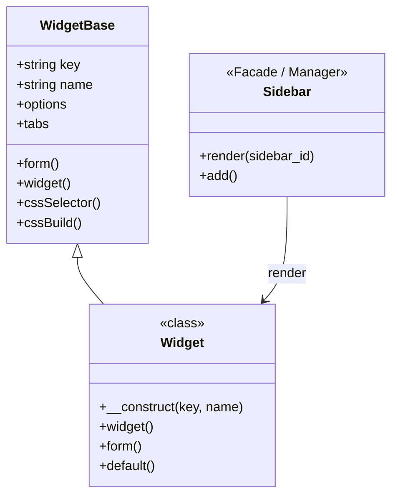

# Hướng Dẫn Tạo Widget Block (Sidebar/Footer)

> Widget Block là mô hình widget cũ, chủ yếu dành cho các khu vực Sidebar, Footer truyền thống. Nếu bạn muốn sử dụng cho Page Builder, hãy xem tài liệu **Tạo Widget Element**.

---

## 1. Tổng Quan Kiến Trúc Widget Block

### 1.1 Khác biệt giữa Widget Block và Widget Element

| Tính chất                                                                                                               | Widget Block (Sidebar)                                                                                                                                                                                                                                                                   | Widget Element (Builder)                                                                                                                                                                                                                                                                 |
|-------------------------------------------------------------------------------------------------------------------------|------------------------------------------------------------------------------------------------------------------------------------------------------------------------------------------------------------------------------------------------------------------------------------------|------------------------------------------------------------------------------------------------------------------------------------------------------------------------------------------------------------------------------------------------------------------------------------------|
| **Class Kế thừa**                                                                                                       | `SkillDo\Cms\Widget\Widget`                                                                                                                                                                                                                                                              | `SkillDo\Cms\Element\Element`                                                                                                                                                                                                                                                            |
| **Vị trí [widget.json](file:///e:/GoogleDriverData/projects/source.5.x/sourcev8/views/theme-store/widget/widget.json)** | `"widgets" -> "block"`                                                                                                                                                                                                                                                                   | `"elements" -> "general"` / `"header"`                                                                                                                                                                                                                                                   |
| **Render Tiêu đề**                                                                                                      | Có tham số cấu hình riêng (Heading options)                                                                                                                                                                                                                                              | Thường tích hợp sẵn trong config                                                                                                                                                                                                                                                         |
| **Tự động áp dụng**                                                                                                     | Không bắt buộc có [icon()](file:///e:/GoogleDriverData/projects/source.5.x/sourcev8/views/theme-store/widget/elements/video/video.widget.php#15-19), [category()](file:///e:/GoogleDriverData/projects/source.5.x/sourcev8/views/theme-store/widget/elements/tabs/tabs.widget.php#19-23) | Bắt buộc khai báo [icon()](file:///e:/GoogleDriverData/projects/source.5.x/sourcev8/views/theme-store/widget/elements/video/video.widget.php#15-19), [category()](file:///e:/GoogleDriverData/projects/source.5.x/sourcev8/views/theme-store/widget/elements/tabs/tabs.widget.php#19-23) |
| **Mục đích chính**                                                                                                      | Dùng cho Sidebar (dọc), Footer truyền thống                                                                                                                                                                                                                                              | Kéo thả trong giao diện Home/Page Builder                                                                                                                                                                                                                                                |

### 1.2 Hệ thống phân cấp Class



---

## 2. Cấu Trúc Thư Mục

Thư mục chuẩn cho Widget Blocks nằm tại `views/theme-store/widget/blocks/`. Bạn nên chia vào các thư mục theo chức năng (như `about`, `posts`, `products`,...). Tại đây, ta lấy ví dụ một danh mục block tên là `demo_block`.

```
views/theme-store/widget/blocks/demo-block/style1/
├── demo_block_style_1.widget.php      # Class chính (extends Widget)
├── views/
│   └── view.blade.php                 # Template hiển thị
└── assets/                            # (Tùy chọn) CSS/LESS/JS
    ├── style-1.less
    └── style-1.js
```

---

## 3. Tạo Widget Block Cơ Bản (Step-by-step)

### Bước 1: Tạo file Widget Class

Tạo file `views/theme-store/widget/blocks/demo-block/style1/demo_block_style_1.widget.php`:

```php
<?php

use SkillDo\Cms\Widget\Widget;
use SkillDo\Cms\Support\Theme;
use Theme\Supports\ThemeWidget;

class widget_demo_block_style_1 extends Widget
{
    function __construct()
    {
        // Tham số 1: Tên Class (key hệ thống)
        // Tham số 2: Tên hiển thị mặc định
        parent::__construct('widget_demo_block_style_1', 'Demo Block (Style 1)');
        
        // Thêm tag để dễ gom nhóm / quản lý (không bắt buộc)
        $this->setTags('demo');

        // Tải các tài nguyên CSS / JS riêng lẻ
        $this->assets('assets/style-1.less');
        // $this->assets('assets/style-1.js');
    }

    /**
     * Khai báo form cấu hình trong màn hình Add/Edit Widget
     */
    public function form(): void
    {
        // 1. Thêm Fields vào Tab "Nội dung" (generate)
        $this->tabs('generate')->adds(function (\SkillDo\Cms\Form\Form $form)
        {
            $form->number('limit', ['label'=> 'Số item', 'start' => 6, 'value' => 5]);
            $form->wysiwyg('description', ['label' => 'Mô tả']);
        });

        // 2. Thêm Fields vào Tab "Kiểu dáng" (style)
        $this->tabs('style')->adds(function (\SkillDo\Cms\Form\Form $form)
        {
            $form->addGroup(function (\SkillDo\Cms\Form\Form $form)
            {
                $form->boxBuilding('boxStyle', [
                    'label' => 'Khung bên ngoài',
                    'customInput' => ['colorHover' => true]
                ])->popup(false);

            }, $this->groupFormBox('Khung Block', 'boxStyleGroup', true));
        });

        parent::form();
    }

    /**
     * Render HTML giao diện người dùng
     */
    public function widget(): void
    {
        // Render thẻ Heading mặc định của Sidebar Widget
        // Function ThemeWidget::heading sẽ lấy config tiêu đề từ $this->options->heading
        $header = ThemeWidget::heading($this->name, $this->options->heading ?? [], '.js_'.$this->key.'_'.$this->id);

        Theme::view($this->getDir().'views/view', [
            'id'      => $this->id,
            'name'    => $this->name,
            'options' => $this->options,
            'header'  => $header,
        ]);
    }

    /**
     * Trả về file CSS động
     */
    public function cssBuilder(): string
    {
        // Sử dụng cssSelector (Hỗ trợ responsive và trạng thái hover/active cực tốt)
        $this->cssSelector('.demo-block-wrapper', [
            'data'  => $this->options->boxStyle ?? [],
            'style' => 'box',
        ]);

        return $this->cssBuild();
    }

    /**
     * Gán giá trị mặc định lúc mới khởi tạo block
     */
    public function default(): void
    {
        // Nếu tên vẫn là mặc định, có thể đổi sang tên thân thiện hơn
        if($this->name == 'Demo Block (Style 1)') {
            $this->name = 'Danh sách Demo';
        }

        $this->options->heading = $this->options->heading ?? [];
        $this->options->limit   = $this->options->limit ?? 5;
    }
}
```

### Bước 2: Tạo View Template

Tạo file `views/theme-store/widget/blocks/demo-block/style1/views/view.blade.php`:

```blade
<div class="demo-block-wrapper js_{{ $key ?? '' }}_{{ $id }}">
    {{-- Hiển thị thẻ Tiêu Đề Widget --}}
    {!! $header !!}

    <div class="demo-content">
        @if(!empty($options->description))
            <div class="description">{!! $options->description !!}</div>
        @endif

        <p>Số lượng item cần hiển thị: {{ $options->limit }}</p>
    </div>
</div>
```

### Bước 3: Đăng ký Block trong `widget.json`

File cấu hình này quản lý toàn bộ Widget hiển thị trong hệ thống.
Sửa file `views/theme-store/widget/widget.json`, tìm node `"widgets"`, thêm vào nhánh `"block"` (hoặc `"footer"`, tùy vị trí bạn muốn):

```json
{
    "widgets": {
        "block": {
            "widget_demo_block_style_1": {
                "path": "widget/blocks/demo-block/style1/demo_block_style_1.widget.php"
            }
        },
        "footer": {
            // ... các widget cho footer
        },
        "sidebar": {
            // ... các widget cấu hình cụ thể cho loại sidebar
        }
    },
    "elements": {
        // ... khu vực Element Builder mới ...
    }
}
```

> [!IMPORTANT]  
> **Tên Key (như `"widget_demo_block_style_1"`) trong `widget.json` PHẢI HOÀN TOÀN TRÙNG KHỚP** với tên class PHP mà bạn đã viết. Đây là tiêu chuẩn để hệ thống map đúng class.

---

## 4. Quản Lý Tiêu Đề (Heading/Title) Của Widget Block

Điểm khác biệt lớn nhất giữa `Widget Block` và `Widget Element` chính là phần cấu hình Tiêu đề. 
Với Block, Hệ thống **tự động thêm field cấu hình "Tiêu đề" kiểu Widget truyền thống (Có thể chọn font, màu sắc, icon, ẩn/hiện, thẻ h1-h6) vào form sinh ra**. 

Bạn nhận được options trong mảng `$this->options->heading`.

Để Render đúng cách ngoài Front-End, ta sử dụng Class Helper `ThemeWidget`:
```php
$headerHtml = ThemeWidget::heading(
    $this->name,                  // Tên Widget
    $this->options->heading,      // Config từ form Widget Setting
    '.js_'.$this->key.'_'.$this->id // CSS Class để map Selector cho style động 
);

echo $headerHtml;
```

---

## 5. CSS Builder với (`cssSelector`)

Các Widget Base được nâng cấp qua hàm `cssSelector` với tính năng hỗ trợ Responsive (desktop, tablet, mobile) cực kì tiện dụng - thay thế cho cách viết cũ `cssStyle`.

```php
public function cssBuilder(): string
{
    // Ví dụ về cấu hình biến CSS (nếu cần xử lí CSS thủ công bên trong file .less)
    // .demo-block-wrapper { grid-template-columns: repeat(var(--limit_item), 1fr); }
    $this->cssVariables('--limit_item', $this->options->limit);

    // Gán Box Padding/Margin/Border với tự động sinh Hover
    $this->cssSelector('.demo-block-wrapper', [
        'data'  => $this->options->boxStyle ?? [],
        'style' => 'box',
    ]);

    return $this->cssBuild();
}
```

> [!TIP]
> Bạn có thể truyền CSS selector dưới dạng mảng để áp dụng hover/active ở vùng bao cha, nhưng lại nhắm thay đổi style ở node con.
> ```php
> $this->cssSelector([
>    'normal' => '.demo-item .title a',
>    'hover'  => '.demo-item:hover .title a'
> ], [
>    'data'  => $this->options->titleStyle,
>    'style' => 'text'
> ]);
> ```

---

## 6. Xử lý Dữ Liệu Thực Tế (Bài Viết, Sản Phẩm)

Widget Blocks Sidebar thường được gọi để load danh sách Bài Viết hay Sản phẩm Mới nhất theo Category:

Ví dụ Load Posts:

```php
public function getPost()
{
    $query = \SkillDo\Cms\Models\Post::where('post_type', 'post')
        ->selectAllBut(['content'])  // Loại bỏ trường nặng
        ->orderBy('order')
        ->orderByDesc('created')
        ->limit((!empty($this->options->limit)) ? $this->options->limit : 5);

    if(!empty($this->options->cateId))
    {
        $category = \SkillDo\Cms\Models\PostCategory::find($this->options->cateId);
        $query->whereByCategory($category);
    }

    return $query->get();
}

public function widget(): void
{
    $posts = $this->getPost();
    $header = ThemeWidget::heading($this->name, $this->options->heading);

    if(have_posts($posts)) {
        Theme::view($this->getDir().'views/view', [
            'id'      => $this->id,
            'posts'   => $posts,
            'header'  => $header,
        ]);
    }
}
```

---

## 7. Checklist Kiểm Tra Khi Tạo Widget Block

- [ ] **Tạo class** extends `Widget`
- [ ] Tham số 1 trong hàm `__construct` phải trùng lấp tên `Class`
- [ ] Thêm dependencies file js/less cần thiết vào `__construct` (`$this->assets()`)
- [ ] Setup `tabs('generate')` và `tabs('style')` trong hàm `form()` và kết thúc bằng `parent::form()`
- [ ] Trích xuất config title bằng `$this->options->heading` vào `ThemeWidget::heading()` trong hàm `widget()`
- [ ] Sử dụng `cssSelector()` thay thế cho các API cấu hình CSS thủ công. Return `cssBuild()`.
- [ ] Khai báo key Widget Class vào `widget.json` dưới mục root `"widgets"` -> `"block"` (hoặc nhóm mong muốn).
- [ ] Chỉnh sửa LESS để style Front-end đúng chuẩn.
- [ ] Setup `default()` để có trải nghiệm thả ra chạy luôn.
