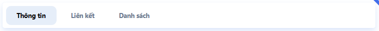

# Tabs



Để sử dụng component tab bạn sử dụng

```php
$tabs = [
    'tabId1' => [
        'label'   => 'Tiêu đề tab 1', //Tiêu đề của tab
        'content' => Theme::makeView('views/tab-exam-1'), //Nội dung của tab
        'classLi' => 'tab-class-li', //class sẽ được chèn vào thẻ ul > li của riêng tab này
        'classItem' => 'tab-class-a', //class sẽ được chèn vào thẻ ul > li > a của riêng tab này
    ],
    'tabId2' => [
        'label'   => 'Tiêu đề tab 2',
        'content' => Theme::makeView('views/tab-exam-1')
    ],
    'tabId2' => [
        'label' => 'Tiêu đề tab 2',
        'href'  => 'admin/home', //đường dẫn nếu là tab liên kết
    ]
];
//Id của tab được active
$active = 'tabId1';

//Các attributes bổ sung
$args = [
    'class'     => 'tab-class-ul', //class được chèn vào thẻ ul
    'classLi'   => 'tab-class-li', //class sẽ được chèn vào thẻ ul > li của tất cả tab
    'classItem' => 'tab-class-a', //class sẽ được chèn vào thẻ ul > li > a của tất cả tab
];

Admin::tabs($tabs, $active, $args)
```